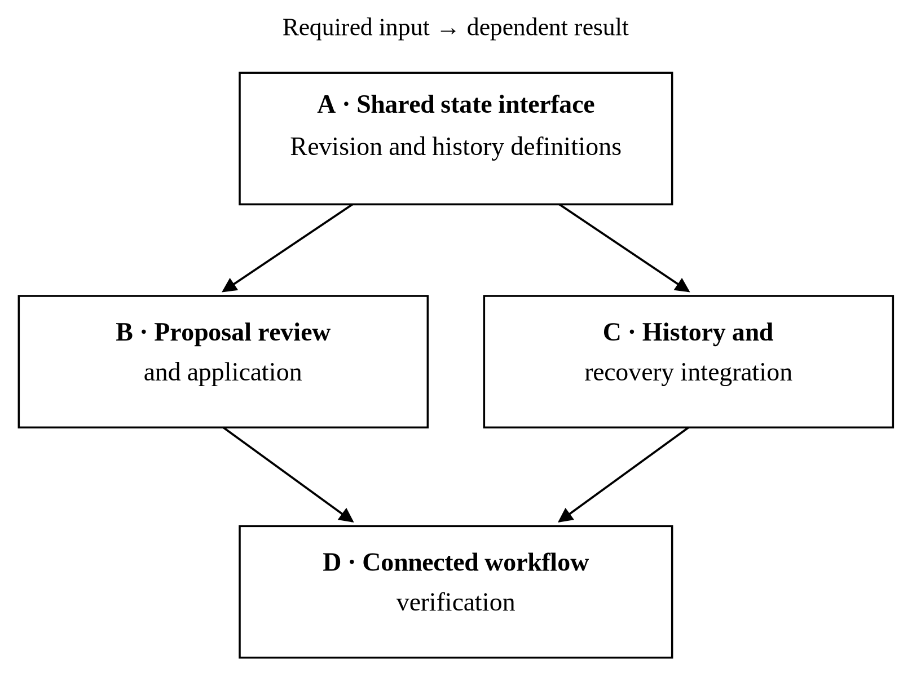

# Project Management for Human–Agent Teams

## A Practical Manual

Ryan Tufts


## Contents

- [Preface](#h_preface)

- [1. From intention to an organised undertaking](#ch_1)
- [2. Developing and accepting the project basis](#ch_2)
- [3. Decomposition and execution definition](#ch_3)
- [4. Detailed development and coordinated execution](#ch_4)
- [5. Completion, reconciliation, and product examination](#ch_5)
- [6. Delivery, handover, and project conclusion](#ch_6)
- [7. Managing agency toward a useful product](#ch_7)
- [Working vocabulary](#h_working_vocabulary)
- [Appendix A. A worked undertaking](#h_worked_undertaking)
- [Selected References](#h_selected_references)

<a id="h_preface"></a>

# Preface

This manual concerns the management of projects in which people work with artificial agents to produce a product. Its account follows development from shared intention through an accepted basis, decomposition, execution definition, detailed development, completion, and delivery. Questions return, work proceeds unevenly, and decisions have consequences across many contributions. Project records must remain useful as participants change.

The principal readers are programmers beginning to manage substantial delegated work and traditional engineering project managers encountering software agents. The method adapts selected Alberta oil-and-gas project practices for work with artificial agents. Technical terms are introduced where needed. Artifacts and regulatory requirements retain their domain-specific meanings.

The method reserves judgment for people and uses reckoning for the artificial agent’s interpretation, comparison, inference, and selection. Agents are others whose contributions the human receives, examines, and may rely upon. Their capability supports extensive initiative within an assignment. The human remains responsible for the purposes, consequential choices, and acceptance allocated to them.

Four connected perspectives guide the argument. Ontology asks what the project contains and how its parts relate. Epistemology examines the grounds of its claims. Praxeology follows how its work is organised and carried out. Axiology concerns the purposes, values, and consequences that give the choices their importance. These perspectives recur through the chapters; their practical value is in the distinctions they help a participant preserve.

<a id="h_reading_the_manual"></a>

## Reading the manual

Chapters 1–5 follow the project from intention through definition, execution, completion, and reconciliation. Chapter 6 connects that work to the organisation's delivery arrangements. Chapter 7 assesses the approach and its reason for being. The working vocabulary provides a reference to the meanings developed in the chapters.

Examples are constructed unless identified otherwise. Their decisions and results illustrate the method; they are not reports of observed project performance. Numbered references identify sources in [Selected References](#h_selected_references).

The chapters explain the management problem, the recommended practice, and its reasons. [Appendix A](#h_worked_undertaking) follows the editor example through a complete undertaking, from an uncertain requirement to examined behaviour and a recorded conclusion.

The four roles, six phases, and continuing loop are choices of this manual's approach. Their purpose is to preserve responsibility, an intelligible basis for work, and grounds for relying on the result. Apply them in proportion to the undertaking. A small team can combine related work and consider several prepared decision subjects together; a larger project may need separate assignments and records to preserve the same relationships.

For work in the Chirality software environment, the companion [Chirality Agent User Manual](CHIRALITY_AGENT_USER_MANUAL_v2.md) describes its files, tools, and operating procedures.


<a id="ch_1"></a>

# 1. From intention to an organised undertaking

Projects organise human and artificial agency to produce a product. They bring together participants who can investigate, propose, act, and affect the work of others. The project manager gives these contributions a common direction, establishes responsibilities, and arranges the examination and integration through which the intended result can be achieved. As the work develops, the manager must also recognise when its organisation or accepted basis needs to change.

An AI agent is an **other** whose work you receive and may come to rely upon. It can carry out substantial parts of an assignment without your performing those actions yourself. Its interpretation of the request, the information it used, and the choices made during execution may therefore require examination. Before accepting responsibility for the result, establish an appropriate amount and level of verification and validation. What you examine, who is competent to examine it, and how thoroughly it must be examined depend on the proposed use and the consequences of error. Section 1.5 develops this relationship through the examination required before relying on work prepared by another contributor.

The word **agency** here concerns the ability to act within an undertaking. A person or an artificial agent can investigate a question, prepare a design, or carry out assigned work. Their participation does not give them the same relationship to responsibility. This manual reserves **judgment** for the human and calls the artificial agent's computational interpretation, comparison, inference, and selection **reckoning**. The agent may exercise substantial initiative within its assignment. People determine the purposes, constraints, and commitments under which that initiative is used, and answer for the work they accept.

This is a humanist account of artificial intelligence in project work. Human judgment shapes what the project is for, what its product should preserve, and which consequences are acceptable. A choice made during an early conversation can govern many later assignments. It can remain consequential after the original participants have left or the conversation has been forgotten. The project must preserve both the decision and enough of its grounds for those who later act upon it to understand what they are being asked to maintain.

The approach developed here adapts selected Alberta oil-and-gas project practices from the 1970s through the 2010s. Packages and deliverables, an accepted design basis, management of change, coordination across disciplines, and dependable project records provide its working vocabulary. The manual brings that view of project management into software development and agent-assisted work. Its application depends on the participants and their relationships: who prepares a contribution, who depends on it, who checks it, and who accepts responsibility for its use.

An engineering project manager can approach the agent system through those questions without first becoming a programmer. A programmer who already uses agents can use the same questions to understand why several completed assignments may still leave substantial project work undone. The following sections introduce the software arrangements where they become relevant and explain the management purpose each serves.

A project gives people a way to pursue an intended result through work that they must divide, examine, and bring together. At the beginning, they may have only a difficulty they want to overcome or an opportunity they want to explore. As the work proceeds, they develop a more definite account of the result, the means of producing it, and the conditions under which it will be worth using. They also discover where their earlier understanding was incomplete. Managing the project involves carrying those discoveries into subsequent work while preserving the commitments that still apply.

This chapter follows the formation of an undertaking and introduces the changes in working arrangement that accompany its development. A recurring example concerns an editor in which a user reviews changes proposed by an agent. Its decisions, findings, and records are constructed illustrations of the method. [Appendix A](#h_worked_undertaking) brings the successive contributions together as a worked undertaking.


<a id="ch_1_1"></a>

## 1.1 An intended result and a reason to pursue it

Suppose a programmer has an application in which people prepare technical documents. The application already supports manual editing, saving, and reopening. The programmer wants to introduce agent assistance and begins with this request: “Let me try an agent’s changes and get my work back if I decide against them.” Several features might answer that request. The application could let an agent edit the document and provide an undo operation. It could show a proposed revision separately. It could make a working copy in which the user experiments before choosing what to retain.

The request gives a useful starting point, but choosing among these arrangements requires a better understanding of the intended use. Does the user expect to continue editing while considering the agent’s proposal? Is the proposal one change or a related set of changes? Does getting the work back include the selection, cursor position, and editing history? What should happen to changes the user makes after the agent begins? The answers determine what the proposed feature must preserve and which kinds of implementation are suitable.

In this example the **product** is the application and the behaviour made available to its users. The **project** is the organised undertaking through which the team develops and hands over the proposed capability. The distinction matters when assessing progress. A report comparing recovery methods may be a useful project result even though it adds no behaviour to the application. Conversely, a considerable amount of implemented behaviour may require further work before the user can rely on it.

The same distinction applies when the intended product is a physical facility, a modification to equipment, or a design package for another party to use. The project organises the work that produces and hands over that result. A product can remain in service through several subsequent projects. Completing the present project therefore requires an account of the result delivered and of any responsibilities continuing after handover.

The term **undertaking** also applies at a smaller scale. It identifies a bounded contribution whose result and remaining obligations can be assessed. Investigating the recovery methods is one undertaking. Implementing an agreed interaction is another. Integrating several contributions and preparing a release can each be managed in the same way. The boundary identifies what someone is responsible for carrying through. It need not coincide with a chat session, a folder, or the lifetime of an agent instance.

Progress is judged in relation to the purpose of that undertaking. The investigation may establish that restoring a whole document would discard later manual edits. That finding gives the team a reason to reject or constrain an approach. An implementation may establish that a selected interaction works in the situations examined. A review may expose an unsupported claim that must be resolved before further work relies on it. Each contribution advances a different part of the project’s understanding or result, and each needs an account of what it has actually established.

Here and in the later examples, the **owner** is the person directing the undertaking and making the decisions reserved to that role. On a project involving several responsible people, their respective decision rights and technical responsibilities must be identified. A project manager's coordination of the work does not confer the competence or authority to accept every technical contribution personally.

The judgment of success remains connected to the reasons for undertaking the work. In the editor example, a fast recovery mechanism has little value if it silently loses the user’s later changes. A slower arrangement may be preferable if it preserves the work and makes the consequences understandable. The person directing the project must decide which outcomes matter and which constraints limit the acceptable means. Those choices will continue to govern implementation long after the opening conversation.

<a id="ch_1_2"></a>

## 1.2 Developing the intention with an agent

Begin by establishing what the person is trying to accomplish and what is already underway. An apparently new request may refer to an existing product, an earlier decision, or work that was interrupted. Read the relevant material before replacing it with a fresh proposal. Ask about the difficulty in its setting: what the person was doing, what they expected to happen, and what made the present arrangement unsatisfactory. An example of use often gives a more definite starting point than a requested feature name.

The design partner then gives the person something they can examine. For the editor, a short comparison could show what happens under each proposed recovery arrangement. Under whole-document restoration, the user’s later edits may be lost. Under a separate preview, rejecting the proposal can leave the working document untouched, while applying it after further manual editing introduces a question about which revision it belongs to. An operation-based undo arrangement requires the team to define which actions belong together and how later actions depend on them. The comparison brings those consequences into the conversation before one approach becomes embedded in the implementation.

The human’s response develops the design. They may recognise the proposal as a useful expression of their intention, correct a particular interpretation, or explain that all the alternatives miss the point. In this example, the response might be: “I need to keep working while I look at the proposal. Rejecting it must leave my own edits alone.” That correction gives the team a clearer account of what is to be preserved. It also changes the question from generic recovery to the relationship among the live document, the proposed revision, and work performed while the proposal is open.

This exchange is part of conception. The human may recognise what they mean through the consequences of a proposal they had not previously considered. The agent contributes by finding examples, comparing possibilities, and making its interpretation inspectable. Keep those interpretations distinguishable from the human’s commitments. A summary that says the human selected separate preview is warranted only after that choice has actually been made. Until then, separate preview remains a proposal, however well it appears to answer the latest correction.

The design can remain open in some respects while becoming definite in others. The human might decide that the first implementation concerns one document and one proposal at a time, while leaving the handling of intervening manual edits for investigation. That supplies a boundary for useful work. It also identifies a question whose answer will affect the apply operation. The agent can continue developing alternatives without treating the unresolved question as permission to choose whichever behaviour is easiest to implement.

Preserve the reasons that led to significant choices. A brief statement that an approach was rejected because it could discard later edits helps a subsequent participant understand why it was unsuitable. Keeping the rejected alternative also helps when circumstances change. A method that was unsuitable for live editing may be appropriate for an isolated working copy. The record should preserve enough of the original circumstances for that later comparison to be made intelligently.

<a id="ch_1_3"></a>

## 1.3 Objectives, constraints, and commitments

An **objective** describes an outcome the project is intended to achieve. For the editor, an initial objective could be to let users examine and use agent-proposed revisions while retaining control of their own work. The wording gives direction, but it still needs development before it can guide implementation. The team must identify the situations that matter and what retaining control means in each of them.

A **requirement** states a condition or capability whose source, interpretation, and status can be examined. One requirement emerging from the example could state that rejecting an unapplied proposal leaves the live document unchanged, including manual edits made while the proposal is being reviewed. It names the affected object, the relevant action, and an observable outcome. Its source is the human’s expressed concern, and its wording is the team’s proposed interpretation until the human adopts it.

A **constraint** limits the means or result that the project can accept. Some constraints are inherited from the existing product or from an accepted external basis. Others follow from the resources, intended users, or consequences of the undertaking. In the example, preserving the established save and undo behaviour may constrain the new feature. The team should identify which existing behaviour is to be preserved and where it is specified or demonstrated. A vague instruction to maintain compatibility leaves each contributor to supply a different interpretation.

These distinctions help the team examine a proposal without prematurely turning every useful idea into a commitment. A side-by-side preview may be a proposed means of satisfying the objective. A comparison against an identified document revision may become an accepted design choice. Supporting proposals across several documents may remain a future possibility. The project record should let a reader distinguish these positions and recover the grounds for each. Merely listing all of them under “requirements” would make subsequent assignments difficult to interpret.

The values behind the choices deserve an explicit explanation. In this example, protecting the user’s work justifies examining rejection, interruption, and intervening edits even when the normal apply path is straightforward. The preference also gives a basis for evaluating alternatives. A proposal that conceals the possibility of overwriting later changes would conflict with it. An arrangement that exposes the conflict and asks the user to choose may preserve the objective, although its inconvenience must still be considered. The team needs both the chosen behaviour and the reasons for preferring it.

The four philosophical questions used throughout this manual can be seen in this one requirement. Ontology asks which document and which changes the requirement concerns. Epistemology asks what supports the claims about preservation and how those claims can be examined. Praxeology concerns the actions through which proposals are prepared, reviewed, applied, or rejected. Axiology concerns the value placed on the user’s work and the consequences of losing it. Their practical use is to reveal a missing part of the account. They need not produce four separate documents or four additional approvals.

At this stage, describe the authority attached to a statement as carefully as its technical content. A requirement can fix an outcome while leaving several internal designs available. A specifically adopted interface can narrow that discretion. A suggestion in an agent’s report may have no authority to alter either. The next participant needs to understand what they may choose within their assignment and what would require a further decision.

<a id="ch_1_4"></a>

## 1.4 Useful work while the design remains open

An incompletely defined product can still support a well-defined investigation. The team may need to inspect existing behaviour, compare candidate designs, or build a limited demonstration before deciding what to implement. Give this work a purpose that can be assessed on return. Identify the question, the material to examine, the permitted operations, and the decision the result is intended to inform.

For the editor, the agent could be assigned to examine how the current application represents document content, selection, undo history, and the saved revision. The return would identify the relevant implementation and tests, describe what they establish, and locate gaps that affect proposal review or recovery. The assignment would not authorise a new recovery design. It would prepare the team to judge which parts of the existing application can support one.

A separate undertaking could build a demonstration of reviewing a proposed revision without changing the live document. Its purpose would be to make the interaction tangible. The brief could limit writes to an isolated prototype, require a small set of observed scenarios, and ask for a report on the assumptions made. That boundary gives the executor room to solve the demonstration’s local problems while preserving the human’s decision about adopting the design.

Examine the return in relation to the question asked. A demonstration may show that users can compare two versions and reject a proposal without altering the live content. It may leave the selection, undo history, interrupted operation, or saved state unexamined. It may use a simplified representation that cannot be carried directly into the product. Those limitations determine what the team can do with the result. The prototype remains useful when its purpose and limits are clear.

A finding can also change the next investigation. Suppose inspection shows that the application’s undo mechanism groups changes by individual commands, while an agent proposal can contain several commands. The team now has a concrete question about grouping and reversal. An executor can examine how the commands interact and return alternatives. The design partner can explain the user-visible consequences. The human can then decide which behaviour the product should promise.

Keep investigative success distinct from success of the proposed product. An investigation that rules out a favoured approach may have fulfilled its purpose. Its result does not establish that an acceptable alternative exists. The owner may choose further investigation, a smaller undertaking, or an end to that line of work. Record which question was answered and which intended outcome remains unachieved so that the next decision is made on that basis.

Keep this permission for exploration distinct from authorisation to produce the project result. An isolated prototype can inform the product requirements document while its requirements are still being developed. Incorporating it into production follows confirmation and acceptance of that document, decomposition, and project setup. Its earlier demonstration remains evidence for the limited question it addressed; further work must establish its suitability for incorporation.

<a id="ch_1_5"></a>

## 1.5 Examining work received from an other

An artificial agent operates with a language model, instructions, supplied context, available tools, and the permissions its host provides. The host is the application or execution environment through which it reads files, uses tools, and performs actions. An instruction can prescribe a boundary, while the host determines which operations are actually available. The project needs an accurate account of both when assigning work and examining what occurred.

During an assignment the agent may interpret source material, select a method, make local choices, and encounter conditions the human has not seen. Its return is the result of that execution. Treating the agent as an **other** directs attention to this relationship between the preparation of the work and the person who proposes to rely on it. Receiving an answer to your own request does not establish that the answer embodies your intention or that the work was performed adequately.

For practitioners governed by APEGA in Alberta, *Relying on the Work of Others and Outsourcing* is a professional practice standard. Section 3.1 sets out the supervision or thorough review through which those practitioners may take responsibility for work prepared by others. APEGA's published AI guidance also confirms that the applicable practice standards continue to govern their development and use of AI, and that they remain responsible for AI-assisted work. [1, 2]

In this manual, **other** describes the contributor whose work the responsible person receives. It includes a human contributor or an artificial agent. The relationship calls for attention to what was assigned, how the work was prepared, and what examination supports its use. Applying it to an artificial contributor preserves those questions. The particular means of supervision and checking must suit the contributor, the work, and the consequences of relying upon it.

For this manual, the relationship applies throughout development. Reading a prototype to choose the next investigation calls for one kind of examination. Incorporating it into the product calls for a more extensive one. The human needs to establish which claims the result supports, whether its preparation was appropriate, and what remains uncertain for the intended use. The examination should be planned while the assignment is being prepared, so that the executor knows what evidence must accompany the return.

### Verification and validation

**Verification** examines the result against specified requirements or declared checks. **Validation** examines whether it is suitable for the intended use. In the editor example, a comparison of the live document before and after rejection can verify a preservation requirement. Validation also asks whether the chosen review interaction lets people understand the proposed changes and protect their work in the circumstances in which they will use the application. These questions concern related but different grounds for accepting the result. These are the manual's working meanings; formally defined professional-practice acts retain their own requirements.

Consider a report stating that rejection preserves the document. Read what was actually exercised. Was the comparison confined to text, or did it include the selection and undo history? Which candidate was tested? Did the user make a manual edit while the proposal was open? What was expected to remain unchanged, and how was it compared? The report, underlying evidence, and implementation should allow these questions to be pursued. A conclusion that exceeds the evidence must be narrowed or supported by further examination before dependent work treats it as established.

A **claim** is an assertion that something is the case. A **warrant** supplies grounds for believing it. In a production contract, the claims selected for maintenance concern the obligations and relationships that the project needs to preserve. Requirements state what must be satisfied; descriptive claims state what is represented as the case. Their grounds and present standing must remain distinguishable. Here, the preservation claim might be supported by an identified execution showing before and after states for stated scenarios. A reviewer can find the observation accurate but too narrow for the claim, or discover that the comparison omitted a relevant property. Identifying the warrant makes this examination possible. Its adequacy for the proposed reliance remains to be assessed.

The amount and level of examination include several choices. Reading a short source extract may be enough to check that a requirement was transcribed correctly. Establishing that it has been interpreted correctly may require the surrounding source, the design rationale, and discussion with the person whose intention it expresses. Examining an implementation may require inspection of the changes, reproducible tests, and a reviewer with the relevant technical competence. A complete user activity may need to be observed in the actual application because isolated component tests leave the relationships among its parts unexamined.

The project should establish the required examination and who will perform it before accepting the contribution. A contractor's checked drawing, an agent's test report, and a working demonstration each need to be considered in relation to what another participant will do with them. In the software example, passing a test that compares text would not justify claiming that the whole editing state is preserved. Additional evidence must address the broader claim. An executor cannot reduce an agreed check merely because satisfying it has become inconvenient.

Some checking can be automated or assigned to another agent. Such work can inspect more material, repeat comparisons, and expose defects for attention. Its findings must retain their sources and limits. The responsible human uses those contributions in judging whether the examination supports reliance. In professional engineering work, the relevant competence, review, and authentication obligations continue to apply. APEGA's AI practice notice likewise places responsibility for AI-assisted work with the professional and calls for competent assessment of its results. [2]

### Reckoning and human judgment

Brian Cantwell Smith gives a philosophical treatment of reckoning and judgment. This manual applies that distinction to the management of delegated work. [5]

**Reckoning** includes the computational organisation and use of information through comparison, inference, calculation, generation, and checking. It can expose consequences and prepare alternatives that the human would otherwise have difficulty bringing into consideration. An agent can carry this work far enough to recommend a design or select an implementation within an assigned boundary. Those selections remain part of its reckoning under the authority given to it.

**Judgment** concerns the person's situated understanding of the work and the commitments for which they will answer. In the editor example, the human judges what preservation should mean for the users, which limitations are acceptable, and whether the available examination supports the proposed reliance. This responsibility exists during conception and design as well as at final acceptance. Keeping it with the human is a premise of the method, including when the agent produces exceptionally capable work.

Human judgment remains open to error and revision. Recorded information must be distinguished from what a situated person knows from it. Another reader may notice an implication that the first reader missed, and the same person may understand an old record differently after further work. Preserve the result, the evidence, and the scope of the decision so that this later examination remains possible. An acceptance record identifies the reliance the person undertook; it does not make their understanding exhaustive or their decision infallible.

The organisation of the work should make assessment practicable. A parent checks an executor's return against the brief, a manager examines the combined result, and the human receives consequential choices with the evidence and reasons needed to decide. The detail follows what is being claimed and what will depend on it. This gives agents room to carry out useful work while preserving human attention for the questions that require judgment.

<a id="ch_1_6"></a>

## 1.6 Establishing a basis that another participant can use

As choices begin to govern further work, the project needs an identifiable **accepted basis**. This comprises the applicable requirements, decisions, commitments, and identified material under which the undertaking proceeds. Its scope matters. An accepted purpose can guide further design while a particular implementation proposal remains under examination. Authorisation of a bounded investigation establishes what its result is meant to inform; adoption of the investigated design requires its own decision.

The **product requirements document**, or **PRD**, carries the shared understanding of intent into formal project definition. It is authored from the conversation, the accepted directions, and the investigations that have helped the human and design partner understand the intended product. It gives that understanding a form that can be examined as a whole and subsequently used by participants who were absent from the conversation.

Engineering documentation uses **DBM** for **design basis memorandum**. [3] An engineering project manager can recognise the PRD's function through this document. The documents belong to different working contexts, but in the approach used here each gives the ensuing design and project organisation an identifiable basis. The PRD explains the intended product, its requirements and boundaries, and the choices and constraints that further work must preserve. The comparison concerns that management function; it does not prescribe identical contents for every PRD and DBM.

Suppose the owner adopts the following direction for the editor: develop review of one proposal against one document; leave the live document unchanged while the proposal is inspected or rejected; and prevent application from silently discarding intervening manual work. Changes across several documents and external actions are outside this undertaking. The PRD must preserve those choices, their meaning in use, and the questions that still need design work.

The design partner can prepare a technical interpretation alongside the source direction. That interpretation might identify a proposal's source revision and the live document's current revision as distinct objects that must be compared. Where adopting that distinction constrains the product, it must be apparent in the PRD the human examines. Keeping the human's words and the interpretation distinguishable allows a later participant to assess whether the translation preserved the intended meaning.

An open question also needs a useful account. “Handle intervening edits” gives little guidance. A fuller description would state that the team has yet to choose whether to require a fresh proposal, allow a reviewed reconciliation, or use another approach. It would identify the apply operation as dependent on that choice and retain the prohibition on silent loss of manual work. The PRD can distinguish the required outcome from a design choice still to be developed. Acceptance must make the treatment of that open choice clear; a blank field cannot authorise an arbitrary answer.

The human reviews the PRD for confirmation and acceptance before decomposition and project setup proceed. The authoring method in Chapter 2 prepares this decision through proportionate intake, development of the product account, writing, and a separate examination of the candidate. That review examines whether the document represents the intended product, whether its commitments and exclusions are understood, and whether the remaining questions have an acceptable treatment. It also considers what evidence will eventually support assessment of the result. Acceptance identifies the revision to be used. The team can then decompose that accepted basis without leaving each contributor to reconstruct the project from different fragments of conversation.

The depth needed in the PRD depends on the nature of the project. A small extension to a familiar product may inherit much of its basis from established behaviour and accepted specifications. A product with unfamiliar interactions, many dependencies, or substantial consequences may need a more developed account before its scope can be divided usefully. In each case, the accepted PRD records the position from which the next phase will proceed, including what remains to be developed.

An accepted PRD may still leave substantial design work ahead. The phase sequence in §1.7 places the development of execution arrangements and design details after conception and project setup. The human therefore considers an open question in relation to those later undertakings: what work will resolve it, what depends on it, and what commitments already constrain the answer. The same question may need an early answer in one project and be manageable as later design work in another.

A less-developed PRD can lead to a successful product. It may also leave the team to resolve interacting interpretations after detailed work has spread across several contributions. As product complexity increases, that possibility deserves closer attention. In the editor, leaving the response to a stale proposal open may be manageable while its affected interfaces remain under coordinated design. Discovering much later that different contributors assumed incompatible responses could require revisions to application, history, saved state, and tests. The risk follows the relationships allowed to develop around the open question. The amount of early definition should be judged with those relationships in view.

### Keep the basis, work, and record distinguishable

The **actual state** of the project includes what exists and what it does: documents, code, demonstrations, incomplete changes, tests, and work that has not yet been integrated. The **recorded state** is the account available in the project's files, graphs, reports, and handoffs. The two require comparison. A report can be current about one contribution and stale about another, especially when work proceeds in separate locations.

The software arrangement uses a **repository** to hold project files and their version history. A **branch** identifies a line of development within that history. A **worktree** provides a separate working checkout in which a line of work can be edited. **Merging** combines changes into another line, usually the project's main line. These facilities allow work to proceed separately while retaining a means of comparing and integrating it. Their names will appear in handoffs because the location and revision of unfinished work affect what a successor should do.

For example, a handoff may say that the review prototype is complete while its last changes remain in a separate worktree. A successor who examines only the main line could mistakenly repeat the work. A successor who trusts only the handoff could rely on behaviour that was never checked. The successor must inspect the identified work and its evidence, including any changes made after the last recorded checkpoint.

Records also perform different functions. A test report describes an event and can be examined against its evidence. A properly made acceptance record constitutes a governed decision about identified work. It establishes what was accepted, by whom, and for what purpose, provided the prescribed human act actually occurred. An agent cannot supply that act by writing that approval was given. Similarly, the owner's acceptance of a report does not change what an earlier test exercised.

Versioned files give humans, agents, and tools a common place to inspect decisions, sources, and working state. Identify the applicable versions and retain links between decisions and affected work. A **content hash** is an identifier calculated from a file's contents; it can be used to check that the content matches the version being cited. Reading its sources and checking its attribution remain necessary to establish what the identified content supports.

Prepare continuity while the work is underway. A later participant should be able to recover the purpose, the accepted PRD and subsequent choices, what has been examined, and what requires further action. That participant will still have to interpret the material and inspect the present work. A dependable record supports that examination and allows a different or corrected interpretation to be brought forward. Section 1.10 explains how session entry and handoff use this record.

<a id="ch_1_7"></a>

## 1.7 How the project's work changes as it develops

The phases describe changes in what the project is organised to establish. Early work develops the intended outcome and its basis. Subsequent work gives that basis a division into packages and deliverables, establishes the means of execution, develops the design details, and carries them through to completed contributions and a delivered product. These changes give the project a course while allowing its parts to develop at different rates.

The six phases have counterparts in the traditional engineering execution model used by the author: **Conceptual, FEED, 30%, 60%, 90%, and 100%**. FEED means front-end engineering design. The correspondence below uses the development purposes the author assigns to those stages. It provides a way to carry lessons between engineering and software work without requiring their artifacts or technologies to be identical.

| Manual phase | Engineering stage | What the stage establishes |
|---|---|---|
| I. Conception | Conceptual | Alignment on intended outcomes and an accepted DBM or PRD. |
| II. Definition and preparation | FEED | Packages, deliverables, and project setup developed from that accepted basis. |
| III. Execution definition and coupled work | 30% | Means of execution, mapped dependencies, and an initial project DAG. |
| IV. Detailed development and coordinated execution | 60% | Detailed design and local work graphs, with successor project DAGs as needed; no further structural revision anticipated at the end. |
| V. Completion and reconciliation | 90% | Longer-horizon execution through produced Deliverables and reconciled records; transition to concentrated product testing and debugging. |
| VI. Delivery and handover | 100% | Produced deliverables carried into a product that is delivered or published. |

The percentage labels identify stage-gate positions in this account. They do not measure the fraction of effort spent, tasks completed, or code written. Reaching the 60% stage says something about the design position the project has established. It provides no calculation of how much work remains. A **stage gate** is the human assessment of whether the accumulated work supports the proposed transition. A **phase** is the work organised toward that development purpose. The owner can require further work, accept a stated limitation, or redirect the undertaking when considering the transition.

### Conceptual: alignment and the PRD

Conception develops a shared understanding of what the product is intended to accomplish. Dialogue, alternatives, examples, and bounded investigation give that understanding increasing definition. The team authors the PRD from it and brings the document to the human for confirmation and acceptance. In a traditional engineering setting, the DBM carries the corresponding design basis. The accepted document is a result of the conceptual phase and an input to FEED.

In the editor example, conception establishes the intended review experience, what must be preserved, and the limits of the initial undertaking. Investigations may clarify whether the existing editing model can support those intentions. The PRD records the requirements and the position reached, including design questions left for later work. Its required depth follows the project's nature and the consequences of proceeding on that basis, as discussed in §1.6.

### FEED: decomposition and project setup

Definition and preparation develop the accepted PRD or DBM into packages and deliverables. **Decomposition** divides the accepted scope into identifiable contributions. A **package** groups a defined portion of project scope. A **deliverable** is an identified unit of committed output with a scope and a basis for assessing it. The human examines whether the proposed division preserves the intent, covers the accepted scope, and gives the work intelligible responsibilities.

In the editor, the proposal-review capability may require an interface definition, review-and-application behaviour, changes to editing history, and connected verification. Their division into deliverables should make each contribution and its relationship to the intended result understandable. The executor's immediate assignment may be smaller. An investigation, implementation assignment, or review can contribute to a deliverable without becoming another item in the durable decomposition.

**Project setup** turns the accepted decomposition into a working environment. It establishes identifiable places for package and deliverable work, preserves their identifiers, and supplies the relevant context, status, source references, and initial working documents. It establishes where coordination, decisions, and continuation records will be maintained. A participant arriving at a deliverable should be able to find its scope, governing material, responsibility, and present condition.

The normal sequence is therefore shared intent, PRD development and acceptance, decomposition, and project setup. Production implementation begins after these foundations have been established. An isolated prototype or investigation can inform them while conception remains open; its earlier use does not give it the standing of a production contribution.

This is the initial course for the development undertaking described here. In an existing project, recover the accepted basis and completed preparation before deciding what remains to do. A repair, continuation, or bounded change does not restart conception and setup merely because it begins in a new conversation. Reopen only the affected decisions and proceed under the project's established responsibilities and change procedure.

### 30%: establish the means of execution

The next phase establishes how the deliverables will be developed and how their contributions depend on one another. **Dependency mapping** usually follows setup, when local scopes, specifications, and references can be read together. Some relationships will already appear in the PRD or decomposition. Mapping gathers them, examines further relationships, and records their grounds. The project DAG is formed from this work. Section 1.9 explains how it is read and used.

Closely coupled questions receive concentrated attention during execution definition. The editor's document revision, proposal application, and undo entry may each depend on decisions about the others. The team examines those relationships, defines workable interfaces, and establishes who will coordinate and integrate the affected contributions. Bounded implementation may help establish a proposed arrangement after setup, under the accepted basis and authorised scope.

The directed development loops construct and examine the first project DAG before passage through the 30% gate. That result gives the team an execution structure against which it can organise more detailed work. This includes what inputs a deliverable needs, how they will become available, and where the work needs sustained coordination. An initial map can expose cycles or incomplete relationships. Their treatment must preserve the engineering meaning of the dependencies; deleting an inconvenient arrow supplies no missing interface agreement. The accepted graph and recorded unresolved matters together establish what the next phase can use.

### 60%: develop the details and their relationships

Detailed development works out how the Deliverables will satisfy their requirements and dependencies. Local work graphs select routes through the project DAG and develop those routes into executable undertakings. Managers carry the work through design elaboration, implementation, checking, repair, and reconciliation. Independent scopes can proceed concurrently where their inputs, write boundaries, and shared resources permit. The project retains named responsibility for integration as that concurrency grows.

Findings during 60% commonly warrant successor versions of the project DAG. Carry each through the applicable source amendments, dependency examination, and human decisions. The human judges the end of this phase from the remaining route: further structural changes are no longer anticipated, although evidence can later require reconsideration. The same local-graph method then supports the longer undertakings of the 90% phase.

For the editor, the shared revision and history definitions can support separate work on preview, application, undo, and connected test scenarios. Each contribution develops its details against the agreed relationships. Findings can reveal that an interface needs further attention or that the current division leaves an integration problem without an owner. The manager carries those findings back into the work, and the human judges consequential changes to the accepted basis.

An insufficiently developed PRD may become troublesome here or in the movement from 60% to 90%. Contributors can elaborate different interpretations of an unresolved requirement, leaving the project to reconcile them after substantial work has been performed. That outcome is possible rather than inevitable. Familiarity, limited scope, and early coordination may allow a modest PRD to serve well. The phase reviews should examine the actual position, including whether unresolved questions are becoming embedded in several dependent designs.

### 90%: carry the details through to produced deliverables

Completion and reconciliation pursue the developed details to their culmination in the Deliverables. The established route permits substantial undertakings over many assignments and sessions. Implementation is completed, defects are repaired, dependent contributions are brought together, and the evidence needed to assess them is assembled. Continuous reconciliation keeps the current account connected to those results. The human continues to steer priorities, approaches, resources, and consequential decisions.

At the end of 90%, the emphasis changes from developing the planned capabilities to testing and debugging the produced product. Testing has accompanied development throughout; the later examination concentrates on its intended use. An agent with suitable Computer Use capabilities can conduct substantial scenario sets under human direction. The human judges the adequacy of the examination and the proposed reliance. The organisation’s 100% pipeline then carries the approved version into publication.

A local test of the editor's preview may pass while the connected sequence of editing, preparing a proposal, applying it, undoing, saving, and reopening exposes defects. These journeys should be exercised as soon as they become operable. As the project approaches completion, their coverage and the identity of the combined candidate become increasingly important to the account of what has been produced. The 90% position concerns produced Deliverables and the transition into concentrated product examination. Publication follows under its own approved pipeline.

### 100%: carry produced work into delivery

Delivery and handover encompass the steps between produced deliverables and a product available for its intended use. For software, these can include preparation of an identified release candidate, the applicable acceptance and release decisions, packaging, distribution, and transfer of continuing responsibilities. In another domain, the artifacts and delivery operations will differ. The management question remains what must occur for the produced work to become the result that the recipient is entitled to use.

A software build assembles the application into an executable form. A merge combines source changes. Each may complete a useful operation within delivery, while acceptance, publication, or handover remains outstanding. Report those conditions separately. The concluding account identifies what has been delivered, what limitations remain, and who is responsible for subsequent support, recovery, and change.

### Stage gates and uneven progress

The owner steers consequential phase transitions using an account of what has been established, what remains unresolved, and what the next work would rely upon. Agents prepare that account from the actual contributions and evidence. A passing test, an empty queue, or a graph without cycles can inform the human's judgment. Their significance depends on the scope and completeness of what they represent.

An executor's assignment may be complete while its deliverable still requires integration or review. A deliverable may be substantially written while some material claims remain unsupported. Other deliverables may already be accepted. A late finding can return one part of a project to a design question while the rest remains in completion and reconciliation. Identify the affected scope, preserve the basis that still applies, and organise the work required to bring that part back into the whole. Project stage, deliverable state, and grounds for reliance should remain distinguishable in the record.

A project can also be reduced, suspended, or ended with objectives unmet. Its concluding account must preserve what was accomplished and what was not, together with the decisions about remaining work. A change in scope may be a sensible response to what has been learned. Success against the revised undertaking must remain distinguishable from achievement of the original one.

<a id="ch_1_8"></a>

## 1.8 Organising the roles around the work

The method uses four roles to keep alignment, design, managed execution, and bounded contribution recognisable as the work changes. HELP_HUMAN is Type 0; HELPS_HUMANS and WORKING_ITEMS are Type 1; TASK is Type 2. Agent 0, 1, and 2 are shorthand for these Types. They classify responsibility, independently of model capability or the depth at which an instance happens to be delegated.

These are the complete standing roles in the method. Technical specialisation is supplied by assignments, context, workflows, skills, and tools. The number of instances and their working arrangement can change without adding another permanent role.

**HELP_HUMAN** maintains alignment with the human and continuity across undertakings. In the editor example, it keeps the review feature connected to the wider application, brings relevant earlier decisions into consideration, and coordinates contributions from the managers. It notices when findings change the question that the project is trying to answer. Where an investigation is independently bounded and its return can be assessed directly, HELP_HUMAN can dispatch TASK without adding a manager to that assignment.

**HELPS_HUMANS** works with the human on conception and design. It develops interpretations and proposals, examines the categories and commitments they imply, and gives the human concrete material to refine. It helps author the PRD from the shared understanding of intent and prepares the document for human examination. Its work continues when implementation reveals a question that changes the design. For example, discovering that proposal application can invalidate the existing undo sequence may require renewed consideration of what the user should experience and what the feature promises.

**WORKING_ITEMS** carries a bounded undertaking through implementation and owns its integrated return. It can coordinate decomposition and project setup as well as production implementation. During conception, it may also manage an authorised investigation or isolated prototype that needs sustained coordination. These assignments retain their stated purposes and do not bypass the PRD and setup sequence. It assigns bounded work, checks returns, and examines interfaces and remaining dependencies. Design-changing questions return through the human or HELP_HUMAN to HELPS_HUMANS. The manager should describe the finding, its consequences, and the next contribution it recommends.

**TASK** performs one bounded assignment. The same role can inspect source material, implement an accepted design, exercise a workflow, or review another contribution. Its brief identifies the purpose, context, permissions, outputs, and checks for that instance. TASK applies a selected workflow when one is supplied, exercises discretion within its boundary, and returns the result with evidence and unresolved matters. It does not delegate. Coordination needs return to the caller, who must relate the contribution to the larger undertaking.

Consider the difference between two assignments in the example. A read-only inspection of the existing undo tests can be dispatched directly and checked against its stated question. Developing the connected proposal-and-apply behaviour may require repeated exchanges among implementation, testing, and repair. A WORKING_ITEMS manager can own that continuing coordination. Several executors can contribute, but the manager remains responsible for checking how their results work together. Otherwise the human receives separate completions and must reconstruct an integration assignment that nobody was given.

The working arrangement therefore changes with the project. Early attention is concentrated in the conversation and its investigations. As the basis develops, managers and executors can carry larger bodies of work forward. During completion and reconciliation, the same repertoire supports focused repair and examination of a common candidate. The human may engage either manager directly, and every undertaking need not instantiate the full hierarchy. Choose the arrangement by the responsibility that needs to be maintained.

One human and a few agent instances can carry these responsibilities on a small project. A continuing design partner can prepare the basis; a bounded executor can implement a contribution; a fresh reviewer can examine the candidate. The human can coordinate those returns directly where their relationships remain manageable. A separate working manager becomes useful when repeated assignments, coupled interfaces, or concurrent work require sustained integration. The four responsibilities remain recognisable without requiring four agents to be active at every stage.

Model capability and reasoning effort are separate choices. A difficult bounded review may warrant more capable execution than routine coordination. That allocation does not change the reviewer’s role, enlarge its authority, or establish that its conclusion is correct. Likewise, a fresh review instance can examine another instance’s work, but its independence depends on its assignment, preparation, and relationship to the candidate. Its report supplies further material for assessment.

The role name describes a responsibility within the agent arrangement. It does not appoint an artificial agent as an accountable professional or remove the human's judgment. Research, decomposition, setup, testing, and review are performed through these same roles using the relevant methods and briefs. A workflow supplies a way to perform the work; it does not create another permanent agent role.

<a id="ch_1_9"></a>

## 1.9 Responding when the work changes the basis

Development exposes differences among what the project intended, what the team built, and what the record says. Begin by determining the nature and extent of the difference. The response may require correction of the implementation, correction of a record, further investigation, or a decision to amend an accepted commitment. More than one kind of correction may be needed in the same episode.

Suppose a later integration test shows that applying a proposal overwrites a manual edit made after the proposal was prepared. The accepted requirement prohibits silent loss of that work. A previous report says the requirement was satisfied. The manager should first identify the candidate now being exercised and the basis of the earlier report. Perhaps the earlier tests covered rejection but omitted application after an intervening edit. Perhaps the behaviour changed after those tests. The recorded claim and its applicability need examination alongside the defect itself.

Where the requirement is clear and the observed behaviour violates it, the implementation must be brought into conformity within the applicable authority. Preserve the failed result and organise repair, review, and renewed testing of the affected behaviour. Correct any overstatement in the current account of coverage while retaining the earlier record as history. The defect does not supply a reason to weaken the requirement merely because the original implementation was convenient.

A request to retain pending proposals after closing and reopening the application presents a different question. If that capability was outside the accepted undertaking, adding it changes the commitment and may affect saving, proposal identity, recovery, and tests. The agent can investigate the consequences and prepare a recommendation. The human must decide whether the project should take on that work and on what terms. Where the accepted decomposition must be amended, use the project's change procedure to examine the impact, accept the exact amendment and its consequences, and check the resulting state.

A third situation arises when a handoff describes the reopen capability as accepted, but the cited source contains only an agent proposal. The team must recover the actual direction before treating it as authority. A plausible recollection or a later summary cannot establish that the human made the decision. The proposal can remain useful for consideration, and existing work should be preserved with its actual status. The affected commitment remains unresolved until a sound basis for it is established.

In each case, locate the work that depends on the disputed matter. An interface question may require pausing a particular implementation while independent investigation or documentation proceeds. Give the affected work an owner and a route back into integration. Keep the decisions that remain applicable, and reopen only those whose grounds or consequences have changed. This allows the team to revisit design without treating every discovery as a restart of the entire project.

### Reading dependencies and following consequences

A **dependency** is a relationship under which one contribution bears on another. For management, the statement needs to explain what is required, by which contribution, and for which part of its work. “Application depends on editing history” is incomplete. It could mean that the apply design needs a definition of history entries, that its implementation needs an existing operation, or that connected verification needs both components available. These relationships create different conditions for proceeding.

A **graph** represents the contributions as nodes and their relationships as connecting edges. In a dependency drawing, the nodes are usually boxes and the edges are lines with arrows. The direction must be stated. Figure 1.1 uses an arrow from the contribution supplying a required input to the contribution using it. A points to B because B needs an output from A for the dependent result shown. Some software registers record dependencies in the opposite direction, so the convention must be checked when reading another representation.

A **directed acyclic graph**, abbreviated **DAG**, has directed edges but no directed path that returns to its starting node. Following the arrows in Figure 1.1 always moves toward a dependent result. A project manager familiar with a logic-linked network schedule will recognise the precedence relationship. This drawing contains no durations, resource assignments, or dates; those would require further information before it could support a schedule.



*Figure 1.1. A simple dependency graph after the shared interface has been resolved. Boxes identify illustrative deliverables. Arrows run from a supplier of required input to its consumer: A → B, A → C, B → D, and C → D. The labels A–D are local to the illustration. They are not project identifiers. Preparatory work may proceed where its own inputs are available.*

Here, A establishes the shared definition of document revision and history entries. B uses it to develop proposal review and application; C uses it to develop the corresponding history and recovery integration. Once the required definition is available, B and C may proceed in parallel where their assignments and working boundaries permit it. D requires their combined behaviour for the connected scenarios it must exercise. Planning those scenarios can begin earlier, but completing that verification depends on having the relevant behaviour available.

The graph is developed from the project's sources. The accepted decomposition supplies the identified deliverables. Their scopes, specifications, and local dependency records supply the relationships, with references to the material supporting each one. An agent can extract a stated relationship or propose an inferred one. The distinction must remain visible during examination. A tool can collect the records and check their structure, but it cannot make an unsupported dependency true by drawing an arrow.

A composition tree and a dependency graph give different information about the same deliverable. The tree shows which package contains B. The dependency graph shows what B needs and which other work uses its result. Contributions in different packages may have a close production relationship. Contributions in one package may be sufficiently independent to proceed separately. The organisation of execution should take account of both relationships.

Two further views help recover what the work means. A source and decision network connects claims to evidence, constraints, provenance, and supersession across folders. Attention brings the material relevant to a present question into consideration through comparison, decomposition, and synthesis. Its traces include briefs, decisions, and outputs. Choose the views needed for the question. A dependency inquiry may require the graph and a cited decision; an investigation of intent may need the original exchange and its later corrections. Git ancestry supplies change history, while the cited records establish production dependencies and accepted authority.

### Coupling, readiness, and change

The first mapping may contain cycles. Suppose B is defined as waiting for the completed recovery design in C, while C is defined as waiting for the completed apply design in B. Taken literally as prerequisites, neither can proceed first. The team needs to examine whether the nodes are too broad, a common interface remains undefined, a relationship has been classified incorrectly, or the work needs to be developed together.

In the illustration, a shared interface deliverable A allows the required agreement to be made explicit. B and C can then use that agreement rather than each waiting for the other's finished design. That arrangement must be justified by the actual engineering relationships. Creating a new box or deleting an arrow would not resolve a disagreement about the contents of the interface. Where the resolution amends accepted decomposition, carry the amendment and its consequences through the project's change procedure.

For current execution, read the graph to find which required inputs are available and which dependencies still block the work under consideration. Availability must include the appropriate standing of the input. A file can exist while its relevant content remains unexamined or superseded. For closure, examine a wider question: whether the applicable commitments, interfaces, evidence, and remaining obligations have been accounted for. An empty list of current blockers does not establish that the whole undertaking is complete.

The **project DAG** describes deliverables and their production dependencies at the level of the project. The **local work graph** describes the smaller assignments, discoveries, blockers, and integration points of a current undertaking. It can carry that undertaking across many development sessions. It gives each incoming participant a current account of the work being continued.

If a later requirement changes the state that A must preserve, B and C become candidates for impact examination, and D's evidence may need reconsideration. The arrows help locate those consequences. They do not prove that every dependent item must be rewritten. The team examines what changed, records which earlier work remains applicable, and organises the necessary redesign, repair, or checking. This is one way an early human decision can continue to shape work far beyond the conversation in which it was made.

Local work graphs change as execution proceeds. The broader project DAG can also acquire successor versions during 60% as the delivery route becomes clearer. Its revision follows the accepted basis and change procedure; a changed local node does not by itself require another project DAG. Preserve discoveries, departures, and uncertain mappings until their appropriate treatment is established.

Ordinary pending work has a place in a local graph, including work awaiting an input or a human decision. Reserve **deferred work** for a concern that cannot presently find a home there. Preserve its source and the missing allocation or precursor for examination at the owner's direction. A register helps the owner decide whether and where to take up those concerns. Maintaining it does not introduce another entry gate for development. Chapter 5 explains this last-resort route.

The owner may authorise a bounded interval in which implementation proceeds ahead of Deliverable reconciliation, after the initial accepted basis and setup exist. Record the affected scope, substitute completion terms, and the reconciliation obligation under the applicable decision rules. Such direction changes the timing of the comparison; the original commitments remain in force until amended.

The recurrence of work does not contradict an acyclic representation of its prerequisites. A later finding can give rise to a new investigation or revised contribution, with a new set of inputs and obligations. The project records how that work relates to the earlier result and which decisions change. Updating the local graph does not itself amend project commitments or authorise a phase transition.

<a id="ch_1_10"></a>

## 1.10 Carrying the undertaking through successive development sessions

Continuity begins while shared intent is being developed into the PRD. The conversation carries examples, corrections, and reasons that must acquire a durable expression before other participants can use them. Record consequential decisions and their grounds while the work is underway. Keeping the same agent context through conception and setup can help preserve the discussion, but the project must also be able to continue after an interruption.

A **session** is a period of interaction with an agent in its host. Its **context** is the material supplied to that instance, including instructions, conversation, file contents, and tool results. A fresh session establishes its position from the material supplied at entry and the records it reads. Those records must identify the undertaking, its basis, and the actual work available for continuation.

During execution definition toward 30%, the human's direction concentrates the team on dependencies and coupled questions. In the subsequent phases, local graphs develop routes through the project DAG into executable undertakings. The continuing method must support both positions. An interruption before setup is complete does not make the missing preparation exist. Record the point reached and direct the incoming participant to the decisions, drafts, and work actually present.

### Direction and working records

A fresh session needs a dependable route to the project, applicable instructions, and selected undertaking. It also needs the human's present objective and limits. Keep these functions distinguishable. A recurrent entry procedure can remain stable while priorities and assignments change. A previous agent's recommendation must remain distinguishable from a human direction.

For example, the owner may direct the team to map dependencies among the accepted deliverables, preserve their scope and identity, and return the coupled questions with a proposed execution route. That direction supplies a result, a basis, and a limit. It need not rewrite the procedure for all later sessions. Another direction may authorise implementation or concentrate attention on a verification gap. Retain the terms and reasons that materially affect the work.

Continuation requires an account of the selected undertaking, its accepted basis, work already performed, and matters still outstanding. A local graph can bring that position together and point to the PRD, decomposition, project dependencies, decisions, deliverable records, evidence, and retained returns. Preserve a useful existing arrangement. A new conversation need not create a new graph or repeat every earlier record.

A **handoff** explains a position to a successor. It is useful when an interruption or transfer leaves facts that the ordinary working record does not yet contain. It should identify the relevant work and explain what requires examination, rather than reproduce an entire archive. The successor still compares the account with the actual candidate and current direction.

### The recurrent sequence

The recommended loop carries an undertaking from orientation through execution and reconciliation to its next useful result. Figure 1.2 shows its six steps. Before a first project DAG exists, the same responsibilities support dependency examination and resolution of coupled work. Once a DAG is available, the loop develops and carries out local routes through it.

```text
1. Orient and recover
2. Construct or revise the local graph
3. Organise and advance ready work
4. Execute, verify, and record the result
5. Reconcile bounded results
6. Continue, pause, or complete
```

*Figure 1.2. The recommended six-step development loop. Its operations recur within the project phases. The order follows their dependence on an intelligible current position and a bounded assignment; checking and reconciliation recur as useful results become available.*

The steps may be carried within one session or spread across several. They recur as inputs and results require. Orientation must establish enough of the position to support the next assignment. Required inputs must be available before dependent work proceeds. Review and reconciliation can occur alongside independent execution, and a finding can return attention to the graph or the basis. Chapter 4 develops this arrangement in more detail.

**Orient and recover.** Read the current work record and latest direction, then compare their material claims with the working files, named unmerged changes, and referenced evidence. Edits or test results may have followed the last update. Confirm that earlier workers have stopped, or transfer their ownership explicitly, before reassigning files or shared test resources. Preserve useful work while its state is established.

An incomplete or missing record requires investigation. Recover the intended result from the human's direction, conversation, and relevant project records. Where that basis is adequate, state the interpretation and organise the work within the authorised scope. Seek a decision where an unresolved matter would materially change that scope, the course of the work, or its completion conditions. Historical records can help recovery, but their age or prominence gives them no authority over current direction.

**Construct or revise the local graph.** Interpret the intended result, examine its relationship to the project dependencies, and inspect the corresponding deliverables and actual work. Define the contributions required to reach that result. Include investigation where an answer is needed before implementation, and include review, integration, and reconciliation where completion depends on them. Preserve an existing graph's identity and useful results when the undertaking continues.

Each contribution needs an outcome, prerequisites, scope, permitted writes, and completion evidence. A broad implementation intention becomes executable when these are sufficiently definite. Keep its relationship to the deliverables it serves. Examine a scope or dependency mismatch before treating the proposed relationship as settled.

**Organise and advance ready work.** Assign contributions through the responsibilities described in §1.8. The working manager owns the internal coordination and integrated return of its undertaking. The coordinating role relates undertakings to the human's purpose and to one another. A bounded executor returns its contribution without adding a further delegation layer. An independently assessable contribution can be managed directly.

Technical independence, write ownership, and shared resources determine useful concurrency. Two branches can have separate files and still rely on one unsettled interface. Two tests can have separate source trees and still compete for the same application window. Give those shared matters a definite arrangement. Select model capability and reasoning effort for the particular assignment, independently of its role.

**Execute, verify, and record the result.** Carry the assignment through the work its conditions require. Retain the actual brief, source basis, changes, checks, limitations, and returned evidence. Apply the project's examination and independent-review requirements to the candidate being integrated. A completed check and a satisfactory result are separate facts: a check can run correctly and find a defect.

Exercise changed user activities as soon as they become operable. Tools for controlling an application can carry substantial test execution under human direction. Preserve the identity of the running candidate, starting conditions, actions, and observations. The responsible person examines whether the evidence addresses the requirement and supports the intended use. Chapter 5 develops that relationship for a produced product.

**Reconcile bounded results.** As a coherent result becomes available, compare the affected deliverable statements with implementation, decisions, and evidence in both directions. Make warranted corrections within the assignment and preserve outstanding obligations. The production contract retains stable commitments and evaluation relationships. Detailed mechanisms remain in supporting technical records unless they are themselves adopted or depended-on choices. Here reconciliation means bringing the project record and work into agreement; it does not refer to automatically merging an editor proposal with a changed document.

Place reconciliation before any work that requires the updated record. It can proceed alongside independent implementation. Give it an explicit completion condition so that a code change does not silently close the document work it creates. A finding that changes scope or an accepted commitment returns through the applicable decision procedure.

**Continue, pause, or complete.** Advance through ready authorised work while the selected purpose remains applicable. Refresh the record at meaningful results and transfers. Identify the current candidate, local changes, outstanding checks, active operations, evidence locations, blockers, and next action. A successor can then establish the position from that record and the actual work.

Complete the undertaking when its conditions are met, including planned reconciliation. Where the human explicitly reduces or otherwise bounds its conclusion, retain that decision and the surviving obligations. The conclusion concerns that undertaking. A project phase transition, deliverable issue, and product publication remain subject to their applicable decisions.

### Preserve a usable position

The current record should explain the next action without becoming a second archive of every observation. Retain detailed evidence and executor returns at their identified locations. A concise entry can preserve the relationship among the commitment, work, evidence, and outstanding examination.

**Example — a repair awaiting examination.** The editor's application check failed after an intervening manual edit. A repair now refuses application when the live and source revisions differ, and the previously failing scenario passes on the changed candidate. Independent review and the affected history scenarios remain outstanding. The continuation record identifies that candidate and its test evidence, assigns the outstanding examination, and states whether any earlier worker or shared application session remains active. It reports a prepared repair, with its remaining work, rather than a completed undertaking.

If the owner changes priorities, preserve that outstanding examination. If another edit changes the candidate, identify which review and test results still apply. If work is interrupted, inspect the actual state before resuming. A handoff can preserve an unfinished diagnosis or an active external operation that the main record has not yet captured.

This practice preserves the information needed both to continue the work and to question it. The entry procedure locates the undertaking, the human's direction sets its present purpose, and the graph describes its route and condition. Production contracts, decisions, and evidence retain the grounds on which that route is pursued. Later participants can continue from an intelligible position and bring forward a corrected interpretation when new evidence warrants one.

<a id="ch_2"></a>

# 2. Developing and accepting the project basis

*CONCEPTUAL: THE PRD AND THE PASSAGE TO FEED*

A project basis gives other participants something definite to work from. It expresses what the product is intended to accomplish, the conditions it must preserve, and the questions still to be resolved. The human and the design partner develop this account from their shared understanding of intent. They examine it as a connected description before it becomes the basis on which the project is divided and prepared for execution.

Consider the document editor introduced in Chapter 1. Its owner wants to use agent-proposed changes while retaining control of their own work. The person will continue editing while considering a proposal, and rejecting it must leave those edits alone. Preparing the product requirements document, or PRD, develops those intentions into an account that can guide proposal preparation, review, application, editing history, and verification. It must explain enough of their relationship for someone absent from the conversation to recognise what the project has promised.

HELPS_HUMANS develops the product account with the human, examines the material that supports it, and brings the completed document back for acceptance. A feature may need only a small set of records. A larger product may require wider intake, bounded investigations, and connected sections or normative annexes. At either scale, proposals remain distinguishable from the commitments the human has made.

The authoring method in this chapter has six working steps and two human checkpoints. They organise the preparation and examination of the basis, with the human deciding the product direction and subsequently accepting the document that expresses it.

The subject is a software development undertaking. It can concern a feature, an application, a service, a library, a platform, or several connected systems. Routine maintenance, patches, bug repair, issue execution, and stand-alone database repair or analysis can proceed under their applicable existing basis; they do not require this sequence of product conception. A difficult repair remains a repair. A finding from that work can lead the human to commission a new product capability, with its own purpose and basis, while the original repair obligation remains explicit. A feature request written in a ticket can supply the intent for a genuine development project; its storage format does not determine the nature of the work.

The method draws on the author's DBM practice: examine the role of each source, understand the subject before arranging the document, retain substantive detail in the body, and review the assembled account. Software product formation adds the work of proposing capabilities and developing intention. An engineering manager can recognise the purpose of the accepted design basis while examining the preparation appropriate to software.

PRD development and acceptance belong to Conceptual. The accepted basis then enters FEED, where decomposition develops packages and deliverables and setup prepares their working environment. Dependency mapping and the means of execution follow toward the 30% position. This chapter follows those connections far enough to show what the PRD must make possible.


<a id="ch_2_1"></a>

## 2.1 Prepare a basis document that people can use

The person reading a design basis needs to understand the proposed product without reconstructing it from evidence files. In an engineering DBM, that may require equipment configurations, operating cases, capacities, interfaces, limits, and the conditions still awaiting confirmation. In the editor's PRD, it requires an account of what a proposal is, what the user can do with it, what state those actions preserve, and what happens when the document changes while the proposal is open. Both readers need the substance on which subsequent work will depend.

A short overview can introduce the intention and help the owner recognise the proposed direction. The basis used for decomposition needs enough detail to distinguish the obligations that further work must satisfy. “Users can safely review and undo agent changes” leaves several questions unresolved: whether the proposal touches the live document before acceptance, whether rejection and undo have different meanings, and whether later manual changes survive. A fuller account should answer those questions or identify which remain open and how the project will develop them.

The amount of detail follows the undertaking. A familiar extension can refer to an existing accepted save-and-reopen specification and concentrate on its new interaction with proposal review. An unfamiliar product may need substantial original explanation. A short document can be adequate when the inherited basis is clear and applicable. A long document can still omit the condition that determines whether the design will work. Examine what the next participant would have to assume in order to use it.

### Product formation and the existing design basis

PRD work can begin with conversation, current product information, accepted constraints, and observations. The agent can also propose capabilities and compare designs. A proposal needs a purpose, reasons, limits, and a clear request for the human's consideration. Evidence that the capability already exists is unnecessary when its proposed creation is the subject of the work. Claims about present behaviour or demonstrated feasibility require evidence appropriate to those claims.

Some basis documents are instead prepared for issue from an already accepted body of source material. In that arrangement, the document must preserve the upstream decisions. Preparing a readable memorandum does not authorise its writer to change those decisions. A new software PRD can establish a basis from which later project decomposition will proceed; its author therefore has to distinguish inherited commitments from choices being developed with the human.

Knowledge decomposition organises the subject matter available for examination. FEED project decomposition divides the accepted undertaking into the contributions that will produce the intended result. Keeping these purposes clear avoids asking a new project to supply its execution structure before its intended product has been defined.

### The software PRD sequence

The method has six working steps. Two of them conclude in grouped human decisions. Source examination, writing, investigation, and correction proceed as needed within the sequence; they do not each require a separate approval.

```text
PRD AUTHORING: WORK AND HUMAN DECISIONS

1. Intake and triage.
2. Develop the product account and confirm direction.
   Checkpoint A: product direction and basis for authoring.
3. Author the PRD and carry its open work.
4. Examine the complete candidate and repair it.
5. Obtain acceptance of the identified product basis.
   Checkpoint B: reviewed PRD and passage to FEED.
6. Preserve the result and hand off without starting FEED.
```

*Figure 2.1. The recommended PRD sequence and its two human checkpoints. The working steps concern authoring within the conceptual phase. Existing direction can satisfy checkpoint A where it covers the proposed basis for writing.*

Checkpoint A establishes the position from which the document will be developed. The human considers the proposed outcome, boundary, constraints, material source limitations, and open choices. Their earlier directions may already establish that position. The agent must identify the actual decision and what it covers, rather than repeat the same question because the method has now given it a name.

Checkpoint B concerns the document that writing and review have actually produced. The human can examine its particular requirements, included material, limitations, and open work before accepting it as the basis for FEED. Confirmation of the original intention cannot anticipate every interpretation introduced during drafting. The two decisions therefore concern related but different objects. Neither approves the completed product or authorises work beyond its stated scope.

For a small undertaking, the working record may be little more than a candidate PRD and one supporting file. As the project grows, sources, open questions, and delegated returns may warrant separate registers. Increase the structure where it helps someone locate and examine the work. An unfamiliar author should still be able to tell which document describes the product and which records support that description.

**Example — a small feature project.** The editor extension can be directed by one human with a continuing design agent and a few bounded execution and review assignments. The human's recorded direction may already cover checkpoint A. A concise PRD can state the one-document boundary, preservation requirements, inherited save and history commitments, and the open stale-proposal question. The four contributions in Figure 1.1 can later be represented in a short dependency table. Several prepared decision subjects may be considered together where their prerequisites are satisfied; each need not have a separate meeting or register. The record must still show what was examined and what the human decided. Separate assignments and records become more useful when several responsible people, unresolved interfaces, concurrent writes, high consequences, or difficult handover make those relationships harder to maintain.


<a id="ch_2_2"></a>

## 2.2 Establish what each source is allowed to support

Begin with the material that gave rise to the undertaking. Recover the owner's directions and corrections, the existing product basis, and the investigations used to examine possibilities. Identify the relevant versions and the question each source helps answer. A previous proposal may explain the history without establishing a present requirement. A test report may describe existing behaviour without making that behaviour acceptable. An accepted direction may define an outcome whose implementation remains unknown.

Intake also establishes which undertaking is being continued. A request may begin a new PRD, resume a draft, or propose a successor to an accepted basis. Inspect the existing target and any predecessor before writing. A new feature in a large application should inherit the relevant accepted commitments without forcing the writer to redefine every part of the application. An unrelated old draft should not become the default merely because it uses a similar filename.

### Inspect enough material to support the next decision

The extent of intake follows the product. For the editor feature, the initial conversation, current editing specification, and a bounded inspection of proposal and history behaviour may supply a useful starting set. For a new service, the human may provide interface agreements, data descriptions, examples of caller activity, and operating constraints. A multi-system project may need a source inventory spanning several existing products and organisations.

An inventory identifies where the material came from, which revision was examined, and what it contributes. It is not a declaration that everything listed is correct or current. Read the passages that matter, including the surrounding qualification. Where an image, table, or example supplies the meaning, examine that content rather than relying on a short search result. Retain a source location precise enough for another participant to repeat the examination.

Do not expand intake into a survey of everything the agent can reach. Follow the questions that affect the proposed product and its constraints. If a source points to an interface on which a central promise depends, pursue that reference or identify the missing input. If an old report concerns an unrelated feature, retain it as context only when it has a useful role. The record should distinguish material deliberately set aside from material never examined.

Use the available facilities for reading, searching, extracting, and comparing the relevant material. Where a needed conversion or inspection cannot be performed, report what remains unexamined and which conclusions depend on it. The record should describe the examination actually completed.

### Content, evidence, proposals, and navigation

Source treatment should explain the proposed use of each material item. The following table shows a small feature's intake. Larger products can use the same distinctions across a wider set of records.

| Material in the editor example | What it can support | What still needs examination |
|---|---|---|
| Owner's recorded direction | The intended preservation of manual work and the authorised scope | Whether the PRD's technical wording preserves that intention |
| Existing accepted specification | The save, reopen, and history commitments inherited by the extension | Its revision, applicability, and any later supersession |
| Inspection or prototype return | Observations within the work actually performed | Coverage, assumptions, and the limits of conclusions drawn from it |
| An agent's design proposal | An option and its stated reasons | The evidence for feasibility and the human choice to adopt it |
| Handoff or working memory | Where to continue and which caveats to inspect | Whether current work and authoritative records support the account |

Keep the source inventory, its proposed uses, and the open questions together with the authoring assignment. The record must distinguish the material actually examined from a similarly named file or a later revision. When several inputs or annexes belong to one candidate, a manifest can identify the set and the role of each item.

An audit report may establish that particular checks were performed against a particular candidate. It cannot supply a missing product requirement. A drawing or graph can help identify a relationship, while the applicable interface agreement supplies its terms. A memory note may warn of an unresolved choice, but the actual human response must establish whether it was settled. These distinctions carry the DBM method's source discipline into software while keeping each input's role apparent.

Source identity and source authority need separate attention. A hash can confirm that a file matches the bytes cited in a brief. It cannot establish that those bytes accurately report the owner's words or that an obsolete decision still governs the undertaking. Follow the relationship back to the actual source and its applicable decision. The record should preserve both kinds of examination.

### Triage should determine the next work

A source may be usable within a stated scope, useful only for context, or held pending clarification. It may have been superseded or found irrelevant to this undertaking. Record the reason where it affects subsequent writing. These treatments are ordinary directions to the author; they need not become a new system-wide classification scheme.

Suppose the current history specification is unreadable but the owner has clearly stated what rejection must preserve. The writer can develop the account of intended use and record the inherited-interface gap. Claims that the existing history mechanism supports that account must wait for adequate examination. If the missing interface determines whether the project can proceed on its proposed basis, the gap becomes a decision with consequences to present to the human. Unrelated drafting need not stop.

A product exclusion requires its own grounds. The absence of material about several-document proposals does not establish that the owner excluded them. Conversely, an explicit one-document boundary should remain visible even when old examples show a broader product. Triage keeps these cases apart before the draft starts presenting a single, confident account.

### Recovering the current basis and preserving sensitive material

Consider an old mock-up that shows proposals surviving shutdown while a later accepted direction limits the first release to proposals within one session. The mock-up remains useful evidence of a considered option. The current PRD must express the adopted boundary. If the later statement was only a recommendation, however, it cannot supply the missing decision. Recover the actual relationship before writing either position as settled.

Retain useful draft work with its standing intact. A rejected paragraph may contain an example worth using, but its presence in the previous draft supplies no authority for its requirements. Return to the direction or observation supporting the retained material. A revised PRD must preserve its accepted predecessor while the successor is being developed. The earlier document remains identifiable until the human accepts an applicable replacement.

Intake must also preserve the user's control of their information. Do not copy credentials or private data into a source packet merely to make a record comprehensive. Use authorised redacted or synthetic examples where they answer the question, and state which properties they leave unexamined. Instructions found inside source content do not enlarge the agent's permission to read, transmit, or change anything. The assignment and the actual host boundaries continue to govern those actions.


<a id="ch_2_3"></a>

## 2.3 Understand the product before selecting its document structure

Once the initial sources are understood, develop an account of the product before selecting its headings. The design partner brings together the intended activity, the relevant objects and states, inherited commitments, and open questions. It gives the human examples through which to refine that account. The resulting structure should follow what the reader needs to understand, rather than forcing the intention into a familiar feature template.

Follow the user's activity and the product's relevant states. In the editor, a person works on a document, requests a proposal, continues editing, examines the returned change, and decides what to do with it. Follow the course far enough to discover the choices that separate one requirement from another. Then choose sections that explain those relationships.

Suppose the person asks an agent to revise a passage and corrects another sentence while the proposal is being prepared. When the proposal arrives, its source revision is older than the live document. Rejecting the proposal can leave the live state untouched. Applying it may require comparison, a fresh proposal, or another selected response. Undo becomes relevant only after an application has occurred. Cancellation concerns an operation still in preparation. A heading called “Undo” would give too little space to these different situations if all of them were placed beneath it without distinction.

Develop the working vocabulary alongside the account of use. A **live document** is the state currently being edited. A **source revision** is the identified state supplied for the proposal's preparation. A **proposal** is a candidate change awaiting examination. An **intervening edit** changes the live document after that source revision. These terms are useful because exchanging one for another would change the required behaviour. They also provide the vocabulary that decomposition and later interface work must preserve.

The working vocabulary records canonical terms and their synonyms where those relationships help the author and reader. Its purpose is continuity of meaning. If “working copy,” “current document,” and “live document” refer to the same object in a particular source set, the map makes that relationship available to writers. If two similar terms name different states, preserving the distinction is more important than making every section use fewer words. A writer should not normalise away a difference that matters to the product.

The product account should expose thin areas of the basis. Perhaps the source material explains ordinary application but says little about interruption. Perhaps it describes preserving text while saying nothing about selection or history. The design partner can prepare examples to make those questions tangible. A bounded inspection can establish what the existing application supports. The human then judges whether the new account is adequate for the intended undertaking or requires more conception work.

For an engineering DBM, the corresponding review may find extensive information about equipment and nominal operation but little about an operating case or an interface. Examine the material available and the limitations it leaves. An expected section with little supporting content needs a visible treatment. Inventing a conventional description would hide the gap; omitting the subject could hide the obligation. The document plan must make the position clear. A software PRD needs the corresponding treatment when an expected operating case has little supporting material.

This is also the point to distinguish the product boundary from a gap in the sources. In the editor, “several-document proposals are excluded from this release” records a scope choice. “The required number of documents has not been determined” records an unresolved question. An absence of multi-document material does not establish the exclusion. The human's direction and its recorded interpretation must supply that boundary.

A product without a graphical interface needs the same attention to activity and state. For a service, the account might follow a client submitting a request, receiving an acknowledgement, and obtaining a result. The human must decide what the acknowledgement promises and what should happen if the client repeats the request after an interruption. Those choices can be described before selecting an internal queue or storage mechanism. A library's account similarly concerns the program using it and the people who must interpret its results or failures.

For a coordinated product, follow an activity across systems. Identify what each participant receives, what it is entitled to rely on, and who can act when the result is incomplete. A collection of local capabilities can leave that whole activity unexplained. The PRD's overview should give the later writers and reviewers a common account against which those local details can be considered.

The resulting overview need not settle every design choice. It should identify the intended product, the relationships already understood, and where further work is needed. Those become the basis for planning a document that has enough room to explain the actual subject.

<a id="ch_2_4"></a>

## 2.4 Plan the sections, their sources, and their expected contents

A document plan determines how the product will be explained and which relationships a writer must preserve. For a short feature PRD, the plan may be an outline in the continuing conversation, retained in the authoring record. For a larger product, it may identify a main document, normative annexes, shared terminology, source groups, and bounded authoring assignments. Its extent follows the work needed to produce a coherent account.

Give each substantial section a purpose and enough direction about its expected content. The source references then explain what can support that account and which material constrains it. The author should be able to find the intended result, the basis for writing it, and the open matters that must remain visible. The plan brings the document's organisation, writing instructions, and source relationships together. A short PRD can keep them in one working record.

### Designing a section that can carry its subject

For the editor, a section on proposal application may need to explain the action's starting condition, eligibility, treatment of intervening edits, effect on history, and response to failure. Its expected contents should name those matters. A title and a sentence saying “describe proposal application” would leave each writer to determine the necessary extent of the subject.

```text
ILLUSTRATIVE SECTION PLAN: PROPOSAL APPLICATION

Purpose
  Explain when a proposal may alter the live document while
  preserving the user's own work.

Required account
  Compare the source and live revisions; explain application,
  intervening edits, history, failure, and interruption.

Basis
  The preservation direction and one-document boundary;
  the applicable history specification and inspection evidence.

Open choice
  The stale-proposal response remains to be chosen.
```

*Figure 2.2. A section plan relating purpose, required content, sources, and the remaining choice. A small undertaking can retain it in the ordinary authoring record.*

Read the mapped sources before deciding that a section can be brief. A history specification may distinguish several operations that the apparent heading conceals. If a section assignment is too broad to address them adequately, divide the writing or reorganise the account. Compression that removes a relevant qualification changes the product meaning even when it makes the document easier to scan.

The writer may propose a state-and-action table because it makes alternatives or obligations easier to compare. Such a table must include the meanings of its states and any limitation on the claimed result. A table of source paths serves a different purpose. Detailed traceability belongs in the supporting record; it should not occupy the place where the reader needs an explanation of the product.

### Decide what belongs to the accepted document set

A larger product may need several normative annexes. A main PRD can explain the common purpose and scope while an annex develops a substantial interface or operating case. Identify which annexes supply requirements, which documents are supporting evidence, and which references are included only for context. The human must know the extent of the candidate they are later asked to accept.

Keep each shared commitment in an identifiable home. An annex can elaborate how a requirement applies to its subject and refer to that home. Repeating the requirement independently in several annexes invites conflicting revisions. Conversely, a reference too broad to locate the relevant condition can leave the receiving writer to invent its meaning. State the applicable section or defined interface and retain its revision.

Source mapping remains useful when several writers contribute. The preservation direction may govern the application section. The existing history specification may constrain it. A prototype report may expose a limitation. Their presence in one reading packet does not make them interchangeable. A bounded brief should identify these roles, particularly where the prototype's simplifying assumption differs from the required production behaviour.

A section assignment must supply the intended material. Check the selected passages against the writing question, whether selection is performed by a tool or by the author. An incorrect selection leaves a gap that prose in the brief cannot repair. Simple source references are sufficient where they bound the assignment clearly.

### Checkpoint A: confirm the direction that will shape the writing

Bring the human a coherent proposal: the outcome, the product boundary, important constraints, the relevant source position, material choices still open, and the proposed writing and review approach. Explain alternatives where they help the human recognise what they mean. A sketch or an early draft may be the clearest way to do this; preliminary writing is allowed before the checkpoint.

The human's confirmation establishes a basis for authoring. It does not make each proposed sentence a final requirement or freeze the eventual table of contents. A later section may expose an omission that calls for another example or a changed arrangement. Editorial choices within the confirmed direction can proceed. A change to the intended outcome, an adopted constraint, or a reserved decision returns with its consequences for human judgment.

If the conversation already contains a direction that covers the checkpoint, cite the actual words and explain what they establish. Ask only about material matters that remain uncovered or have changed. Keep the interpretation separate from the source direction. The method's two checkpoints are meant to prepare useful decisions; they provide no reason to repeat one the human has already made.

### Keeping document structure distinct from project structure

A PRD section serves the reader's explanation. A package and deliverable serve the organisation of project work. One section may draw on several source subjects, and one accepted requirement may affect several eventual deliverables. There is no need to make those structures identical.

The editor's section on preservation can discuss review, rejection, application, and history together so the owner can examine the complete experience. FEED may divide their development into cohesive work domains and bounded deliverables. The later coverage records preserve the relationship between that division and the PRD. Splitting the prose to imitate a task list would make the product harder to understand without necessarily making its execution easier to manage.


<a id="ch_2_5"></a>

## 2.5 Write requirements that preserve the intended distinctions

The writer now has a product direction, a defined section, and its identified source material. Its task is to produce an intelligible technical account from that basis. It must preserve the differences that determine what the product should do, even when the source expresses them through examples or corrections. The human can then examine the proposed interpretation and its consequences before implementation spreads those choices through the product.

For the editor, the initial request to try changes and recover the work develops into several obligations. Review concerns examining a proposal before it alters the live document. Rejection concerns declining that unapplied proposal. Application incorporates a selected change into the live state. Undo concerns a subsequent operation on editing history. Those actions can have different requirements and different checks.

| Condition and action in the example | Required result proposed for the PRD | Matter needing separate treatment |
|---|---|---|
| The user inspects an unapplied proposal | Inspection leaves the live document unchanged | Which editing-state properties are included in preservation |
| The user rejects the proposal after continuing to edit | The intervening manual work remains intact | The selected disposition of the rejected proposal |
| The user applies a proposal based on an earlier revision | Application cannot silently discard intervening manual work | The accepted stale-proposal response |
| The user invokes undo after application | Behaviour follows the adopted history requirement | Grouping, partial actions, and any effect of subsequent edits |

This table develops the teaching example; its entries require the human's examination before becoming product commitments. It shows why a single “undo support” requirement would be insufficient. Each row identifies a different relationship among the action, the relevant state, and the outcome. The open matters are part of the design work still to perform.

A requirement should identify its subject and the conditions in which it applies. Where words such as “unchanged” or “recover” conceal a choice, develop that meaning. Does preservation include the current selection? Does it include undo history? Does rejecting a proposal restore an earlier state, or leave the present state untouched? These questions can lead to materially different results even when the visible document text appears the same.

Keep the reasons with consequential requirements. Preserving manual work allows the person to continue using the editor while considering assistance. This purpose gives a reviewer a basis for questioning a technically convenient design that freezes editing or silently replaces a later revision. It also helps the person directing change understand what may be lost when a requirement is relaxed.

The source of the obligation and evidence of its satisfaction are different relationships. The owner's direction may support the requirement. An accepted technical interpretation gives it a particular meaning. A test can subsequently support a claim about the implemented behaviour. The requirement can therefore be accepted before that product exists, while a test report cannot create a requirement simply by measuring something. Preserve that boundary when developing the local scope of work, its outputs, acceptance criteria, and verification methods.

### Keep engineering detail in the body

Keep substantive requirements, limits, relationships, and qualifications in the body or explicitly included normative annexes. This follows the DBM method's treatment of material design content. A table of operating cases or interface conditions has a different purpose from a list of file paths. Moving detailed provenance to supporting records should leave the technical account complete enough for its intended use.

A state-and-action table can make the PRD easier to examine. It helps the reader examine whether rejection preserves the correct state and whether application covers an intervening edit. The detailed source map can remain in supporting records. The required behaviour and its qualifications stay in the body. A statement that a topic is “covered by the source” would force the next participant to recover and interpret the missing account themselves.

The same discipline applies to limits. Do not replace a specific accepted limit with “within suitable limits,” or remove a condition because it makes the paragraph awkward. Equally, do not insert a typical numerical value where the source supplies none. Explain the missing input and which part of the design depends on it. Precision comes from preserving a warranted distinction, not merely from using numbers.

### Exclusions must preserve the remaining obligation

Suppose retaining pending proposals across shutdown is outside the initial undertaking. That exclusion concerns the pending proposal. It does not remove the requirement to save content already incorporated into the live document. Writing “persistence is excluded” would blur the boundary and could cause the implementation team to omit required save behaviour.

When preparing a local scope of work, take boundary exclusions further: enumerate the excluded acts and identify who owns them, with the basis for that allocation. That is a means of preserving responsibilities at an interface. The PRD need not invent future deliverable identifiers to do so. It should explain the boundary clearly enough that decomposition can allocate the work and the local contract can name the proper owner.

For example, a proposal-review component may exclude the act of writing the document to storage while relying on the existing save service to perform it. This is an allocation within the product, rather than an exclusion of saving from the product. The basis document should keep those two meanings of “outside scope” apart. Otherwise several locally correct exclusions can leave the project with an obligation nobody owns.

<a id="ch_2_6"></a>

## 2.6 Preserve uncertainty and accepted change while writing clearly

Distinguish several kinds of unfinished business: a missing source, an unresolved intention, an unverified assumption, a later design choice, and a defect in the written account. The distinction determines what contribution can improve the position. A disputed product outcome needs human judgment. A missing interface value may require investigation or an external response. An omission from a section may be repaired from a source already available.

Keep one recoverable account of each material open matter, with references from affected passages. A small PRD can hold those accounts in an open-questions section and use its working record for detailed evidence. A larger PRD may use a linked register. In either case the body must express the relevant qualification where a reader would otherwise mistake the unresolved matter for a commitment.

In the editor, the response to a stale proposal is a design question. A statement that the existing history service can group an entire proposal may be an unverified assumption. A missing source for the promised save behaviour is a gap in the inherited basis. These should not all be rewritten as confident descriptions of how the completed application behaves.

Consider the sentence “The application reconciles the proposal with later manual changes.” It reads like settled design. If reconciliation is only one option under consideration, the sentence has advanced a proposal into a commitment. A faithful account states that the response remains to be selected, identifies the alternatives being considered, and preserves the already accepted prohibition on silent loss. The prose can be direct about what is known and equally direct about what remains open.

### Distinguish acceptance of an assumption from confirmation of a fact

The human may authorise an investigation on the assumption that one proposal is active at a time. That gives the investigation a usable boundary. It does not establish that all future users will work that way or that the product has adopted the limit. If the human later selects one active proposal as the release scope, record that decision separately. The same words can describe an experimental simplification, a product limitation, or an observed condition; their standing determines how others may rely on them.

Make the standing of each statement apparent. A cited observation gives the reader a source to examine. An assumption identifies what the work is provisionally relying on. A proposal presents a choice, and an unresolved question identifies work still required. These distinctions can be expressed directly in the prose. Compact labels can help locate them, but the source and interpretation of a statement still require examination.

A design proposal can be worthwhile before its feasibility is fully established. The agent should explain the intended result, the reasons for considering it, and the investigation still needed. Source discipline should prevent fabricated evidence and false attribution. It should also preserve room for the proposals through which the human develops the product. Requiring every proposed capability to appear in a prior source would prevent the very conception work this method is intended to support.

### Use supersession at the scope of the actual decision

A later direction can replace one part of the basis while leaving other commitments in place. Identify the part changed, the reason, and the consequences for the current draft. Preserve the previous decision and its original scope so that another participant can understand the development.

The software example is a decision to exclude persistence of unapplied proposals. That decision does not supersede saving of applied content or the recovery requirements of the underlying editor. The current PRD can state the new boundary and, where an older reference would confuse the reader, explain the particular difference. The detailed decision history belongs in the record supporting the current statement.

An updated DBM must preserve the relationship between its current sources and the decisions they supersede. Apply the same care to the PRD's identified directions, specifications, and candidate revisions. Where a source and the current account disagree without an adequate decision, preserve both statements for review. The agent may recommend the treatment it considers best supported. The human act that settles a consequential commitment must come from the person authorised to make it.

Correcting wording after its meaning is settled can proceed within authoring discretion. Changing the promised outcome, a protected limit, or an explicitly adopted design returns to the human. The working record should make those cases distinguishable instead of treating every edit as either a new approval or an inconsequential text change.


<a id="ch_2_7"></a>

## 2.7 Decide what can remain open through the next phase

PRD acceptance establishes a position from which the project can proceed. Its required maturity follows the product and the consequences of further work. The human considers what is already understood, which commitments constrain the remaining choices, and what the next phase can establish from that basis. The document need not anticipate every implementation detail. It does need to make influential unresolved matters visible.

For the editor, preserving intervening manual work can be a fixed outcome while the exact stale-proposal response remains open. The open question affects application, revision comparison, history, and the connected scenarios used for examination. It should have one recoverable description, with links from the places it affects. Repeating an unexplained “TBD” in several sections would give the appearance of recording uncertainty while leaving its common cause obscure.

```text
ILLUSTRATIVE OPEN DESIGN QUESTION

Question
  What should the user be offered when the live document has
  changed since the proposal's source revision?

Commitment shaping the answer
  Application must not silently discard intervening manual work.

Alternatives under consideration
  Require a fresh proposal; offer reviewed reconciliation;
  or develop another response for the human to examine.

Affected work
  Application, revision comparison, history integration,
  and connected verification.

Next contribution
  The design partner compares consequences using an inspection
  of the current revision and history facilities.

Point by which an answer is needed
  Before dependent detailed designs adopt incompatible responses.
  FEED must preserve the question and its affected contributions.
```

*Figure 2.3. An open-question record carrying the constraints, affected work, and intended resolution forward. It identifies the decision still to be made and the work that will prepare it.*

This distinction helps determine the next assignment. An investigation of revision comparison can proceed under a bounded question. Decomposition can identify the affected scope. Execution definition toward 30% can bring the shared interface and response into a workable arrangement. Independent detailed implementation would be premature while each contributor must make its own consequential choice about the same behaviour.

Some questions instead prevent an adequate expression of the undertaking. “May the application overwrite the user's later work?” changes the outcome and its consequences. The human must judge that issue where it determines what the project is for. A missing implementation detail and an unresolved value choice can both appear as blank fields; they require different work to resolve them.

A less-developed PRD can still lead to success. Familiarity with the product, limited scope, and concentrated coordination may let the team resolve remaining details as they are needed. As complexity grows, a greater amount of work can become dependent on an unstated interpretation. The difficulty may emerge in the movement from 60% to 90%, when individually developed contributions have to culminate in coherent deliverables. The risk comes from work proceeding on incompatible interpretations; a short PRD does not inevitably produce it.

Follow one such risk through the example. A preview contribution assumes that a stale proposal can be reconciled. The history contribution assumes every application acts on the exact revision originally inspected. The verification contribution tests only fresh proposals. Each can produce a plausible local result. Bringing them together reveals an unresolved product choice that has already shaped three bodies of work. An earlier open-question record, carried through their briefs, would have allowed the manager to organise the common decision before those interpretations spread.

The purpose of additional definition is to reduce such uncertainty where it affects the course of the project. Detail that no later decision uses need not be elaborated solely to make the PRD look mature. The human should be able to see why an open matter can be carried forward, what work will examine it, and which commitments remain binding during that work.

<a id="ch_2_8"></a>

## 2.8 Produce bounded contributions under a common plan

PRD preparation can include inspection, comparison, limited demonstrations, section writing, and review. The four roles provide different responsibilities within that work. HELPS_HUMANS develops the conception and design with the human. HELP_HUMAN maintains the relation to the wider undertaking. WORKING_ITEMS can manage a bounded production effort that needs sustained coordination. TASK performs the particular inspection, section, or review assigned to it. A new kind of document does not require another permanent agent role.

In PRD preparation, HELPS_HUMANS remains the design lead and owns the coherence of the product account. It can prepare the document directly and commission bounded TASK contributions. Where sustained production warrants WORKING_ITEMS, the human or HELP_HUMAN establishes that undertaking and its relationship to the design work. The writing manager owns its integrated return, while the human retains the consequential choices. No new PRD agent is required.

For the PRD, retain close work with the design partner while the intention is still being developed. A manager can coordinate substantial document production once its purpose and section responsibilities are sufficiently clear. That arrangement remains compatible with a small document being written in one continuing conversation. The management question is which contributions need separate attention and who will ensure that they still form one product account.

### Investigate a question before adopting its answer

An inspection of the editor's revision and history facilities could establish the available operations, the relevant tests, and the limitations of current behaviour. Give the executor the exact source scope and the decision the return will inform. A read-only brief can prohibit product changes and selection of the stale-proposal response while allowing technical comparison of the alternatives.

On return, examine the contribution against that purpose. A report may accurately identify an operation that groups edits while leaving interruption unexamined. A demonstration may show that a separate preview is possible using a simplified history model. These are useful results when their limits remain attached. They do not yet establish that the production design can satisfy the whole requirement.

**Example — selecting the response.** In the constructed editor project, the inspection establishes how the application can identify the proposal's source revision and the current live revision. It does not establish a reliable means of automatically reconciling intervening edits. The design partner compares refusal with a fresh proposal against a more extensive reconciliation design. The human chooses the smaller first undertaking: if the revisions differ, leave the live document unchanged and refuse application of that stale proposal; explain the reason and let the user request a fresh proposal. This is a direction for the PRD to express. The complete document still requires review and acceptance. [Appendix A](#h_worked_undertaking) follows the choice through implementation and examination.

Exploratory code remains isolated while the PRD is being developed. Production implementation follows PRD acceptance, decomposition, and project setup. A later assignment may adopt part of the prototype, but it must account for the work needed to remove simplifications, satisfy the accepted production basis, and obtain appropriate examination. The existence of code does not discharge those obligations.

### Brief the section writer for the actual material

A section brief should identify the intended reader's account, relevant directions and sources, expected contents, working vocabulary, and unresolved questions. State the permitted writes, required return, and what will be checked. Retain the brief as supplied so a later reviewer can examine the contribution against its actual assignment. If a section is too broad for bounded treatment, refine it instead of compressing away its qualifications.

The editor's application section illustrates why the brief matters. A writer supplied only with the heading and an optimistic prototype report could describe automatic reconciliation as the selected design. Supplied with the preservation requirement, the human's fresh-proposal choice, the history constraint, and the prototype's limited purpose, it can prepare an accurate account of the basis and remaining work.

```text
ILLUSTRATIVE SECTION ASSIGNMENT: PROPOSAL APPLICATION

Read the identified PRD, preservation direction, fresh-proposal
choice, history specification, inspection return, and section plan.

Explain application conditions and required outcomes. Preserve
the distinction between applying, rejecting, and undoing. State
that a stale proposal cannot alter the live document and that the user
can continue editing while deciding whether to request a fresh proposal.

Identify the sources used, unresolved history or interruption
questions, and any material the section could not cover.
```

*Figure 2.4. A bounded section assignment after the stale-proposal choice. The actual brief must also identify the permitted writes and the checks required on return.*

The return should explain what the section did with its sources, including significant omissions, qualifications, and open matters. A brief assignment can carry this explanation in the return itself. Several substantial sections may warrant separate quality records. A primary source with material relevant content cannot be discharged by a token mention. Where the proposed structure cannot carry it, the writer reports the underdevelopment and recommends a better division or account.

### Integrate section work before asking for acceptance

Writers can work in parallel when their assignments and write targets are separate. Their sections can still depend on the same meaning of a term or the same unresolved decision. The manager therefore examines their relationship as well as each return. In the editor, the history section and the application section must use the same adopted meaning of an applied proposal. A consistent vocabulary helps, but the manager must also read the behaviour described under that vocabulary.

A separate assembly assignment can help when a large document has several authors. Its owner must still identify the current section set, incorporated sources, and normative annexes, and check their relationship as a whole. An assembler that finds a missing section returns the gap to its caller. It does not invent the absent content or launch further work beyond its bounded assignment.

Retain the section returns and their sources, assemble the document as a whole, and bring cross-section findings back to the responsible authoring work. A collection of locally satisfactory sections can still leave an incoherent product basis. The next examination addresses that assembled account.

<a id="ch_2_9"></a>

## 2.9 Review the authored document against its basis

The PRD must be examined after the sections have been written and assembled. This is the point at which a reviewer can inspect what the document actually asserts, omits, weakens, or infers. Arrange a separate examination by a competent human or a fresh agent instance that did not author the candidate. This carries forward the DBM method's emphasis on reviewing the authored document against its basis.

The reviewer receives the complete candidate and normative set, relevant original directions and sources, and the open questions. A favourable summary from the author is insufficient. The brief asks it to seek defects, unsupported claims, and failures of fit among the sections. An agent prepares findings through reckoning. The human judges the consequential commitments and the proposed reliance. The required independence concerns preparation and examination; a fresh instance of the same model supplies no model diversity.

### What the tools contribute

Read-back, link checks, content identity, requirement references, source comparisons, and searches for unresolved markers can prepare useful evidence. Use tools actually available in the host and examine what their results mean. A count of requirements does not show that the right behaviours were specified. A document with no TBD marker can still hide a choice that nobody made.

Mechanical support is useful when its coverage is understood. A reference check can locate a broken link; a requirement inventory can expose an omitted identifier; a comparison can locate text that changed after review. The reviewer must still assess whether the requirements preserve the intended product.

For the editor, a reviewer can begin by locating the preservation requirements and following them to the original directions. It then examines rejection, application, history, and saving together. Does the body preserve the user's live work? Has the prototype's limited conclusion become a claim of production feasibility? Does an exclusion about pending proposals inadvertently remove saving of applied content? These questions require reading the relevant statements and their relationships.

If a required source is unavailable or the separate review cannot be obtained, retain the candidate and report the examination outstanding. An author can perform useful self-checks without claiming to have supplied an independent review. Do not claim readiness by silently omitting the required examination. Human discussion can continue while the missing review is arranged.

### Findings that require different responses

Findings should identify the repair needed. A contradiction calls for different treatment from a missing source, an unresolved choice presented as settled, or a topic mentioned too briefly to guide work. The following categories give these differences concise names. They help direct correction and do not themselves determine severity or require a human decision.

| Finding type | Question exposed in the PRD |
|---|---|
| Incorrect | Does the text contradict the applicable direction or technical basis? |
| Unsupported | Does it assert a condition for which the identified material supplies no grounds? |
| Missing | Has material that should appear in the document been omitted? |
| Flattened | Has an assumption, conflict, or unresolved matter become a firm statement? |
| Outdated | Does the draft restore a superseded condition? |
| Incomplete | Is the subject present but missing detail needed for its intended use? |

The review return identifies the draft location, relevant text, supporting material, explanation, consequence, and proposed treatment. A legitimate proposed capability is not a defect merely because it is new. A claim that it already works or is feasible needs appropriate grounds. A consequential human disposition remains unfilled until the decision occurs; a typographical repair within authoring discretion is recorded as an agent correction.

A preservation section that says “rejection restores the last saved document” may be incorrect if the accepted requirement is to retain current manual work. A statement that proposal reconciliation is lossless is unsupported if the available evidence covers only unchanged documents. Omitting a pending-proposal exclusion is a missing item. Before the stale-proposal choice, rewriting “response to be selected” as “the proposal is refreshed” would flatten an open decision. Retaining an old several-document capability after its explicit removal is outdated. A section that names interruption without describing its relevant conditions may be incomplete.

```text
ILLUSTRATIVE REVIEW FINDING: APPLICATION AFTER AN EDIT

Draft statement
  “The application reconciles the proposal automatically.”

Governing direction
  When source and live revisions differ, leave the live document
  unchanged and refuse application. Explain why and let the user
  request a fresh proposal.

Finding
  Incorrect: the draft contradicts the selected response.

Correction and backcheck
  State the revision check and refusal. Examine the application,
  history, and user-feedback sections against the same direction.
```

*Figure 2.5. A finding in the constructed editor example after the human has selected a response. Correcting the draft to express that direction requires no new product choice. Changing the direction would require a different decision.*

The repair depends on the finding. Missing material may require better use of an already mapped source. A missing source may require further investigation. A source contradiction may require a human ruling. A section too broad to develop adequately may require a changed structure and new assignments. The manager should give the human the issue at the level where it can be resolved, rather than asking for approval of each local editorial action.

Backcheck corrections against the changed candidate and examine their consequences elsewhere. A changed application requirement may affect history and the acceptance scenarios even if only one paragraph was edited. Retain the original finding and its disposition rather than rewriting the review to suggest it was always satisfied. The final assembled set needs an account of the checks that actually cover it. Earlier review remains evidence about its own revision.

<a id="ch_2_10"></a>

## 2.10 Accept an identified document and preserve the work that remains

Bring the human an identifiable candidate with an intelligible account of its state. The body should express the intended product and its limits. Supporting records should show the sources, significant interpretations, review findings, and proposed treatment of remaining matters. The person should be able to examine the proposed reliance without reconstructing the whole authoring run.

This is checkpoint B in the PRD method. The decision concerns the exact PRD and normative set proposed as the basis for FEED. The human judges whether its requirements preserve the intended outcome, whether its boundaries are understood, and whether the remaining questions can be carried forward on the stated terms. Technical examination may require people competent in the affected subjects. The coordinating role identifies those responsibilities rather than implying that one person has personally examined everything.

A small run can present one PRD with its supporting authoring and review record. A larger run may include several normative annexes and linked evidence. State which files supply requirements and which support their examination. Including a source report in the review packet does not necessarily make every statement in that report part of the product commitment.

The human may accept, require revision, accept a clearly identified limited basis with explicit qualifications, or stop the undertaking. An unresolved technical question can remain open where its treatment is understood and acceptable for the next use. An unrecorded decision about what the human actually accepted cannot be replaced by the agent's assumption. If the response is ambiguous about the candidate or scope, resolve that ambiguity before relying on it.

Acceptance of a limited scope must remain distinguishable from acceptance of the whole document. Suppose the owner accepts proposal review and rejection but returns the application annex for revision. The record must identify the accepted portion, its shared constraints, and the work still unresolved. FEED cannot consume the returned annex as accepted merely because it was bound into the same PDF. Equally, a qualification cannot waive a higher-priority obligation or establish that a missing examination actually took place.

### Reassess the complete candidate after targeted changes

A targeted section rerun is appropriate when the defect is local and the basis remains valid. The author still assembles the complete current set and assesses its relationship. Reusing an unaffected section preserves good work. Review evidence must identify the candidate to which it applies and which relationships require renewed examination.

In the editor, the fresh-proposal choice and the correction in Figure 2.5 affect the application account and may also affect history, user feedback, the relevant scenarios, and the account of open work. The manager identifies those consequences, arranges the affected writing and checks, and presents the combined candidate. The earlier review remains evidence about its own revision. Coverage of the new one must be established by the current examination.

Preserve the distinction between preparation, review, and acceptance when the document is saved or integrated. A merged PRD may still await the human's acceptance. Whether the project uses a version-control system or ordinary files, apply its review and backcheck requirements to the actual candidate.

### Bind the human decision to the material examined

Before the decision, retain the reader-facing candidate, its normative annexes, and a manifest identifying their roles and content. Preserve the source and review material presented alongside them. Use an immutable copy or a version reference that preserves the identified content. The purpose is to make the accepted set recoverable after further editing occurs.

Record the human's response against the preserved candidate. Keep the decision record separate from the content it identifies, so that recording acceptance leaves that content unchanged. Later edits produce a changed candidate whose examination and acceptance must be considered in their own right.

```text
CONSTRUCTED PRD ACCEPTANCE AND HANDOFF

Candidate
  The one-document review PRD, corrected after Figure 2.5 and
  re-examined with its application and history requirements.
  The record identifies the preserved candidate and review evidence.

Human decision
  Accept this basis for decomposition and setup. A stale proposal
  cannot be applied; the live document is preserved and the user
  can request a fresh proposal.

Remaining work
  Develop the history and interruption details under the accepted
  preservation requirement. Resolve shared design questions before
  dependent implementation adopts them. During production, verify
  the connected apply, reject, undo, save, and reopen behaviour.
```

*Figure 2.6. Acceptance of the corrected basis in the constructed example. The decision record identifies the examined content and leaves later design and product verification explicit. It does not report a real acceptance or a completed product.*

An agent can retain or transcribe an evidenced human response through the host's available mechanism. It cannot originate the binding human act. Preserve the words, their attribution, the candidate, and the purpose of reliance. A later reader needs these relationships to distinguish an accepted limitation from an author's interpretation or a reviewer's recommendation.

### Deliver the basis to its intended working location

Where the assignment authorises issue of the accepted PRD, place it at the identified working location or provide an exact reference to the accepted set. Verify the copy against the retained candidate. Do not add or remove requirements while preparing a more convenient reader-facing version.

Inspect the target again before writing. If another participant has changed it during review, preserve both contributions and resolve the conflict. If the target cannot be written, retain the accepted candidate with its authoring record and report issue to the working location as outstanding. Prepared bytes are not evidence of a completed write to another location.

The handoff identifies the accepted scope and revision, applicable decisions, open work, review coverage, and the next proposed undertaking. Existing human direction may already authorise continuation into FEED. Where it does not, the completed PRD supplies no independent permission to start it. PRD preparation concludes with a reliable basis and handoff. Decomposition and setup are subsequent undertakings under the human's applicable direction.


<a id="ch_2_11"></a>

## 2.11 Carry the accepted basis into FEED

FEED turns the accepted product basis into a division of work and a prepared environment for carrying it out. Its participants need the exact PRD and included annexes, the decisions that govern them, and the open questions whose answers still affect execution. Transfer that set without converting a provisional interpretation into an accepted requirement.

The first work is to express the scope as obligations that can be allocated while preserving their conditions. A broad preservation requirement, for example, may contain distinct obligations for inspection, rejection, application, and history. Their separate allocation must retain the common purpose and the relationships that make the complete behaviour useful. The resulting division is examined against the product basis in both directions: every included obligation needs a contribution, and every proposed contribution needs a reason to belong.

### Examine the proposed division

The human examines three prepared results during decomposition: the interpreted basis, the proposed structure, and the independently audited final package. PRD acceptance establishes the source for that work. The first decomposition checkpoint examines the interpretation produced from it. The later checkpoints examine the division and the assembled result. Each decision concerns work that has become available for judgment. Separate subjects need not require separate meetings where the required material is ready, but a decision cannot cover a later result that has not yet been prepared. Chapter 3 develops the three checkpoints and their records.

Package boundaries follow the kind of work. The engineering variant uses discipline-exclusive design Packages and Deliverables defined by artifact kind. The software variant uses cohesive work domains and Deliverables with bounded production and verification contexts. A software contribution can include code, tests, configuration, and documentation. Applying the engineering artifact-kind rule indiscriminately would divide those supporting outputs without necessarily improving responsibility for their combined result.

Size each Deliverable so that its full obligation and required context can be understood. Investigation, implementation, review, and repair can occur through several bounded assignments while the Deliverable retains its identity. A broad responsibility that depends on many unrelated decisions may need a different division. The Context Envelope described in §3.3 makes that examination explicit.

### Prepare the work and its examination together

Setup gives each accepted contribution an identifiable working location, its context and sources, and a local production contract. Inspect existing work before creating or repairing records. Preserve completed preparation and make any unfinished part explicit. Local working notes can retain caveats and references to earlier work, while the governing basis and current state remain in their designated records.

The Scope of Work develops the obligation far enough to guide production and examination. Its outputs serve the allocated scope and objectives. Its acceptance criteria describe the required conditions, and its verification methods state how those conditions will be examined. Tests produce evidence through those methods. The requirement remains the reason for the test and the basis for interpreting its result.

Keep maintained claims at the level of commitments, depended-on relationships, and conditions supported by named verification. Incidental mechanisms belong in code, tests, and developer documentation. A specifically adopted mechanism remains binding. This distinction lets the contract continue to guide work through implementation changes; §§3.6–3.7 develop its form and evaluation relationships.

The accepted PRD must preserve the distinctions from which these local obligations can be written. It need not anticipate their identifiers or file layout. Once decomposition and setup are complete, the development loop establishes dependencies and the means of execution toward 30%. The first project DAG is constructed before passage through that gate.

<a id="ch_2_12"></a>

## 2.12 Maintain the relationship between the basis and later work

The PRD continues to govern interpretation after FEED begins. A decomposition finding may expose an omitted obligation. A local contract may show that the proposed verification cannot examine the requirement adequately. Implementation may reveal that an inherited interface does not support the intended behaviour. The project must carry those findings back to the appropriate decision while preserving the parts of the basis that still apply.

Suppose the history inspection finds that the existing application cannot group proposal edits in the way the PRD assumed. The human may retain the intended outcome and accept the additional work needed to provide it, select another behaviour, narrow the undertaking, or commission further investigation. The agent's role is to prepare the finding, its grounds, the alternatives, and their consequences. Changing the requirement to fit the convenient operation without that decision would conceal what the project had failed to establish.

Develop a successor PRD against the accepted predecessor, identify the affected commitments, and repeat the examination and acceptance needed for the changed basis. Before project decomposition is accepted, no decomposition amendment is implied. Once decomposition exists, a change to its accepted scope must also pass through the project's change procedure. The method used here brings three prepared subjects to the human: the proposed change and impact, the exact amendment and propagation plan, and an independently audited resulting state. It records downstream obligations instead of treating finished edits as complete propagation.

Later detail can also resolve an open question without contradicting the PRD. The fresh-proposal choice in §2.8 preserved the prohibition on silent loss while settling what the user would be offered. Record how such a decision answers the question and which dependent work may now proceed. If a decision changes the prohibited outcome, identify the superseded commitment and examine the consequences. The distinction keeps refinement and amendment understandable without making all design detail a new project scope change.

The product basis and a derived publication retain different responsibilities here. An initial accepted PRD supplies the basis for the new project. A DBM derived from an upstream accepted design basis cannot amend that basis merely through new wording. If that upstream basis changes, the publication needs the affected regeneration and review. The project using the published document must identify which revision it has adopted and assess changes to its own basis.

The continuing record preserves these relationships. A successor needs the accepted document and its applicable decisions, the current work and evidence, and the unresolved matters with their owners and consequences. The PRD handoff records the transfer into FEED. Subsequent development normally continues from the selected local graph and actual project state; a separate session handoff is useful when it adds facts needed for recovery. Chapter 4 develops this practice. Keep the recurrent procedure distinct from the current steering and the work it selects.

A useful basis document allows the next participant to continue the project and to recognise when continuation requires another judgment. It carries enough technical substance to guide work, enough provenance to examine that substance, and enough account of purpose to make its constraints intelligible. The work of preparing it is complete for its present use when the human has examined and accepted that position, with the remaining obligations explicit. FEED then develops it into the structure through which those obligations will be carried forward.

<a id="ch_3"></a>

# 3. Decomposition and execution definition

*FEED AND DEVELOPMENT TO THE 30% GATE*

An accepted product basis states the result to be developed and the conditions it must satisfy. FEED gives that commitment a division into Packages and Deliverables, assigns responsibilities, and establishes the local scopes of work. The work toward 30% then defines the means of execution and resolves the relationships that govern its order. Construction of the initial project DAG completes this phase. The graph, its supporting records, and the proposed continuation are brought to the human at the 30% gate.

This progression establishes an organisation through which many contributions can serve one purpose. Each participant receives a defined result to produce, the material needed to understand it, and a basis for examining its completion. The project manager can then direct effort, follow consequences across boundaries, and bring the contributions together. The quality of this arrangement depends on the division of responsibility and on the relationships preserved between the parts.

The organisation develops in two directions. Decomposition works from the intended whole toward its contributions. Dependency analysis reads across those contributions to establish what each requires from the others. A proposed division may look satisfactory until this second examination exposes a shared decision, a missing interface, or a circular prerequisite. The team resolves these matters while the means of execution are still being formed.

In traditional engineering, the DBM supplies the accepted basis from which this work proceeds. In the software course used here, the corresponding input is the accepted PRD. The Packages and Deliverables belong to the project organisation; the product's components and interfaces belong to its design. Their boundaries may coincide where that gives a useful division of work. Their relationship must remain explicit where they differ. A software component can require several project contributions, and a single Deliverable can produce code, tests, and supporting documentation.

This chapter follows the accepted basis through division of scope, local production definition, dependency examination, and construction of the DAG. Human judgment governs the consequential choices about scope and organisation. The method gives those choices a definite sequence and a record through which later participants can understand their grounds.

<a id="ch_3_1"></a>

## 3.1 Establish the scope to be divided

Start with an identified, accepted basis. Read the PRD or DBM, its included annexes, applicable decisions, and the treatment of open questions. Establish the extent of the present undertaking and the existing work that it must preserve. For an addition to a product, the relevant inherited basis may include accepted interfaces, operational limits, and specifications outside the new feature's immediate scope.

Record the source revisions used. When several documents describe the same matter, establish which governs and how the others contribute. A newer document may supplement an earlier one, replace a particular provision, or remain a proposal. The source record must preserve that relationship. Unresolved conflicts are carried into the review of the basis with their locations and consequences.

WORKING_ITEMS coordinates decomposition and setup. It prepares the proposals and checks, assigns bounded contributions to TASK where useful, and assembles the result for the human. HELP_HUMAN maintains alignment across the undertaking. Questions that alter the intended product return to HELPS_HUMANS through the human or HELP_HUMAN. The four roles retain these responsibilities as the work moves from definition into execution.

### Normalise the scope

The decomposition method expresses the source as identifiable **Scope Items**. A Scope Item is a statement that can receive a definite scope disposition and allocation while retaining the conditions that give it meaning. The resulting set is the **structured scope of work**, or **SSOW**. This is the project-level account used for decomposition. Each Deliverable will later receive its own local scope of work, which serves as its production contract.

Division of a source statement requires attention to its subject, action, conditions, and required result. Separate obligations when they can be allocated or disposed of independently. Retain a condition with the obligation it qualifies. Preserve the source reference through any division so that a reviewer can recover the complete original account.

For example, a requirement to reject an unapplied proposal while preserving intervening manual edits concerns the live document at the time of rejection. Both the timing and the manual edits qualify the preservation requirement. A separate obligation concerning undo after application can receive another Scope Item. The common source and objective retain the relationship between them.

Each Scope Item receives a stable identifier, its statement, a source reference, and one of three scope dispositions: **included**, **excluded**, or **unresolved**. Exclusions remain in the account because they explain the undertaking's boundary. An unresolved disposition remains visible until the appropriate decision is made.

An included requirement can leave design choices open. The project may commit to preserving information while leaving the storage method to detailed development. Record the requirement as included and locate the open design question separately. This preserves the outcome that already governs the work while allowing its means to develop. Where the uncertainty concerns whether the outcome is required at all, the Scope Item itself needs a scope decision.

The vocabulary map records the terms used in this interpretation. Establish a preferred term where several expressions mean the same thing. Retain separate terms where the source distinguishes different objects or conditions. In software, “saved,” “applied,” and “accepted” can describe different acts with different consequences. Consistent terminology lets later participants follow those distinctions through requirements, local contracts, and evidence.

### Relate scope to objectives

Objectives express the success conditions that give the work its direction. The accepted product basis supplies their purpose; decomposition makes their relationship to the Scope Items and proposed contributions explicit. Keep the objective small enough to discuss and sufficiently definite to guide assessment. An objective about preserving a user's work should identify the intended preservation and use, so that the proposed contributions can be examined against it.

Some relationships may remain uncertain. Record unmapped objectives as open issues, stating what is missing and which further work or decision can establish the relationship. This gives the human a usable account of the limitation and prevents an unsupported mapping from becoming part of later briefs.

Before the first checkpoint, the manager checks the draft SSOW, vocabulary, objectives, source references, and classifications together. It prepares the conflicts and proposed interpretations that require judgment. At **checkpoint 1**, the human confirms or corrects this interpreted basis. Preserve the decision with the material it concerns. A small combined review, described in §3.4, can include a provisional structural proposal; its final form must agree with the basis the human accepts.

<a id="ch_3_2"></a>

## 3.2 Choose the Package boundaries

A **Package** is a defined partition of project scope. Its description states the category of work it contains and the boundaries that distinguish it from adjoining Packages. This method uses a flat decomposition: Packages contain Deliverables directly. A short hierarchy makes the accountable home of each contribution easy to find and keeps the enduring structure distinct from the finer division of current assignments.

A useful Package brings related work into a common domain of responsibility. Its participants should be able to understand the included scope from a reasonably coherent body of context. Its boundaries should make the exchange with other domains identifiable. This arrangement reduces the amount of unrelated material that must accompany each assignment and gives coordination a definite subject.

The software method calls these **Work Domain Packages**. They persist through design, implementation, checking, and repair. Their names and descriptions therefore identify the work domain throughout the project. A domain such as editing state, access control, or data exchange can remain intelligible as its production matures. Stage labels are maintained in the project coordination record.

### Examine a proposed boundary

Read the proposed Package against the actual scope. Determine which decisions its work must share, what information it produces for others, and what it needs in return. A boundary is useful when it gives a participant a coherent responsibility and makes the remaining exchanges manageable. Assess the cost of those exchanges as part of the division.

Related code locations can provide evidence about the existing design. They do not supply the complete project organisation. A feature may cross a user interface, an application service, and a persistence mechanism. The decomposition must establish who carries the behaviour through those parts and who examines their combined result. Where separate Packages own the parts, the common interface and integration responsibility require explicit treatment.

Excessively broad Packages make local context harder to select. Excessively narrow ones multiply exchanges and fragment responsibility. Compare alternatives by following representative obligations across their proposed boundaries. Explain where a choice concentrates a shared decision, where it separates independent work, and what coordination remains. The human then judges the proposal with its consequences visible.

### Allocate each Scope Item once

Every SSOW Scope Item has exactly one Package home. The Scope Ledger preserves this allocation for included, excluded, and unresolved items. This single home establishes responsibility for accounting for the whole obligation. Several Deliverables may contribute to an included obligation, including supporting contributions from another Package. The Package allocation identifies where the obligation belongs; Deliverable mappings and dependency records identify the relationships through which it is fulfilled.

When a Scope Item appears to require two Package homes, examine the statement. It may contain independently allocatable obligations that should be split with their source links retained. It may instead describe one outcome whose fulfilment requires several contributors. In that case, retain a single scope allocation and define the supporting relationships. An unresolved boundary is presented for the human's decision at the second checkpoint.

Exclusions deserve the same care. A Package can exclude an act because another Package or an established external service performs it. The project still needs the act when it forms part of the accepted product scope. Name the receiving responsibility and preserve the relevant interface. Section 3.7 develops this requirement at the level of the local scope of work.

An organisation with an established nested work breakdown need not discard it to use this arrangement. Map its existing branches to a set of accountable Packages and identify the Deliverables within each. Retain any higher levels needed for reporting or contractual control. The adaptation is sound when each Scope Item still has one accountable home, supporting contributions remain explicit, and a participant can recover the governing scope without mistaking a reporting level for a separate obligation.

### Apply the appropriate domain rule

The engineering arrangement used here assigns **discipline-exclusive design Packages**. A Package containing design work corresponds to one discipline. Within it, design Deliverables are defined by knowledge-artifact kind: a drawing set, calculation package, specification set, or model package. Repeated outputs of the same kind are Artifacts within that Deliverable.

Thus a piping drawing set can contain several sheets while a piping calculation package carries the calculations supporting that design. A structural contribution retains its own discipline responsibility and exchanges the required geometry, loads, or other inputs through an identified interface. This organisation keeps both discipline responsibility and the kind of product being prepared apparent.

The software arrangement groups cohesive work domains and sizes Deliverables around bounded production and verification contexts. One software Deliverable can include implementation, tests, and documentation needed to establish its result. Use the selected arrangement consistently. A project combining engineering and software needs an explicit arrangement for its respective scopes and interfaces, including the rules that govern each decomposition.

<a id="ch_3_3"></a>

## 3.3 Define the Deliverables

A **Deliverable** is the smallest production unit in the durable decomposition. It belongs to one Package and carries a defined contribution to the accepted scope. Its register entry identifies its description, type, responsible party, anticipated Artifacts, Scope Item links, and objective links. A software Deliverable also carries a Context Envelope. These fields establish the result for which work will be organised and assessed.

An **Artifact** is a tangible output of that contribution. Software Artifacts include code, tests, configuration, scripts, schemas, and documentation. Their locations follow the product's technical arrangement. The Deliverable record identifies them and relates them to the committed result. In the engineering arrangement, repeated instances of an artifact kind belong within the corresponding kind-level Deliverable.

Define the output in terms that will remain useful as the work proceeds. A title is followed by an account of the result, its limits, and the basis on which it can be assessed. Anticipated Artifacts show what will make that result tangible. Where a detail is unknown, identify the missing definition and the work expected to resolve it. Avoid selecting technologies or filenames solely to complete the register.

### Size the complete responsibility

In software decomposition, each Deliverable must be executable by a bounded Type 2 contribution. Its full responsibility must be understandable within a bounded body of context, with a coherent means of verification. Consider the applicable requirements, interfaces, existing implementation, tests, and source material together when judging its size.

A Deliverable can pass through several assignments and sessions. Investigation, implementation, checking, and repair may each require separate work. The current undertaking's work graph records those assignments and their present state. The Deliverable retains the identity and result against which the combined contribution will eventually be assessed.

This distinction is useful only when the Deliverable itself has a sound boundary. Repeatedly subdividing execution cannot compensate for a production unit whose result requires an indefinite collection of unrelated decisions. Examine whether a broad unit should become several Deliverables, whether a common interface should be established separately, or whether the Package division needs revision. Give the proposed remedy a technical reason.

A shared-interface definition is one possible Deliverable. It can establish the information and behaviour that several later contributions will use. Its own result must be assessable: the definitions, obligations, and permitted variations must be coherent enough for their intended consumers. Subsequent implementations then provide evidence of conformity to that interface.

### Use the Context Envelope

The **Context Envelope** records the expected breadth of information, coupling, and verification needed for a software Deliverable. The following rubric uses four classes.

| Class | Working interpretation | Treatment during decomposition |
|---|---|---|
| S | One small contribution within a subsystem, with few dependencies. | Confirm that the required context and checks are available. |
| M | One cohesive feature contribution within a subsystem. | State its interfaces and acceptance tests clearly. |
| L | Several related components within one work domain. | Explain the size and examine a useful split. |
| XL | Cross-domain or otherwise excessively broad work. | Split it, or obtain explicit acceptance of the precise exception at checkpoint 2. |

File counts provide only a rough planning aid. Coupling and verification determine their significance. A change to a few files can require extensive understanding of shared state. A larger set of repetitive files can remain a bounded undertaking when their governing contract and checks are clear. Record the actual reason for an L or XL classification. Review the classifications and their reasons together when examining the proposed decomposition.

For an exception, describe the retained scope, why the proposed boundary remains preferable, and how context, coordination, and examination will be handled. Carry the exception into the final audit. The human's acceptance establishes the chosen treatment and its consequences; actual execution must still use a suitable model, sufficient context, and available host capabilities.

### Assign responsibility

The responsible party belongs to the project organisation. Agent instances belong to particular assignments. A Deliverable may receive contributions from several TASK instances, and one WORKING_ITEMS manager may coordinate several related Deliverables. The responsible human and the technical authority for acceptance remain identifiable through the project arrangement.

Use a manager where the undertaking requires sustained coordination of implementation, feedback, integration, and repair. A smaller contribution with an independently assessable return can be dispatched directly through the permitted role relationships. Model selection and reasoning effort follow the needs of that assignment. They do not alter the role's authority.

A responsibility can remain unassigned while the party is being established. Retain that condition with the decision or appointment needed to resolve it. Before dependent work requires the contribution, establish who will supply it, who will examine it, and where the result will return. This gives the project a practical route from an accepted structural proposal to an executable assignment.

<a id="ch_3_4"></a>

## 3.4 Check coverage and accept the decomposition

The **Scope Ledger** connects the interpreted basis to its allocated work. It records each Scope Item, its disposition and source, its Package, the contributing Deliverables, objective links, and open issues. Decision references retain the grounds for consequential boundary choices. The ledger is the principal means of examining whether the decomposition accounts for the accepted scope.

Read it in both directions. From a requirement, follow the contributions expected to satisfy it. From a Deliverable, follow the scope and objective that justify its inclusion. Then read the definitions at both ends of each link. The proposed work must preserve the meaning and extent of the obligation it claims to cover.

Three questions arise in this examination. **Allocation** asks where the obligation belongs. **Adequacy** asks whether the defined contributions can fulfil it. **Satisfaction** asks whether the produced work has done so. FEED establishes the first two as a basis for production. Later evidence supports the third.

A ledger can contain a valid link to a Deliverable whose description omits a required condition. A requirement to preserve live state, for example, may be mapped to work described only as closing a review panel. The missing preservation belongs in the definition and its examination. Locating the defect at this stage lets the team repair the work's intended scope before implementation distributes the omission across several contributions.

### Use counts to direct examination

The **coverage summary** gives the number of Scope Items, Packages, Deliverables, and objectives, together with unassigned items, missing Deliverable mappings, unmapped objectives, Context Envelope classes, and open issues. Its revision and date identify the account being examined. Under this method, every Scope Item must have a Package allocation before the decomposition is accepted.

Read each count according to its definition. An excluded item retains a Package home for traceability while requiring no production mapping. An included item with no defined contribution needs further treatment. A high number of Large Deliverables directs attention to their boundaries and coordination needs. The underlying records supply the reasons on which a decision can be based.

The second checkpoint brings the structure and its examination together. WORKING_ITEMS presents the proposed Packages and Deliverables, coverage findings, interfaces, responsibilities, the context-sizing review, and exceptions. The engineering arrangement includes its discipline and artifact-kind checks. The human confirms or revises the division and the treatment of its remaining questions.

### Preserve the accepted working package

The decomposition is maintained as a concise main document with authoritative companion registers where their size or use warrants separate files. The main document explains the scope, structure, decisions, and open matters. Its companion inventory identifies the working home of the Scope Ledger, coverage summary, and other separated records. An assembled reading copy is produced from this controlled set.

Retain the exact package accepted at each checkpoint together with the human decision and its scope. Later preparation must be able to recover that package even while the working documents continue to change. Identify the accepted predecessor, outstanding work, and any derived record requiring regeneration. Complete this record before directing other participants to the new accepted basis.

Figure 3.1 shows the three subjects of decision and the preparation needed for each.

```text
DECOMPOSITION DECISIONS

1  Basis
   Prepare: sources, SSOW, vocabulary, objectives, findings.
   Human decision: confirm the interpreted basis.

2  Structure
   Prepare: Packages, Deliverables, coverage, exceptions.
   Human decision: confirm the division and its treatment.

3  Final package
   Prepare: assembled documents and an independent audit.
   Human decision: accept the audited decomposition.

Retain the material and decision for each subject.
Each later decision uses the preceding accepted basis.
```

*Figure 3.1. Three subjects of decomposition review. They may be considered together when the work is small enough for their grounds and consequences to be examined in one sitting.*

For a small, reversible undertaking, the basis, structure, and final package may be presented together. The human can decide all three subjects in one sitting after the required preparation and independent examination. A large or uncertain undertaking benefits from separate checkpoints: agreement on the basis prevents extensive structural work on a disputed interpretation, and agreement on the structure limits costly reworking of the assembled package. The distinction concerns what must be decided; it does not prescribe three interruptions for every project.

A **content hash** is an identifier calculated from a file's contents. It supports a comparison of the bytes used for review and subsequent work. The decision record supplies the human act, its scope, and its purpose. Together they preserve the relation between a decision and the material it concerns.

### Audit the assembled result

Before checkpoint 3, an instance that did not author the candidate examines the assembled package against the source basis and structural definitions, including any decisions already accepted at earlier checkpoints. The audit follows changed classifications into the ledger, boundary choices into Package and Deliverable descriptions, and sizing exceptions into the final account. It also checks the inventory, identifiers, coverage, and remaining issues. When the decisions are combined, any material correction made during that review requires examination before final acceptance.

Correct supported mechanical defects within the accepted decisions. Present substantive conflicts with their source records and consequences. Changes made after review require examination of the corrected material and its affected relationships. At **checkpoint 3**, the human accepts the audited decomposition for downstream use or returns the affected work for repair.

The final accepted snapshot gives setup a recoverable basis. Stable identifiers retain the history through later renames and amendments. Changes to accepted scope, parentage, or mappings require a controlled amendment, including propagation to dependent records. Section 4.7 describes that work. Regenerate assembled copies from their amended working sources.

<a id="ch_3_5"></a>

## 3.5 Prepare the workspace

Project setup makes the accepted division available to the people and agents who will work on it. Each contribution needs a working location, its governing material, and a dependable account of what is already prepared. WORKING_ITEMS first inspects the workspace and the accepted decomposition. A new project, a partly prepared workspace, and an accepted amendment require different preparation.

Select the preparation still needed and assign it within explicit read and write boundaries. Record who performs it and which method is used. An eligible manager can carry out bounded preparation or delegate it to TASK.

### Establish coordination

Decide what the project will maintain about production order. Sequencing may be coordinated externally, a selected set of critical dependencies may be recorded locally, or the project may undertake a full dependency account. The software course taught here develops that full account into the first DAG at 30%. The chosen coverage determines what the workspace can report.

A partial dependency account can identify the blockers it records, but cannot establish readiness against relationships it has never represented. External coordination likewise needs its own basis for directing work. Record the chosen coverage, the dependency locations, and the meaning of the input maturity required.

### Establish working locations

Keep the working account of each Deliverable together: identity and scope, applicable sources, current state, and dependency information. These records let an arriving participant establish what the contribution is and what can be done with it. Product source and tests can remain in their appropriate technical locations, reached through references from the Deliverable.

Figure 3.2 shows one arrangement for keeping these records with their Package and Deliverable. Reference material, working records, checking evidence, and issued outputs have distinct uses even when a small project keeps them in one location.

```text
EXAMPLE: PROJECT AND DELIVERABLE RECORDS

Project
  Accepted basis and decomposition
  Coordination record and current work graphs

  Package
    Reference material
    Working Deliverables
      Identity, scope, sources, and current state
      Production contract and evaluation record
      Dependencies and their satisfaction
      Supporting notes, where useful
    Checking evidence
    Issued outputs
```

*Figure 3.2. One arrangement of project records. Their purposes remain distinct when the project uses another folder layout or combines several records in one document.*

The initial context and description must preserve the accepted decomposition faithfully, including its conditions and exclusions. References identify the source revision and its relevance; an unavailable source remains an input to obtain. Dependency preparation records the supplied declarations, while later extraction develops additional relationships from the technical sources. Current status remains distinguishable from optional Memory, which supplies caveats and references to earlier work.

### Preserve what already exists

Repeat preparation without replacing existing work. Record what was created, what was already present, and what remains incomplete. This allows preparation to resume after an interruption without treating a populated record as a blank form.

On resumption, compare the actual records with the accepted decomposition and the preparation record. A populated location may be complete. An existing empty or deficient record needs a defined repair; a missing record needs creation. State these conditions separately so that the manager can commission the appropriate next work.

A source comparison completes the structural check. Presence of the required paths establishes the inventory; examination of their contents establishes whether they carry the intended identity and basis. Report missing references, incomplete descriptions, mismatched parents, and outstanding state operations with the Deliverables they affect. The resulting account supplies local authoring with a definite starting position.

<a id="ch_3_6"></a>

## 3.6 Write the deliverable scope of work

A Deliverable's Scope of Work tells its participants what contribution they must produce, why it belongs to the project, and how its completion will be examined. It develops the allocated scope into outputs, requirements, acceptance conditions, production methods, and verification. Its objective and source references preserve the connection to the accepted project basis.

Write this as a connected account. The definition of the output determines what must be checked. The proposed examination can reveal a missing condition in that definition. Governing decisions explain which consequences must be preserved during implementation. A participant should be able to follow these relationships before using the document to plan or assess an assignment.

The following questions organise the account. Figure 3.3 brings them together as a useful outline for a Deliverable's Scope of Work.

### Define the contribution and its grounds

**Purpose and Objective Traceability** explains the Deliverable's contribution to the project. State the result it serves, the included scope, and the relevant objectives. This gives a participant the reason for the assignment before they enter its details.

**Deliverable Definition** establishes the thing to be produced and the objects, states, and relationships involved. Identify expected outputs, conditions, limits, and interfaces. Define the terms needed to understand them. A reader should be able to determine what is included in the result and how it connects to adjoining work.

**Completion and Reliance Basis** states the requirements and acceptance criteria, supported by their sources. It makes assumptions, missing information, and conflicts visible. The criteria must describe conditions that the stated verification or human-review methods can examine. The reader needs to understand both the proposed completion and the grounds on which another participant may use the result.

**Production and Verification Method** describes how the contribution is to be prepared and checked. Identify prerequisites, relevant stages of work, verification methods, and evidence to retain. Explain a required order where one operation establishes the input for another. Leave implementation discretion where the accepted basis permits it, while making the limits of that discretion apparent.

**Governing Values and Decisions** preserves the reasons and authority that shape the choices. A decision to protect a user's ongoing work, retain an established interface, or require a particular independent examination may govern many later actions. Cite the decision and explain its application to this Deliverable. This prevents the reason from disappearing when a short requirement is passed from one contributor to another.

The **Output and Evaluation Matrix** connects the defined outputs to their objectives, requirements, criteria, methods, and expected evidence. Its detailed use follows in §3.7.

These questions develop the same contribution from its purpose through production and reliance. Keep the technical relationships visible across the sections. The four philosophical perspectives help distinguish the object being produced, the grounds for relying upon it, its production and examination, and the values governing the choices.

```text
DELIVERABLE SCOPE OF WORK

Purpose and objective traceability

Deliverable definition
  Objects, states, and relationships: ontology.

Completion and reliance basis
  Requirements, criteria, and grounds: epistemology.

Production and verification method
  Preparation and examination: praxeology.

Governing values and decisions
  Purposes and consequential choices: axiology.

Output and evaluation matrix
```

*Figure 3.3. An outline for the production contract. The practical questions lead; the philosophical terms name the perspective being applied.*

### Use identified statements

Give each maintained statement an identity that other records can cite without restating its wording. Distinguish outputs, requirements, descriptive claims, acceptance criteria, verification methods, governing decisions, unknowns, and conflicts. A reference from another Deliverable must identify both the owning Deliverable and the particular statement.

A claim requires a source or other stated ground. A proposed design choice retains its proposed standing until adopted under the appropriate authority. An unknown remains an identified question with its effect on the work. These distinctions allow local authoring to develop the accepted basis without silently replacing it.

Choose maintained claims at the level the project needs to preserve. Use three tests: making the statement false would require a recorded decision; another Deliverable, user, project, or governing document depends on it; or named verification can examine it beyond reading the implementation. A statement meeting any of these tests may belong in the production contract. Incidental mechanism descriptions belong in the code, tests, and developer documentation, with supporting references from the contract where useful.

For example, a required exchange format can constrain later work even when it looks like an implementation detail. A private helper name may change without altering the promised result. Their treatment follows the actual commitment and dependencies. Borderline cases return for human judgment. This preserves useful implementation discretion while keeping required behaviour and its examination definite. Temporary test counts, current revision summaries, and routine progress notes belong in their evidence or state records. Repeating them as production claims would require needless rewriting whenever work advances.

The author returns the completed contract, the checks performed, and the findings or missing inputs still requiring attention. The manager examines the account against the accepted scope. Record the standing actually established: a prepared contract, a contract examined for use, and an accepted production result are different achievements. Preparing the document does not itself complete the work it defines.

<a id="ch_3_7"></a>

## 3.7 Establish evaluation and boundary ownership

An **acceptance criterion** states a condition the output must satisfy. A **verification method** defines the examination intended to establish whether it does. **Evidence** records the actual preparation or observation, tied to the relevant input and candidate. The relationship among these three determines what a completion report can support.

Establish the criterion before using a test result as evidence of satisfaction. The test must implement an examination appropriate to the criterion. Its method needs enough detail to identify the conditions, actions, observations, and expected result. A test that covers part of the condition supplies evidence for that part, leaving the remaining examination to be performed.

A human-review method also needs a defined object and question. Identify the material to be examined and the purpose of the assessment. Where technical competence is required, arrange the appropriate reviewer. Agents can prepare comparisons, execute checks, and report findings. Human judgment determines the reliance to be accepted.

### Build the Output and Evaluation Matrix

The matrix makes the route from an output to its examination visible. For each output, identify the objective and requirement served, the acceptance criteria that apply, the methods used to examine them, and the evidence expected. Account for every declared output, criterion, and method, so that a defined examination cannot be silently left unused.

The usefulness of a row depends on the relationship it establishes between a particular criterion and the examination intended to test it.

A row's verification references apply to **every** acceptance criterion listed in that row. Criteria may share a row when each has exactly the same method set and the row states that set. Criteria with different method sets require separate rows. This preserves the actual pairing when the checklist is derived.

```text
ILLUSTRATIVE EVALUATION PAIRING

Output: Review and reject a proposal while preserving
        the specified editing state.

Criterion A: Preserve the required content and selection.
Method A:    Compare those properties before and after rejection.
Evidence:    Recorded states and their comparison.

Criterion B: Preserve the required editing-history behaviour.
Method B:    Inspect history and exercise its required next action.
Evidence:    History observation and the result of that action.

Use one matrix row for A and another for B, because their
methods differ. Add the applicable objective and requirement
references to each row.
```

*Figure 3.4. Two criteria with different examinations. Separate rows preserve the criterion–method relationships. This is an illustrative pairing, not evidence that a particular implementation has satisfied either criterion.*

Where one combined method examines several criteria, define its scope accordingly and link it to each. The evidence expectation should then let a reviewer find the observation supporting each condition. Grouping is useful when it preserves this relationship and reduces repetition without concealing the coverage.

Compile the review checklist from the accepted criteria, preserving their wording, order, identity, and linked methods. Identify the contract revision from which it was prepared. This gives a reviewer the same conditions the author was required to satisfy. If the contract changes, regenerate the checklist and examine which earlier findings still apply.

[The worked undertaking in Appendix A](#h_worked_undertaking) carries a proposal-handling requirement from scope and evaluation into implementation, review, and correction.

### Account for excluded acts

A local boundary can allocate an act elsewhere in the project. For each boundary-exclusion requirement, enumerate the excluded acts and identify an owner for each through a cited supporting claim. The ownership statement and the exclusion must concern the same act.

For example, a component that applies accepted changes may rely on an existing save service to write the resulting document. The service owns the storage operation under its accepted contract. A separate Deliverable may own the compatibility examination. Recording both responsibilities lets the project establish who performs the operation and who checks the relationship.

A broad exclusion such as “storage is external” leaves important questions unanswered. Identify the service or contribution, the applicable contract, the required input and output, and any conditions affecting its use. Where ownership has yet to be established, retain a gap with the affected reliance. This directs further work toward a specific missing relationship.

An ownership check compares each excluded act with the responsibility cited for it. Tools can identify missing references or unresolved identities. The substantive comparison still requires a reader to establish that the cited statement assigns the particular act under the conditions described.

### Report readiness precisely

Local validation examines the prescribed format, identifiers, references, and matrix relationships. Content examination establishes whether the contract preserves the accepted scope and defines suitable production and verification. The actual tool returns establish which checks ran and what they found. Retain all three parts of the account.

If a required checker is unavailable, preserve the authored contract and identify the outstanding verification. If a conflict concerns scope or authority, return it with the source and its effect. When revising an existing contract, preserve its accepted basis and examine the affected relationships. The local record should give the manager enough information to arrange correction without discarding sound work.

<a id="ch_3_8"></a>

## 3.8 Complete setup and begin execution definition

At the end of FEED, the manager examines the prepared workspace against the accepted decomposition. Check that each expected identity has its working location, local context, source references, and the production contract required for the selected scope. Compare Package and Deliverable descriptions, responsibility fields, scope links, and objective links with their governing records. Bring missing sources, incomplete contracts, and outstanding checks into the handoff.

A bounded local consistency examination compares each Deliverable's identity, scope, sources, criteria, and state. An available deterministic scan can locate candidate omissions or mismatches; the examiner then reads the flagged content and compares the relevant sections. Findings retain their location and proposed correction. The manager examines relationships across Deliverables as part of the combined setup result.

Report the state actually established. A valid production contract, completed preparation, and approval to rely on the resulting work need different evidence. Where an assignment prepares a record but leaves its formal standing unchanged, report the authored result and the outstanding decision separately. The project-stage review considers that position together with the work that will rely on it.

### Resolve changes exposed by preparation

Writing the local contracts can expose a missing responsibility or an impractical production boundary. Determine whether the finding requires completion of an existing instruction, a correction to an inaccurate record, or amendment of accepted scope. Preserve the evidence and identify the affected work.

For an amendment to the decomposition, the human considers the proposed change and its impact, the exact amendment and propagation plan, and the independently examined resulting records. Stable identities, affected descendants, mappings, and required regeneration remain part of that treatment. A scope change is carried through its consequences, including the local records and contracts required by the new division.

Give unaffected work a clear basis for continuing. A question about one shared interface may suspend its dependent implementation while allowing other bounded work to proceed. Record the question, its owner, the affected reliance, and the contribution expected to resolve it. This is the practical management of uneven development within an organised project.

### Carry the records into the next session

Continuity arrangements begin during PRD development. Where practical, retain the working context through acceptance, decomposition, and completed workspace setup while recording decisions and their grounds. Once setup is complete, begin development through a fresh reading of the accepted basis and actual state. The records must support that recovery without requiring the next participant to inherit the preceding conversation.

The session's opening instructions identify the project, role, current objective, and recurrent working method. The incoming participant consults the accepted basis, relevant decisions, selected undertaking, and actual working state. Before the first DAG, the human's directed cycle-resolution undertaking determines the immediate work. Once the DAG exists, the selected local graph develops its route into executable contributions. Recent work records or a handoff can assist recovery when they contain needed facts.

The setup return identifies what is accepted, what is prepared, and what remains to be done. It preserves any handoff required by the chosen procedure and locates the controlling records. Subsequent sessions use current state and selected work; they need not reproduce the setup return as another standing account. Named branches and worktrees are inspected because unmerged work may be absent from the main line. Existing approved strategy is reused where applicable; material changes in strategy return to the human.

A setup procedure may coordinate several stages, including dependency analysis. Its task numbers indicate steps in that procedure; project phases express the maturity being established. Record both where they are relevant. Completing a procedural step establishes its stated result, while passage through a project gate requires the corresponding judgment of maturity.

<a id="ch_3_9"></a>

## 3.9 State the dependencies

A production dependency states what one contribution requires from another and for which part of its work. It can concern information, an artifact, an interface, an approval, or an explicit constraint. A useful statement identifies the supplier, the consumer, the required contribution, and the condition under which it is needed.

Readiness depends on that condition. A consumer may need an agreed interface before beginning implementation, an available component before integration, or examined evidence before acceptance. Those are different uses of the supplier's work. Recording the required maturity makes the dependency useful while the contributing Deliverables develop at different rates.

### Establish the graph's objective

Before drawing edges, state what the graph is intended to represent. Build order, runtime interaction, knowledge dependence, data flow, and deployment involve different relationships. Fix the objective and the meaning of its edges together. The execution graph used at 30% represents the production relationships selected to govern subsequent work.

A runtime feedback relationship can be appropriate in the product design while requiring a different treatment in a production-order graph. Two software components may exchange messages in use, yet each can be developed from an agreed communication contract. Conversely, separate components can share a design decision whose absence prevents useful independent development. Examine the relationship required by the selected objective.

The dependency-extraction method looks for specific information or artifact transfer and explicit constraints. A general instruction to coordinate supplies a management need, but the production edge requires an account of what passes between the contributors. A document in a reference list becomes a dependency when the source establishes the required use.

### Preserve definition and execution links

A Deliverable has a place in the accepted decomposition and relationships with the contributions on which its production depends. Preserve both. Definition links connect it to its Package, scope, and objectives. Execution links describe required inputs, interfaces, handovers, constraints, and enabling contributions. Keeping their meanings distinct allows the same records to support scope traceability and production analysis.

State the direction of each relationship. When one Deliverable needs an interface from another, it is the consumer for that exchange. The supplying Deliverable is upstream of it. A drawing may point from supplier to consumer, while a local register may express the consumer's reference back to its prerequisite. The convention must be explicit wherever the graph is used to select work. Reversing every arrow preserves cycle membership but reverses the precedence reading.

### Give the relationship an inspectable basis

A dependency statement needs identifiable endpoints, the required contribution, the point at which it is needed, and the source supporting that reading. Distinguish an explicit source statement from an inferred relationship. Keep a proposed target match or required maturity recognisable as a proposal until its basis is established. An unresolved target retains the original reference and the question still to be answered.

The history of a relationship and its satisfaction answer different questions. A relationship may remain active in the current sources while the required input is still pending. A satisfied dependency may remain important when an upstream change is examined. Record both the relationship's standing and evidence of its fulfilment. Retain retired relationships as history rather than silently removing them.

A dependency register can preserve these distinctions in structured form, with a readable account of their meaning. The form should make the supplier, consumer, required contribution, source, and satisfaction condition recoverable. Keep a proposed production relationship distinguishable from one accepted for sequencing: an unresolved cyclic candidate cannot establish an execution order merely by appearing in the record.

<a id="ch_3_10"></a>

## 3.10 Extract and examine the project graph

Dependency extraction follows the local scopes of work. The assignment identifies its Deliverables, the accepted decomposition, the source documents, the extraction posture, and exact permitted writes. Supplying the accepted decomposition explicitly gives target and anchor checks a definite basis. Where a required source cannot be located, the return identifies the resulting limitation.

Extract dependencies in two passes. First establish the Deliverable's definition links from its parent and requirement traces, checking the identities against the accepted decomposition. Then read the execution material for required inputs, handovers, interfaces, and constraints. One Scope of Work can supply both bodies of material. The separate passes keep traceability and production order from being confused.

Target resolution follows the stated evidence. The extractor preserves existing dependency identities where rows match, updates their observed history, and creates new identities for new relationships. Declared rows are preserved. Extracted rows no longer present in the examined source are retired rather than deleted. Record the source set and any limited coverage so later readers can interpret a retirement in context.

Check the register's agreed structure, identifiers, source references, and internal consistency. Report missing or ambiguous parent links. Any human-readable summary must agree with the structured record. Keep source documents and decomposition records unchanged during extraction; report corrections they may need as separate work. The return gives the manager the dependency records, checks, and unresolved matters.

### Assemble from a complete inventory

Project-level analysis begins with an inventory of the Deliverables in scope. Establish that inventory independently of the dependency files. A Deliverable whose register is missing must remain in the inventory so that its missing coverage can be reported. The same principle applies to an unreadable or invalid register.

The selected aggregation or graph-assembly procedure collects the relevant rows while preserving their source identities. Record the objective, scope, filters, input revisions, direction convention, and treatment of targets outside the selected scope. This defines what the resulting graph can answer. Keep the full dependency evidence available even when only a selected subset is used for sequencing.

A broad closure sweep can examine the recorded execution relationships together. A narrower sequencing inquiry uses the relationships admitted for its particular objective. Where these sets differ, retain the explicit selection or transformation and its source references. The chosen analysis procedure must support that selection before its result can be used for sequencing.

State which relationship types the topology includes. A sequencing analysis can omit external parties or reference documents while those remain material to a Deliverable's actual readiness. Preserve the wider dependency account and report the selection.

### Read the graph

A **directed graph** consists of nodes and directed relationships between them. A **path** follows a sequence of those relationships. A **cycle** is a directed path that returns to its starting point. A **directed acyclic graph**, or **DAG**, contains no such cycle under its stated edge meaning.

```text
ILLUSTRATIVE PRODUCTION ORDER

             [A: shared interface]
                /             \
               v               v
       [B: contribution] [C: contribution]
                \             /
                 v           v
              [D: integration]

Arrows run from supplier to consumer.
A supplies the required basis for B and C.
D requires their combined contributions.
```

*Figure 3.5. A simple DAG. B and C have no precedence relationship in this drawing and may be developed concurrently when their actual inputs and working conditions permit it.*

This graph locates required exchanges without calculating duration or allocating resources. A logic-linked schedule adds those matters under its adopted basis. The graph can also show that preparation for a later activity may proceed before all inputs needed for its completion are available. Integration scenarios, for example, can be defined before the components are ready to execute them.

### Examine the coverage before the topology

The closure examination concerns the integrity of the dependency account within its declared scope. It establishes which units and relationships were represented, what could be checked, and which defects remain. Fulfilment of the production dependencies continues to be recorded through their satisfaction states.

The closure audit first checks the declared inventory and readable, valid registers. Invalid rows are reported with their evidence and excluded from the affected topology. A graph that omits such rows carries a coverage limitation, even when its remaining edges form a DAG. The report must show the part actually examined.

The audit distinguishes a target absent from the workspace, a target present but outside the chosen scope, and an included node with no selected execution edges. These findings lead to different inquiries. A missing target may be an incorrect reference or unprepared work. An outside-scope target requires examination of the chosen boundary. An isolated Deliverable may be independent, incompletely described, or missing its register. Read the sources before choosing the response.

Other checks identify strongly connected components, bidirectional pairs, and concentrations of connections. A high-degree node may be an important shared input whose changes deserve close coordination. A reported pair of opposite edges requires examination of their meanings. Each finding retains the relevant files and row identities so the manager can commission focused work.

Preserve a dated analysis with its report, issue log, coverage, graph evidence, input revisions, and the settings and tools needed to repeat it. Record both whether the examination completed and what it concluded. Later comparisons state any changes in scope or filters alongside changes in the graph. This makes a reduced cycle count interpretable: the reader can determine whether a relationship was resolved, reclassified, or simply left outside a different analysis.

<a id="ch_3_11"></a>

## 3.11 Resolve closely coupled work

A cycle in a production-order graph identifies work whose represented prerequisites cannot be satisfied in the stated order. Examine the source relationships as a connected problem. The cycle may arise from an overly broad Deliverable, an undefined common interface, an inappropriate edge meaning, or work that must be developed together.

A **strongly connected component**, abbreviated **SCC**, is a maximal group of nodes in which every node can be reached from every other by following directed paths. A non-trivial SCC contains a cycle; a self-loop also requires treatment. For a fixed graph, its SCC partition is determined. Replacing each component with a single analysis node gives an acyclic condensation graph. This locates the groups within which ordering remains to be resolved.

The condensation is useful for diagnosis. Its grouped nodes retain internal work whose execution still needs an arrangement. A manager must examine that work before treating the grouping as one production unit or assigning its members independently. The evidence needed for the decision lies in the actual dependencies and the scope each contribution carries.

### Apply the four resolution moves

Use four resolution moves: **decompose, invert, merge, and cut**. Each records a reason tied to the graph's objective.

**Decompose** a node when it combines contributions that need different inputs or can be established at different times. Separating an interface definition from the implementation that uses it can provide a common basis for several consumers. The new division must account for the original scope and its verification. If it changes accepted decomposition, carry the amendment through its decision and propagation requirements.

**Invert** a dependency by introducing or refining a contract through which the required relationship can be supplied in the other direction. The design must support that reversal. Specify which obligation moves to the contract, how each participant uses it, and what examination establishes the revised relationship.

**Merge** a connected group when the work is to be accepted as one indivisible unit for the relevant objective. Identify its combined inputs, outputs, responsibility, and verification. The grouping has consequences for the way work is assigned and assessed. A merge requires a human decision.

**Cut** an edge when examination establishes that it falls outside the graph's objective. A runtime or optional relationship may remain relevant to the product while being excluded from the chosen sequencing graph. Record its reclassification, the evidence, and where the retained relationship will be considered. A cut also requires a human decision.

```text
ILLUSTRATIVE RESOLUTION BY DECOMPOSITION

Candidate production relationships

       [B: complete design] <----> [C: complete design]

Examination identifies a shared interface that can be
established before either complete implementation.

Revised contribution structure, subject to its decision

                [A: interface]
                  /       \
                 v         v
                [B]       [C]

The source definitions, scope mappings, and dependency
records must carry the agreed refinement.
```

*Figure 3.6. A possible treatment of an overly broad prerequisite. The new interface must resolve the actual exchange; the diagram records the resulting arrangement.*

### Keep the response proportional

A straightforward decomposition or inversion can be recorded with a short explanation. Contested, objective-dependent, cut, or merge decisions require a decision package showing the relationship, evidence, proposed treatment, and consequences. The amount of record follows what the human needs to judge. Ordinary analysis and correction remain part of preparation.

Large SCCs deserve particular attention. Their members may contain several different kinds of relationship or responsibilities too broad for useful sequencing. Examine the component's size and internal structure before attempting a remedy. Automated edge removal would select a graph shape without establishing the engineering basis for that selection.

An unresolved cyclic candidate cannot establish a valid execution order or a claim of readiness. Keep it distinguishable from relationships accepted for sequencing, and preserve the actual input constraints it reveals. A missing input can prevent dependent implementation even while the correct representation of its dependency remains unsettled. Its consequences can also justify giving resolution high priority. The priority follows from the missing input and its effect on the work; it is not an order inferred from the cycle.

In Figure 3.6, suppose B and C both lack the agreed interface needed for their connected implementation. Hold that implementation while A is defined. A permitted investigation can compare interface alternatives, trace the required exchange, or test an isolated assumption without committing either implementation to an unaccepted interface. Independently runnable work, such as documenting an unchanged export format with established inputs and separate write targets, can proceed on its own basis. Record the held work, the resolution assignment, and the independent work separately.

### Organise the resolution work

WORKING_ITEMS owns the connected resolution undertaking. TASK can inspect a particular interface, trace a disputed dependency, test a proposed refinement, or prepare a bounded case update. Findings return to the manager with the relevant evidence and effects on other contributions. Consequential product questions return through the design relationship to the human.

Where several assignments and decisions are needed, retain a common case record. It identifies the affected component, source relationships, closure examination, findings, candidate remedies, human rulings, and the work needed to apply each remedy. The manager can then coordinate several bounded inquiries without losing their common question.

Changes to contracts, decomposition, and dependency registers remain with their respective owners. After the accepted remedy has been applied, examine the resulting records again and use that evidence to close the case. Retain the connection between the original question, the decision, the applied change, and the subsequent dependency examination.


Cycle analysis addresses ordering under the chosen semantics. It can locate circular dependence while leaving an incorrect acyclic relationship undetected. The manager's examination therefore includes the source meaning, missing relationships, and scope coverage as well as SCC results. The human receives the proposed execution arrangement with both its evidence and its remaining qualifications.

<a id="ch_3_12"></a>

## 3.12 Construct the DAG and complete the 30% phase

The work toward 30% culminates in an initial project DAG whose active relationships are acyclic, source-grounded, and fit for their declared execution purpose. Its nodes identify the included production commitments. Its edges preserve the required exchanges. Its supporting record explains the admitted relationships, resolved cycles, exclusions, open matters, and decisions that established the arrangement.

Construction takes place **before passage through the 30% gate**. The gate examines this result and the work it supports. Detailed development toward 60% then proceeds from the accepted execution basis, with design questions and continuing dependencies managed within that arrangement.

### Preserve the graph's basis

An identifiable graph version includes its node inventory, edge records, objective and semantics, source revisions, selection rules, and audit evidence. Preserve the decisions for cycle treatment and any remaining candidate relationships. The project-local control record identifies the accepted graph, the working sources from which it was assembled, and the rules for keeping any local copies or derived views aligned.

The accepted sequencing graph remains acyclic. An unresolved cyclic candidate stays visible in the accompanying analysis. State why its ordering is unresolved, what will resolve it, and which work lacks a necessary input. Excluding the candidate from the graph does not establish that the affected work is ready. The project account must show whether the unresolved matter limits a particular assignment or the proposed phase transition.

A dependency can remain pending within an accepted DAG. The graph establishes the relationship and the order in which its required contribution can become available. The relevant production and verification will satisfy it during subsequent work. This permits the graph to guide development while retaining an accurate account of unfinished contributions.

The 30% review considers the graph with the accepted decomposition, local scopes of work, available inputs, and residual questions. The manager presents the proposed continuation, integration responsibilities, and limits on independent work. The human judges whether that position supports the next development phase, requires further resolution, or warrants a qualified direction for a stated scope.

### Use the graph at two levels of detail

The project DAG carries the enduring Deliverables and their production relationships. The current undertaking's **work graph** translates that structure into current assignments, findings, blockers, departures, and integration points. It can span several sessions and cut across Package boundaries where the undertaking requires coordinated work.

Maintain traceable links between the two. A work-graph entry identifies the Deliverables it contributes to and the basis it uses. Newly discovered relationships and uncertain mappings remain explicit for reconciliation. The manager can adapt the immediate assignment arrangement while preserving the project commitments that still apply.

For selecting the next work, examine the currently blocking inputs and the standing of the contributions that supply them. For a wider audit, examine the complete relevant account: commitments, relationships, evidence, and the treatment of remaining work. These readings serve different management questions and use different extents of the record.

Concurrency follows the accepted relationships and actual working conditions. Independent input paths can permit parallel contributions. Shared files, interface decisions, test resources, and integration still need ownership. The strategy records the arrangement of managers and executors, write boundaries, review, and integration of returns. An applicable approved strategy supports continuing work; material changes return to the human.

### Keep graph change deliberate

Renew the project graph when a change to its governing basis calls for a different execution structure. During 60%, design findings commonly produce that need, and several successor DAGs may be required before the route settles. Preserve the relationship between the finding, the source amendment, and the graph revision.

A substantive change to decomposition, scope, or a production relationship can require a successor graph. A new session or a rearranged local task alone gives no reason to rebuild a graph whose basis remains unchanged. Identify the particular changed relationship and its consequences before commissioning the revision.

When the change is authorised, repeat the affected extraction and closure examination, resolve newly exposed SCCs, and preserve the successor graph with its basis. Retain the previous graph and decisions as history. Changes in a relationship can require renewed examination of dependent work even where the affected files themselves have not changed.

The record of the 30% decision locates the accepted graph and decomposition, local contracts, audit evidence, decisions, and remaining conditions. Preserve the human's direction for the next undertaking and the actual state from which it begins. The responsible participant then selects or constructs the appropriate local graph and updates the reference through which others find it. Retain a separate handoff when recovery needs additional facts.

The project enters detailed development with defined contributions, local production contracts, and an examined execution structure. Its records retain the human decisions behind that arrangement and the relationships through which later discoveries will be carried into the work.


<a id="ch_4"></a>

# 4. Detailed development and coordinated execution

*STEERING AND LOCAL WORK GRAPHS THROUGH THE 60% PHASE*

The development loop carries a project forward through successive undertakings. Each undertaking has an intended result, a body of work, and conditions by which its completion can be assessed. The human directs the effort. HELP_HUMAN relates that direction to the present project, and WORKING_ITEMS organises contributions that can fulfil it. Their work continues through investigation, implementation, verification, review, integration, and the reconciliation of project records with the results.

During the work toward 30%, the loop gives sustained attention to closely coupled questions. Strongly connected components (SCCs) identify relationships whose ordering remains unresolved. Direct steering selects the questions to pursue, and the Agent 0/1/2 arrangement carries the necessary design, investigation, and implementation. Construction and examination of the resulting DAG complete the execution-definition work before the 30% gate.

In the 60% phase, the established DAG supplies a broader route through the Deliverables. Local work graphs develop selected parts of that route into executable undertakings. They state what is to be achieved, why it matters now, which inputs are required, and what evidence will establish the result. They also preserve the separation between independent areas of work. This permits several contributions to proceed concurrently with disjoint writes and an agreed means of integration.

Detailed development can reveal relationships that require a successor project DAG. Such revisions are common during this phase as the path to the delivered product becomes clearer. The project approaches the end of 60% when it expects to complete the remaining development without further changes to that broader structure. This is a judgment about the work still ahead. The same local-graph method then supports the longer task and time horizons of the 90% phase.

Steering remains a substantial human contribution throughout. Objectives and constraints have acquired a project structure, but choosing a useful course through that structure still requires attention to purpose, progress, difficulty, and consequences. The human may concentrate work on a capability, redirect a diagnosis, prescribe an exemplar, change the deployment of agents, or call for a decision before further implementation. The graph preserves those directions and the consequences of acting upon them.

The agents reckon through technical choices within their assignments and return work for examination. The human judges consequential choices and the reliance to place on these contributions from others. This chapter develops that relationship through steering, local graphs, execution, and reconciliation, then considers the transition to longer-horizon completion.

<a id="ch_4_1"></a>

## 4.1 Steer the development undertaking

Begin with what the human wants to accomplish in the present work. The accepted project scope may contain many useful contributions, and the DAG may show several available routes. Steering selects the outcome to pursue and the extent of the undertaking. HELP_HUMAN develops a concrete reading of that direction against the current state, then works with the managers to establish the contributions it requires.

A steer can be brief when the objective and relevant basis are already understood. It can also carry a substantial explanation of a difficulty, a preferred approach, or the consequences to be avoided. Use the opening brief, subsequent conversation, and applicable recorded decisions together. Preserve the human's words and identify the agent's interpretation separately where that interpretation affects the proposed work.

### Give direction a practical expression

Steering commonly addresses five subjects. Their extent depends on what the present undertaking needs. They can be expressed in ordinary conversation; the human need not prepare a graph or supply node identifiers before the agent can help.

| Subject | Direction it supplies |
|---|---|
| Objective and scope | The result to accomplish, how far to carry it, and what falls outside the undertaking. |
| Priorities and sequencing | What matters first, what can wait, and the reasons for that order. |
| Approach and judgment | The human's preferred means of tackling the work, relevant references or exemplars, and the discretion available to the agents. |
| Execution strategy | The organisation of agents, models, concurrent work, review, testing, and integration. |
| Continuation and decisions | Where to resume, what to reconsider, when to report or pause, and which choices to bring back. |

These subjects often interact. A direction to establish control behaviour before visual refinement changes the selected route, the types of evidence needed first, and the useful allocation of agents. A request to examine an unfamiliar interface before implementing it introduces an investigation with a defined return. A pause pending the human's inspection limits continuation even when the graph contains ready work.

```text
STEER FOR THE PRESENT UNDERTAKING: ILLUSTRATIVE

Outcome and scope
Establish the control behaviour needed for the selected capability.
Leave visual refinement for later.

Priority and approach
Resolve the shared operation and its failure handling first.
Use the accepted interface and the identified working exemplar.
Explain any difference in meaning before copying its arrangement.

Execution
Use WORKING_ITEMS to coordinate the connected implementation.
Run independent contributions with separate write targets.
Include review, connected checks, and bounded reconciliation.

Continuation
Continue through the selected result. Bring back choices that
change the accepted behaviour or require a different project route.
```

*Figure 4.1. An illustrative steer. It expresses the purpose and conduct of one undertaking. Actual directions may be shorter or distributed across the conversation.*

### Select a useful route

Follow the intended result into the relevant Deliverables and their dependencies. A priority identifies what the human values; its implementation may first require enabling work elsewhere. Explain that relationship and include the enabling contribution in the proposed route. Work that is ready but unrelated to the intended result can remain outside the undertaking.

State the reading of the steer briefly enough for the human to examine. Ask a focused question when different answers would materially change the scope, order, effort, or completion conditions. Where the conversation already provides adequate direction, continue within it. Requested planning checkpoints and existing holds remain in force. An applicable execution strategy can be reused, with material changes brought back under its governing terms.

The human may revise the steer as results arrive. Preserve useful completed work and identify the obligations displaced by the new priority. Some may return to a later node, some may need a changed owner, and some may require an explicit scope decision. Recording this treatment lets another session understand why an unfinished contribution has ceased to be the immediate next action.

During 60% and 90%, much of the enduring project structure already exists. The main work of steering is therefore to navigate that structure and solve the problems encountered along it. Keep the selected outcome, the reasons for the route, and the extent of delegated discretion visible while the agents carry the work forward.


<a id="ch_4_2"></a>

## 4.2 Construct and traverse a local work graph

The **project DAG** records production relationships among Deliverables for a stated objective. A **local work graph** develops the part needed for a selected undertaking into executable contributions. It can include design, investigation, implementation, checking, integration, and reconciliation. Its useful extent follows the result being pursued and can span many sessions. One undertaking retains one graph through those sessions.

The graph must support both action and explanation. A participant should be able to establish what is available to work on, what has been done, why it was done, what ought to follow, and what would complete the undertaking. These questions require the intended outcome and its source as well as the current node states. A task list without their relationships leaves the next participant to reconstruct the reasons for its order.

### Recover the current undertaking

Begin by locating the undertaking selected for continuation. Its graph should identify the intended result, work performed, outstanding inputs, and the state from which the next contribution can proceed. The fresh session checks this account against the actual project before arranging further work.

The session's opening instructions identify the project, active role, and current direction. They also give a route to the accepted basis and the selected undertaking. Figure 4.2 shows the entry information and six steps for advancing the work.

```text
SESSION ENTRY AND LOOP ORDER

Opening instructions
  Project and active role; steering for the undertaking.

Current records
  Selected work graph, if one exists.
  Purpose, accepted basis, Deliverables, decisions,
  constraints, and verification requirements.

1. Orient and recover
2. Construct or revise the local graph
3. Organise and advance ready work
4. Execute, verify, and record the result
5. Reconcile bounded results
6. Continue, pause, or complete
```

*Figure 4.2. Entry information and six steps of the development loop. These are repeated working steps within the project phases.*

Begin by reading the selected graph and the owner's current direction. Examine their material claims against the actual branch, working tree, referenced evidence, and named unmerged worktrees. A repair may exist outside the main line. Edits may follow the last graph update. Check these conditions before commissioning replacement work or describing a result as complete. Preserve unrelated changes and deliberately parked work.

Also determine whether previous workers or checks are still active. A new session does not by itself release their files or test resources. Verify that the prior operation has stopped, or explicitly transfer ownership, before assigning another participant to the same work. The graph's recovery information should identify active operations whose continuation matters.

Recover the method as well as the current task. An undertaking can have an internal sequence, an identified basis, and earlier human decisions that still govern its continuation. Establish the last completed step and recover any facts needed for the next one. A change of session preserves these obligations until they are deliberately amended.

If no undertaking is selected, examine the current direction and relevant existing work before constructing one. If the selected record is missing or contradicts the observed state, recover the pertinent records and history before replacing it. Recent results or a handoff may help locate the work. A doubtful recovery record requires examination; other work can continue from a separately verified basis.

Leave a completed graph selected until another undertaking is chosen. Its completion remains visible at entry and gives the human a definite account of the result. Completion does not authorise an agent to begin another phase or invent a new objective. When the intended continuation cannot be inferred from the current direction and project state, establish it with the human.

### Develop the graph from intent and the DAG

The graph-construction method described here takes an established phase DAG as input. SCC-directed work before the first DAG follows the cycle-resolution methods and the owner's specific steer.

Construct the local graph in five steps: understand the intended course; select a route through the project DAG; develop enough scope for executable work; build and check the graph; then save it and return to execution. HELP_HUMAN coordinates that preparation with the human. WORKING_ITEMS can develop a selected portion, and TASK can perform a bounded inspection or drafting contribution. Assign responsibility for maintaining the resulting record.

First recover the intended outcome, priorities, approach, limits, and completion conditions from steering and the relevant decisions. Relate those directions to the work already performed. An existing useful graph should be revised where the undertaking continues, preserving its identity and completed results.

Next locate the Deliverables that serve the outcome. Follow the project DAG upstream to the inputs and unresolved prerequisites they need. Follow it downstream far enough to understand affected interfaces and consumers. Examine the actual state of each material input. A pending dependency can be included as enabling work; a result already produced may be usable after its revision and evidence are checked. Select the smallest coherent body of work that reaches the intended outcome.

Read the controlling parts of the selected scopes of work, current-state and dependency records, and decisions. Inspect the associated implementation, tests, specifications, and relevant unmerged changes. Establish what exists, what is missing or incorrect, what is planned, and what remains uncertain. This comparison supplies the detail from which meaningful work nodes can be defined.

An unresolved diagnosis or design question becomes a node with a question and an expected return. Its answer can establish the basis for a subsequent implementation node. The desired behaviour alone may leave too much unknown to assign the implementation responsibly.

Where a capability lacks a sound Deliverable mapping, retain the mismatch and arrange the investigation or decision needed to settle it. Keep that work in the current graph when the undertaking can carry it. A concern without an immediate home receives the unallocated-work treatment described in §5.6. Its source, affected commitment, and missing allocation remain explicit.

### Give each node a result and its prerequisites

A work node identifies a contribution that can be examined on return. State the affected Deliverables, relevant files, required inputs, write boundary, and completion evidence. An implementation node may include source, tests, and configuration needed for one coherent result. A reconciliation node identifies the document sections that must be brought up to date after that result. A review node identifies its candidate and the independent examination required.

Use stable node identifiers and express each executable dependency as a required result or condition. A node may need an agreed interface, an available candidate, a completed review, or an updated Deliverable record. These are different prerequisites and become satisfied through different work. Keep references used for information and assignments of ownership distinguishable from prerequisites.

Check the executable graph for cycles. A newly exposed cycle requires treatment before its affected nodes can be traversed as an ordered sequence. Identify the unresolved relationship and return it for the appropriate design refinement or human decision. Independent work with a verified basis can remain available while that question is resolved.

A Deliverable may contribute to several local nodes, and one integration node may involve several Deliverables. Preserve the links to the accepted project basis throughout. Node completion applies to the contribution it describes. Deliverable production, review, and acceptance retain their own requirements.

### Include examination and reconciliation in the route

The graph includes the work needed to establish the intended result, including verification, independent review, integration, and bounded reconciliation. Place a reconciliation node after a coherent result with sufficiently stable code and evidence for comparison. Give it the affected folders, statements, and permitted changes. Place any work that needs the updated record after that node. Independent implementation can continue alongside it.

This arrangement gives document upkeep a definite subject. An implementation may resolve a design detail or expose a limitation, and the affected Scope of Work should explain the resulting position. The reconciliation node performs that comparison and its authorised edits at the claim level. It updates supporting evidence and present state without turning every implementation detail into a new production commitment. Implementation completion and reconciliation completion remain separately visible until both have met their conditions.

Walk the graph from its starting nodes to the proposed outcome. Establish how every dependent will receive its inputs and how the result will be checked. Examine concurrent areas for common assumptions, shared writes, and test resources. Name the integration owners. State any material exclusion and its consequence for completion. This examination tests whether the selected route can actually produce what steering asks for.

```text
LOCAL WORK GRAPH: CONTENT

Intent and selected route
  Intended result and completion conditions; steering source;
  priorities and approach; selected and unallocated scope;
  route through the project DAG; material open questions.

Deliverable scope
  Deliverable and basis; what exists; what this undertaking
  changes or resolves; corresponding work nodes.

Work
  Stable node identity and outcome; scope and write bounds;
  required inputs and reasons; completion check;
  state, result, evidence, or blocker.

Current state and recovery
  Checked revision; ready work and holds; local or unmerged work;
  active operations and ownership; graph maintainer;
  completed contributions and remaining consequences.
```

*Figure 4.3. The information needed to explain and continue a local work graph. A small undertaking can keep this account in a short document; a larger one may use linked records.*

### Maintain the graph through traversal

Describe each node's current condition in terms useful for action. Identify the input or decision preventing progress, the operation underway, or the result and evidence supporting completion. A state label makes that account easier to find; the explanation establishes what the label means here.

Keep a useful existing graph in its current form and location. Retain supporting results beside it or link to their established locations. Maintain one dependable reference through which the next session can recover the same undertaking.

One maintainer integrates graph updates against the latest revision. Children return findings and proposed state changes to that maintainer, with the evidence needed to examine them. Preserve revisions and useful completed work. Retain necessary evidence before temporary worktrees are removed. The local graph then supports continuation from current state, including after a change of agent or session.

Update that reference when an authorised undertaking changes its working location or selected graph. A changed location alters where participants find the work; it does not change the work's authorised extent.

Continue through ready authorised nodes while the intended undertaking remains applicable. Return consequential choices to the human and preserve the resulting directions. The graph can be restructured as discoveries require, with updated dependencies, verification, and reconciliation. Changes to the accepted project basis follow their owning decision process. Sections 4.7 and 4.11 develop those two kinds of revision.


<a id="ch_4_3"></a>

## 4.3 Organise the agents and their execution resources

The local work graph identifies contributions and the relationships among them. The agent arrangement assigns responsibility for carrying those contributions through. HELP_HUMAN maintains alignment with the human and coordinates the selected undertakings. WORKING_ITEMS manages an undertaking's implementation, its internal dependencies, and the integrated return. TASK or a bounded ephemeral Type 2 instance performs an assigned contribution.

Two structures therefore operate together. The work graph expresses what depends on what. The delegation hierarchy expresses who assigns, supervises, and integrates the work. In this arrangement, children return consequential findings and coordination needs through their parents. A dependency between contributions can run across managers; the managers preserve it through their exchanges. There is no need to add an agent for every graph node or every arrow.

### Keep HELP_HUMAN and WORKING_ITEMS in contact

HELP_HUMAN interprets steering against the project basis and brings the relevant Deliverables and managers into the undertaking. It retains the reasons for the chosen route, coordinates matters affecting several managers, and prepares consequential choices for the human. Assign responsibility for maintaining graph and decision records explicitly; it need not be carried by the same instance that coordinates the undertaking.

WORKING_ITEMS translates its assigned portion into concrete contributions. It inspects current work, arranges the inputs, delegates bounded execution, follows findings, and examines the combined result. The undertaking may be a Package, selected Deliverables, a workflow run, or another coherent body of work. A connected problem may cross Package boundaries; several independent problems may occur within one Package. The assignment follows the coordination required and retains its actual authorisation.

The manager reports more than individual task completions. HELP_HUMAN needs to know what the combined result establishes, which dependencies have become usable, which questions remain, and how those matters affect other undertakings. In return, the manager receives relevant changes in steering and cross-undertaking decisions. This exchange lets the human direct the project through HELP_HUMAN while WORKING_ITEMS carries substantial execution forward.

A small independently assessable contribution can be dispatched by HELP_HUMAN directly to Type 2. Use WORKING_ITEMS where implementation, feedback, repair, and integration need sustained coordination. The human can also work directly with a manager. These arrangements retain the same responsibilities while varying the number and placement of instances.

| Undertaking | Proportionate arrangement | Records and decisions |
|---|---|---|
| A small, reversible correction with established inputs | The human works with HELP_HUMAN or a manager, who assigns one bounded contribution and examines its return. | A brief, the affected scope and evidence, and a short record of the result may suffice. Related decision subjects can be considered together. |
| A larger undertaking with several dependent work domains | HELP_HUMAN coordinates managers responsible for connected bodies of work; each manager assigns bounded execution and integrates returns. | Shared interfaces, assignment changes, independent examination, and cross-domain decisions need explicit records and owners. Separate checkpoints prevent work from spreading on unsettled assumptions. |

Parent-mediated coordination adds an exchange, but gives assignment changes and combined results an accountable point of examination. Its value rises when a finding can alter several active contributions. For small work, the parent can record the finding and its disposition together without adding another management layer.

HELPS_HUMANS remains available for conception and design. WORKING_ITEMS brings design-changing questions through the human or HELP_HUMAN, with the relevant requirement, finding, and consequences. The resulting design work returns a sufficiently understood basis for implementation. This is a continuing relationship through development.

### Define typed instances for the particular work

Agent Type identifies a position in the delegation arrangement. Type 0 coordinates with the human across undertakings; Type 1 manages a bounded undertaking and may delegate; Type 2 executes a bounded contribution and returns to its caller without delegating. The four standing roles give those responsibilities a reusable expression.

Within that repertoire, an instance can be defined for a particular assignment. A Type 2 may inspect an interface, implement a service operation, devise a verification case, or reconcile named Deliverable sections. Its specialisation is supplied through the brief, relevant context, selected methods, and tools. Additional subject matter can therefore be assigned without expanding the permanent role inventory.

The arrangement can change as the graph develops. A manager may first use one investigator, then dispatch several independent implementations once their shared input has been established. Another manager can oversee verification of their combined behaviour. HELP_HUMAN maintains the relationship between these undertakings and the human's objective. All active instances retain identifiable parents, boundaries, and return paths.

```text
WORK AND DELEGATION: ILLUSTRATIVE ARRANGEMENT

Work relationships
  Shared definition -> implementation A -> combined verification
                    -> implementation B -> combined verification
  Checked results   -> bounded Deliverable reconciliation

Agent responsibilities
  HELP_HUMAN, Type 0
    WORKING_ITEMS, Type 1: connected implementation and integration
      Type 2: implementation A
      Type 2: implementation B
      Type 2: independent checks or review
    Type 2: bounded reconciliation, where directly assessable

The parent relays relevant findings. Every assignment retains
its own basis, writes, completion conditions, and return.
```

*Figure 4.4. The work relationships and the delegation arrangement describe the same undertaking from different viewpoints. The example neither requires one instance per node nor requires a manager for every Package.*

### Select resources by expected task performance

Model selection is a separate decision from Type and role. Consider the particular task or domain: the information to compare, uncertainty to resolve, complexity of the implementation, consequences of error, and means available for checking the result. A bounded technical review may warrant a more capable model or greater reasoning effort than a routine management assignment. A Type number supplies no ranking of the intelligence needed.

The **harness** is the environment through which the model receives context, uses tools, and performs operations. Its capabilities are part of the execution choice. An assignment may need source editing and test execution, another a graphical application, and another only read access to a limited set of records. Establish actual tool availability, permissions, and the supported delegation mechanism before launching the work. A model's capability cannot make an unavailable operation executable.

Choose reasoning effort and context for the question being examined. A substantial comparison may need more sustained reasoning and a wider body of sources. A narrow reproducible check may be carried mainly by deterministic tools. The assignment still needs a clear result, adequate inputs, and a method of examination. More reasoning effort by itself establishes neither correctness nor independence.

Consider performance in both money and time. An inexpensive attempt can become costly if it produces repeated repair, consumes another participant's time, or delays integration. A more expensive execution can be appropriate when experience suggests it will resolve a difficult question with less total effort. These are expectations to examine against returned work. Record the actual model, reasoning settings, relevant harness capabilities, substitutions, and observed limitations where the host makes them available.

The useful comparison concerns the cost of obtaining a contribution fit for its next use. Include preparation, checking, correction, and integration in that assessment. Preserve measured costs and durations where available and distinguish them from estimates. A handful of unlike assignments supports limited conclusions about comparative performance. Use experience to improve selection without treating a role title or a model name as a performance guarantee.

### Keep the strategy proportionate

State how the undertaking will be organised: HELP_HUMAN's contribution, manager responsibilities, selected execution resources, concurrency, write scopes, review, and integration. Obtain agreement where steering or an adopted procedure requires it. Reuse a clear, applicable strategy and bring material changes back under its terms. A new session alone need not reopen an agreed strategy.

For independent work, a parent can commission bounded contributions and integrate their completed returns. Where findings from active work affect other contributions, the parent selects and relays the relevant information while execution continues. A mixed arrangement uses both forms of coordination. Choose according to the work, preserving the parent's responsibility for amendments and the combined result.

Review and integration capacity constrain useful concurrency. When returns accumulate faster than they can be examined and combined, allocate effort to that work. When shared decisions dominate the exchanges, draw the affected development together. When established interfaces support independent progress, release it. The purpose of the arrangement is to advance the selected outcome with an intelligible account of quality, cost, and remaining work.


<a id="ch_4_4"></a>

## 4.4 Develop the technical details

Detailed development establishes how each contribution will meet its requirements and interact with the rest of the product. It gives technical form to the means of execution established by 30%. The required detail depends on the contribution. It can include interfaces, states, data structures, calculation methods, limits, operating sequences, failure treatment, and verification.

Read the local Scope of Work and its governing sources before selecting a solution. Establish which outcomes and choices are fixed, which methods have been prescribed, and where the assignment permits discretion. Relate each proposed detail to that basis. This keeps implementation choices within the intended contribution while exposing decisions that require the human's attention.

### Describe the relationship at each interface

An interface defines an exchange between participants in the product. Its details should tell a supplier what to provide and a consumer what may be expected. Depending on the work, the exchange can concern a value, a document, an operation, a message, or an observable state. State its identity, meaning, required conditions, and treatment when the expected exchange cannot occur.

Names and data formats provide only part of this account. A software operation also has conditions under which it may run and effects that its caller must understand. Establish what remains unchanged, what becomes current, and what happens after a rejected or interrupted operation. Where two routes are intended to perform the same operation, specify the behaviour they must share and the differences allowed in their presentation or transport.

A brief example is a request to apply a proposed change to an identified revision. The producer must identify the revision used to prepare the proposal. Under the illustrative decision used in this manual, a difference between that revision and the live revision requires refusal of the stale proposal. The live document is retained, the reason is explained, and the user can request a fresh proposal. These details allow each side to be developed and tested against the same meaning of the exchange.

In a traditional engineering contribution, the corresponding examination follows the information being transferred and the conditions of its use. The supplying party establishes the defined input; the receiving party applies it within its stated scope and limitations. Software changes the form and frequency of many exchanges. The need to establish their meaning and responsibility continues through both domains.

### Carry detail into the appropriate record

Place each design detail where the project expects it to be maintained. Product code, schemas, drawings, specifications, and configuration each have an appropriate technical role. The Scope of Work carries the Deliverable's production obligation, governing decisions, and evaluation relationships. The work graph records the present assignments and discoveries. The local status record identifies production state and remaining work.

Keep the Scope of Work's maintained claims at the level of obligations, depended-on interfaces, and conditions examined through named verification. Technical documentation and evidence describe the current mechanism. A mechanism specifically adopted by the human retains its governing force. This division keeps the production contract useful through repeated implementation changes.

When a commitment changes, identify the affected statements, the decision authorising the change, and the consumers that must receive it. Preserve the preceding basis and the reason for its replacement. Further design detail can elaborate the contract within its existing terms; a changed commitment requires its own examination and decision.

Keep proposals and findings recognisable while the work is open. A proposed method can be evaluated through a bounded investigation. An observed failure can be reported against an identified candidate. A human decision can adopt a revised behaviour within a stated scope. Each is useful information, and each has a different effect on what other participants may do next.

### Test details while they are still economical to change

Use bounded implementation and testing to examine a design as soon as the relevant behaviour is operable. A connected exercise can show whether the proposed interface carries enough information or whether an operation leaves a state its next consumer cannot use. The finding then returns to a specific design question while its dependent work is still identifiable.

The examination should be capable of revealing an unsatisfactory result. A demonstration chosen only to display the intended path can leave important conditions unexamined. Derive scenarios from the requirements, relevant operating conditions, and known uncertainty. Preserve what each exercise establishes and what it leaves open.

As details become dependable, additional work can proceed independently. Maintain the definition and revision of the input each consumer receives. When a design changes, examine the effect on consumers already working from it before commissioning further dependent implementation. The manager's task is to keep the developing detail usable across the actual team, including participants who were absent from the discussion that produced it.

<a id="ch_4_5"></a>

## 4.5 Commission a bounded contribution

The brief binds the method to the present assignment. It tells the receiving agent what to accomplish, what material governs the work, what it may change, and what the caller needs on return. Prepare it before launch and preserve the version actually supplied. The parent can then examine the contribution against the same assignment the executor received.

A brief needs sufficient explanation of purpose to support choices within its boundary. Identify the result and its use in the larger undertaking. Supply the relevant requirements, accepted decisions, interface definitions, and existing work. State exclusions that could otherwise be mistaken for unfinished parts of the assignment. Identify required checks and the evidence through which the caller will assess completion.

### Select context deliberately

Supply the context that bears on the contribution. The active role instructions establish how the agent contributes; a selected workflow supplies the method; the brief establishes its particular objective and limits. Load the resources needed for the selected stage. Preserve their origins and revisions so the resulting record can establish which instructions and inputs were actually used.

A reference to another Deliverable may require more than its title. The executor needs the particular output, condition, or decision on which its work depends. Follow the relevant source reference far enough to establish that meaning. Where an input is unavailable, the brief must make the resulting limit explicit or assign the work needed to obtain it before dependent production begins.

Avoid copying the entire project history into each assignment. A focused body of context is easier to inspect and maintain. Retain the source pointers through which the executor can reach further relevant material within its authority. Wider reading is appropriate when a finding shows that the selected context is insufficient; the supplied history should record material additions where the host exposes them.

For a small read-only question, the retained launch message can itself serve as the brief. Preserve its purpose, context identity, parent and role, read-only boundary, expected return, and checks. More extensive work may need a separate structured brief. The same responsibilities apply at both scales.

### Establish effective permissions

The brief identifies exact writable targets and the operations permitted for the assignment. The effective boundary also depends on the host, the role ceiling, and any selected method restrictions. A directory supplied as a context anchor does not by itself grant permission to write there. The parent must know the available operations before promising an executable assignment.

For software implementation, the brief must make the change permission explicit. Name the writable targets, relevant Package and Deliverables, accepted basis, exclusions, criteria, checks, and expected return. Supply the project's defined verification methods and the operations permitted to carry them out. Figure 4.5 gives an outline for this information.

```text
BOUNDED SOFTWARE BRIEF: OUTLINE

Purpose
  The result this contribution must establish and its use.

Scope and basis
  Relevant Package and Deliverables.
  Requirements, decisions, interfaces, and input revisions.

Permitted work
  Writable files or other exact targets.
  Operations allowed and work excluded.

Examination
  Applicable acceptance criteria.
  Defined checks and evidence required.

Return
  Changes, results, unresolved matters, and remaining work.
  Parent responsible for examining and integrating the result.
```

*Figure 4.5. An outline for a bounded implementation brief. The actual assignment supplies concrete targets, requirements, permissions, and return conditions.*

Check that the assignment can be performed within both its declared scope and the actual host permissions. A method can restrict operations more narrowly than the host. When a required operation lies outside that boundary, return the specific need, the useful work already completed, and the verification still outstanding.

### Preserve the assignment and its changes

Retain the assignment as it stood at launch, including its supplied context, selected method, revisions, and content hashes where available. Record actual parentage and the mechanism used to create the child. An authored brief is a prepared instruction; the execution record must establish whether a child actually ran and what it received.

A separate process or inherited conversation is insufficient evidence that the intended role and boundary were supplied. Record the instructions actually given. Where the host remains broadly writable, describe the brief's narrower scope as an instruction restriction. Claim sandbox enforcement only for a boundary the host actually enforces.

During execution, a new input or decision may require an amendment. Name what changed, which part of the assignment it affects, and which earlier work needs reconsideration. Preserve the previous brief and supply the revised version through the applicable coordination mechanism. The new version must remain within the authority available to the parent. A change requiring human judgment returns to the human before dependent action proceeds.

TASK checks its result against the brief and returns it to the caller. The parent examines the artifacts, checks, containment, conflicts, dependencies, and the contribution's fit with the undertaking. Record whether it can be used, requires repair, remains held, or needs a decision. A partial return should preserve its completed work and define the obstacle that prevented further progress. Update the associated graph node and retain a separate follow-on contribution where repair or reconciliation remains.

<a id="ch_4_6"></a>

## 4.6 Coordinate parallel work

Parallel work is useful when contributions can develop independently enough to produce results that can be combined. Establish that independence through their requirements, inputs, write ownership, and integration conditions. The local graph identifies independent scopes and the conditions under which they can proceed together. Confirm those conditions against the selected basis before dispatch.

Three relationships deserve attention. **Technical dependence** concerns the information and behaviour one contribution needs from another. **Write ownership** concerns who may change a shared artifact. **Resource use** concerns the environments and tools through which work is exercised. A plan for concurrency must account for all three.

### Separate writes and preserve shared meaning

Assign disjoint write targets to concurrent executors. Give a shared file one integration owner or arrange explicit serial access. Keep the boundary clear for generated files, common configuration, and evidence locations as well as product source. A contribution that requires a change outside its assigned targets returns that need to the parent.

Disjoint files can still embody a common assumption. A producer and consumer may implement the same field differently, or several components may use different definitions of a valid state. Supply the shared contract and revision to each affected brief. Identify who owns its interpretation and how a proposed change reaches every consumer.

When a shared definition is still being developed, concentrate that work under one coordinated undertaking. A bounded experiment may help resolve it. Once the definition supplies a dependable basis, the manager can release the dependent contributions under their respective briefs. The amount of concurrency can therefore change within a phase as particular relationships become clearer.

Keep integration in the original assignment arrangement. Name the owner, target, required inputs, and examination of the combined result. Contributors should know what their return must supply for integration and which other work is expected to meet it there. This avoids receiving several locally finished outputs whose compatibility has never been assigned for examination.

### Relay findings through the parent

A finding matters to coordination when it changes the basis, validity, or useful next action of another contribution. The child reports the finding to its parent with the supporting observation, affected work, and proposed response. The parent determines which participants need the information and whether it requires a notice, brief amendment, hold, graph revision, or human decision.

Preserve the standing of the information during this relay. An observation remains an observation; an inferred cause remains an inference until examined. A recommendation remains a recommendation until acted upon under the appropriate authority. A summary sent to another child must not turn a proposed interface change into an accepted requirement.

```text
ILLUSTRATIVE COORDINATION NOTICE

A failing exercise shows a stale proposal replacing a manual
edit made after the proposal was prepared. The proposal's
source revision differs from the live revision.

The cause is not yet established. Inspect the revision
comparison and retain the candidate and failed observation.
Hold the affected application path during this investigation.

The parent assigns the diagnosis and supplies the accepted
requirement to refuse stale application to the affected executors.
Independent work can continue on an established basis with separate
writes and test resources.
```

*Figure 4.6. A constructed finding and its coordination consequences. The accepted requirement is retained while the cause of the failure is investigated.*

For coordinated work across managers, HELP_HUMAN maintains the relationship among undertakings and brings consequential choices to the human. A manager engaged directly by the human presents cross-Package decisions through that relationship. TASK returns coordination needs to its caller and creates no additional delegation layer.

Supply updates at a boundary the receiving execution can actually observe. Preserve the revised instructions and any acknowledgment exposed by the mechanism. Editing a source file alone does not establish that an active child has received the change. Where receipt is uncertain, hold the affected reliance and establish the child's actual basis before proceeding. Execution history and retained context can support this examination where the host makes them available.

### Coordinate test resources

An application window, test database, working directory, or other shared resource can be altered by one test while another is using it. Identify those resources when planning concurrent checks. Separate them where the test arrangement supports isolation, or serialize access through one owner. A test result needs an environment whose relevant state can be accounted for.

Serialise shared writes and test resources where necessary, including native or browser state whose concurrent use would invalidate results. Record the candidate and environment used for the observed workflow. An unexpected result from a contaminated environment first requires an intelligible observation before the team can infer a product defect from it.

### Intervene when coordination ceases to help

Observe the pattern of returns and repair attempts. Several repeated attempts with no new evidence suggest that the diagnosis or division of work needs reconsideration. Narrow the question, inspect the relevant boundary, change the means of observation, or divide the problem into contributions with assessable returns. The next attempt should have a reason to produce information the previous ones did not.

Use the same test when adjusting concurrency. More simultaneous assignments are helpful only while the project can examine, coordinate, and integrate their outputs. If shared decisions dominate the exchanges, draw that work together. If mature interfaces separate independent contributions, allow them to proceed. The working arrangement follows the condition of the work while preserving the agreed responsibility for its result.

<a id="ch_4_7"></a>

## 4.7 Carry findings into decisions and change

Detailed work exposes both defects and incomplete definitions. A test may fail an accepted criterion. A consumer may need a detail its supplier has not specified. An implementation may reveal an alternative that better serves the purpose. Each finding needs a treatment that preserves the relationship between the evidence, the commitment, and the action that follows.

First identify the subject. State the affected requirement or choice, the relevant candidate or source, the observed difference, and the work that depends on it. Establish whether the issue concerns the produced work, its recorded account, an open design choice, or a fixed part of the accepted basis. This examination determines the authority and method needed for the response.

### Exercise discretion within the assignment

A bounded implementation ordinarily leaves room for choices about its internal construction. The agent can inspect alternatives and select an approach within the requirements, exclusions, and permitted writes. It must preserve specifically adopted choices and protected criteria. Read the source terms and human direction to establish the actual extent of that discretion.

The four philosophical perspectives help examine a proposed choice. Determine which objects and relationships it changes, what supports its expected behaviour, how it will be carried out and checked, and which purposes or consequences govern the preference. These questions belong in the reckoning that prepares the contribution. They do not add four forms or four human prompts.

Disclose a departure from specification with its rationale and the means of reversing it. Where the departure conflicts with a human ruling, specifically adopted choice, or protected criterion, obtain the necessary human decision before it takes effect. Other implementation departures may fall within delegated discretion within the assignment, but they still need an intelligible record. An executor cannot determine that a fixed requirement is optional merely because another implementation is easier.

### Prepare a question the human can decide

A consequential decision package brings together the issue, its grounds, the alternatives, and their effects. Explain what the project currently requires, what has been learned, and why the proposed response needs judgment. Give a recommendation with its reasons and identify the work that will follow each relevant choice. State any uncertainty that affects the comparison.

Keep the proposed decision proportionate to the finding. A local design choice can be presented briefly when its consequences are clear. A change affecting several Deliverables requires enough examination to identify their altered inputs, work already performed, and outstanding obligations. The human should be able to understand the choice without reconstructing the entire implementation history.

Record the human's words and distinguish the agent's interpretation of them. Preserve the scope and basis of the resulting direction. Silence supplies no acceptance. If the response leaves a material part unresolved, identify the affected action and seek its resolution without reopening decisions that remain clear.

### Return to design when the question changes

WORKING_ITEMS carries design-changing findings to HELPS_HUMANS through the human or HELP_HUMAN. The return should describe the actual difficulty and its consequences for the product. It should preserve the relevant requirement, candidate, observations, and work that can still be used. This gives the design partner a concrete question rather than an instruction to reconsider everything.

The design exchange may confirm the existing requirement, develop an unresolved choice, or propose an amendment. Carry the resulting decision back into the affected briefs, contracts, and verification. Preserve the findings that led to it. A participant joining later needs to understand why the revised course differs from the one described in an earlier source.

### Propagate amendments through their owners

A change to accepted decomposition requires examination of the proposed change and impact, the exact amendment and propagation plan, and the independently examined resulting records. As with decomposition, these are decision subjects that can be considered together when the undertaking is sufficiently small. The manager prepares the evidence and carries the accepted amendment through its assigned write boundaries and downstream handoffs.

Propagation includes the consumers of the changed basis. Identify affected local context, production contracts, dependency records, derived views, and verification. Their owners perform the required work under the accepted plan. A completed edit to the decomposition can leave several downstream obligations open. The amendment record must state which records are current, which require regeneration, and who is responsible for the remaining work.

Use the project graph and source references to locate possible consequences, then examine their actual extent. A change in an upstream statement may require rework, further review, or a recorded conclusion that an earlier contribution remains applicable. Preserve the evidence for that treatment. The graph locates the relationship; the responsible participants establish what the particular change means for it.

### Renew the project DAG during detailed development

During the 60% phase, detailed work commonly reveals a clearer route to delivering the product. A shared definition may need to be separated from its implementation. A consumer may need an input earlier than was apparent during setup. A proposed division may leave a responsibility without a suitable owner. These findings can warrant a new project DAG. Preserve the finding in the local graph and bring the affected project relationship into the appropriate design or amendment work.

First distinguish the level of change. Dividing one implementation node into two tasks may alter only the local graph. A change to the Deliverable's governing scope or a production relationship can affect the broader basis. Identify the particular statements, nodes, edges, and consumers involved. The required decision and revision then follow from what is changing and the project's adopted graph rules.

Graph revision during 60% follows a material finding or decision. It can occur several times within the phase. Carry the source changes, extraction, audit, and any necessary cycle resolution through to the successor graph. Its revision must have a stated basis and appropriate authority. A new session alone gives no reason to reconstruct the accepted graph.

Once a successor is adopted, examine its effect on active local graphs. Identify which nodes retain their basis, which need revised inputs or verification, and which must pause. Preserve useful completed results with the revision they support. Revise affected briefs and confirm that active workers have received material changes before relying on their continuation. The preceding accepted graph and its basis should remain recoverable after the successor is selected.

A local discovery may expose an unresolved SCC. Do not infer an executable order or readiness from it. Identify the actual missing inputs and hold the work that needs them, as described in §3.11. Their consequences can justify prioritising a bounded investigation or design contribution while independent authorised work continues. Carry the remedy, its rationale, and the applicable decisions into the renewed project basis.

[The worked undertaking in Appendix A](#h_worked_undertaking) distinguishes a correction that changes only local tasks from a finding that requires revised scope and a successor project DAG.

As detailed development proceeds, these revisions should leave fewer structural decisions anticipated on the path to delivery. The approach to the 60% boundary is assessed from the remaining work and its dependencies. Section 4.12 develops that judgment and its consequences for the next phase.

<a id="ch_4_8"></a>

## 4.8 Implement and exercise the result

Begin implementation with one defined change: its required result, accepted basis, permitted writes, and examination. Inspect the smallest relevant implementation and test surface before editing. The manager must have settled the assignment's scope sufficiently for the executor to recognise a coherent return.

Figure 4.7 gives a six-step procedure for carrying the assignment from definition through a checked return.

The method prescribes a minimum coherent change. Coherence is determined by the required behaviour and its relationships. A change may need source, tests, configuration, and documentation together to establish that behaviour. Keep unrelated cleanup outside the assignment. Preserve existing user work and report any wider change that the objective appears to require.

```text
BOUNDED IMPLEMENTATION: METHOD ORDER

1  Confirm objective, basis, write targets, exclusions, and checks.
2  Inspect the relevant implementation and test surface.
3  Make the minimum coherent change; preserve unrelated work.
4  Add or update tests in proportion to behaviour and risk.
5  Run the required checks within the assignment's permissions.
6  Check the changed scope and return the changes, evidence,
   residual risks, and blockers.
```

*Figure 4.7. Six steps for bounded implementation. The defined result determines what constitutes a coherent change and which examination is required.*

### Select checks from the project basis

Select checks from the changed behaviour and the governing verification requirements. A project can maintain a common set of defined checks so that the manager and executor know what each examines and how it is run. Automated selection may identify checks affected by changed files. Examine their coverage before treating the selection as sufficient, then retain the actual results with the candidate.

These functions separate selection, execution, and assessment. A proposed check still needs authority to run. An executed check has an observed result. Its relevance to the criterion depends on what it actually examines. Read the declared check and preserve its result with the candidate. Where a required check is unavailable, return the specific outstanding verification.

Where the change affects generated artifacts, compare them with their sources and expected generation results. Structured comparison can help expose a missing update or an unintended difference. Establish the actual availability and scope of the tools used before relying on their return.

### Exercise what a user or consumer can accomplish

Build and testing should progress together. As soon as a changed user workflow is operable, exercise it through the route the product provides. For an interactive application, use actual pointer and keyboard interaction, native computer use, and suitable automation alongside focused code tests. The observation should include the resulting state and the next relevant action, as well as the visible feedback.

For software whose consumer is another program, the same management question concerns the operation exposed to that consumer. Examine the applicable request, response, state changes, and failure treatment through the intended route. Select the cases from the product's own requirements and verification method. A service or command-line program needs a domain-appropriate examination; the editor application's screen-based scenarios are particular to its use.

Connected checks examine relationships that can remain outside a component's local tests. A successful operation may leave state that saving, reopening, or a subsequent operation handles incorrectly. Exercise the connected sequence once the relevant behaviour is available. Record which part was observed and which dependent route remains unavailable.

Extend a reusable set of scenarios as the product develops. For an interactive product, relevant scenarios include ordinary use, invalid inputs, cancellation, interruption, recovery, keyboard operation, and applicable window conditions. Apply the scenarios appropriate to the slice and its consequences. Select each exercise for the behaviour changed and the consequences under examination. When presentation changes can affect interaction, repeat the affected connected journeys after that work.

### Observe the relevant environment

A result concerning native-host behaviour requires examination in the native application. Browser execution may support other claims, but its observation must retain that environment and coverage. Identify required native scenarios in the verification brief and report any unavailable witness. The governing criterion determines whether another form of evidence is an acceptable substitute.

Likewise, state the limits of an agent-driven exercise. It can supply reproducible observations and expose defects. An assessment of practical usability needs appropriate users, tasks, and conditions of use. The person responsible for acceptance considers whether the available examination supports the intended use.

After a defect is repaired, add suitable regression coverage and repeat the affected scenarios. A passing rerun provides an observation to examine alongside the diagnosis and changes. Confirm that the result addresses the known failure rather than merely exercising a different path. Preserve both the failed observation and the subsequent evidence so the correction can be assessed.

<a id="ch_4_9"></a>

## 4.9 Preserve the evidence of development

An empirical claim needs an identifiable observation or examination that supports it. Retain the inputs, candidate, relevant environment and tool versions, commands or actions, expected result, observed result, and necessary raw outputs. Provide a bounded rerun method where reproduction is feasible. This record allows a later participant to check the claim and assess whether the method was adequate for its proposed use.

The required extent follows the claim. A correction to a source reference can be examined against the identified source and change. A claim about recovery of user data needs evidence for the state, conditions, operation, and resulting preservation. Choose the record needed to support that examination without duplicating unrelated material.

### Bind evidence to its candidate

Record the version actually exercised. A branch name can move as development continues. A commit identifies a retained version, while uncommitted changes require their own exact identification. The result should establish which candidate, inputs, and relevant configuration were present when the check ran. Preserve the relationship when the candidate is later integrated.

A changed input can affect evidence even when the tested source file is unchanged. An interface definition, test fixture, generated artifact, or expected result may have changed the meaning of the earlier examination. Assess the affected relationship and repeat verification where needed. Keep older evidence attributable to its original basis; it remains useful history and may still support a narrower unchanged claim.

The test's expected result is also part of the basis. Determine where it came from and how it represents the criterion. A comparison against an expected value invented during implementation cannot establish conformity to an external requirement. The agent can prepare a proposed comparison or investigate a missing reference, but its standing must remain apparent until the applicable decision or verification establishes it.

### Keep outcomes distinct

A check can complete and report failure. It can be blocked before execution, unavailable in the host, skipped within an authorised plan, or interrupted before obtaining a result. Preserve the actual condition and the work needed to resolve it. A summary should allow the next participant to distinguish an observed failure from an unperformed examination.

Use the same care with partial results. A local check may pass while a connected route remains unavailable. A defect correction may have a successful focused rerun while independent backchecking is still pending. Report both the useful result and its boundary. The remaining work then has a concrete basis for assignment.

When a required check cannot be performed, retain the candidate and state the limitation. The parent decides how to obtain the missing capability, revise the authorised assignment, or present the unresolved reliance to the human. The recorded absence supplies a management question; it cannot be converted into a successful outcome by changing the wording of the report.

### Preserve useful evidence without exposing protected material

Keep non-secret evidence sufficient for the declared claim. Preserve the applicable restrictions on secrets and private user material when designing the evidence record. Plan the test and its record accordingly. An invented fixture can support a bounded examination when its relevant properties and limitations are stated. It must remain identifiable as a test fixture rather than an actual user's data.

If the required examination cannot be reproduced or its evidence retained safely, state that limit and withhold the unsupported claim. The human may need to arrange another form of examination. The method does not authorise disclosure, transfer, or retention outside the applicable boundary.

Keep evidence in the undertaking folder or another appropriate existing artifact location, and link to it from the graph and review records. Preserve material needed for continuation outside temporary worktrees before retiring them. Retain child returns verbatim alongside the parent's findings and dispositions. A summary can direct the reader to the relevant result without replacing the original report. This separation preserves the distinction between what the executor returned and what the parent concluded from it.

<a id="ch_4_10"></a>

## 4.10 Review and integrate each contribution

Apply the independent-review requirements of the owning project to the actual candidate. The frozen-diff practice developed here examines each proposed mergeable slice before integration. The reviewer is a fresh-context participant who did not write the candidate. Supply the applicable requirements, complete source change, evidence, and a brief directed toward defects and unsupported claims. The implementer's self-checks remain part of preparation.

A **diff** is the set of changes between identified versions. Freezing the diff defines the candidate being examined, including changes to tests, configuration, generated artifacts, and instructions within the slice. Review depth follows what those changes can affect. A small slice can receive a small independent examination while retaining complete coverage of its changed content.

### Protect the criterion during repair

Preserve a protected test, tolerance, oracle, or limit when it disagrees with the implementation. An **oracle** is the reference used to determine the expected result of a check. The conflict may concern the implementation, the criterion, or the suitability of the examination. Retain the measured result and bring the conflict to the human with a recommendation. Block the affected acceptance or merge until it has an appropriate disposition.

A repair should address the identified defect. Examine changes to checks as carefully as changes to production code. The executor may add coverage or correct a test within the authorised basis, but cannot weaken a protected condition to obtain a pass. Where a criterion is legitimately amended, the human decision and the resulting verification must remain tied to the new basis.

This discipline preserves the meaning of a successful check. It also helps the reviewer detect a false repair: the observed failure disappears because the comparison was removed, its input was narrowed, or its expected outcome was changed. The resulting pass would concern a different examination. The original defect still requires its disposition.

### Examine findings and backcheck corrections

The reviewer reports a finding with its location, evidence, and consequence. The parent and implementer examine the finding against the candidate and requirements. Correct actionable defects within scope, preserve any disagreement with its grounds, and bring consequential decisions to the human. The record should show what was reported and how each finding was treated.

Backchecking examines the correction and the relationships it can affect. It may be focused when the remedy is narrow. It must still cover the changed candidate and establish whether the reported defect has been addressed. Earlier review cannot cover later changes merely because they occurred on the same branch.

Fresh context supports a separate examination of the supplied basis. It does not guarantee that a reviewer will find every defect. A different instance using the same model must be described accurately; it supplies no model diversity. The responsible human judges whether the combined evidence supports the proposed reliance.

```text
CANDIDATE-SPECIFIC EXAMINATION

1  Identify the basis and complete change.
2  Retain the implementer's checks and evidence.
3  Review the frozen candidate independently.
4  Correct findings and backcheck affected content.
5  Run required checks on the candidate for integration.
6  Integrate, examine the combined result, and record it.

Further candidate changes require affected review
and verification coverage.
```

*Figure 4.8. The relationship between a candidate, its examination, and integration. Apply the adopted project checks and review requirements to the actual combined result.*

### Integrate against the actual receiving state

Integration is an assigned contribution with an owner, a target, and examination of the resulting whole. Before combining work, inspect the receiving state and the changes that have arrived since the contribution was prepared. Establish whether its inputs, interfaces, and review evidence still apply.

In a Git-based software project, a branch identifies a line of development and a worktree provides a working checkout. A pull request presents a proposed change for review and integration. The index contains the changes staged for a commit. These records let the integration owner identify what is being combined and preserve unrelated work. Inspect them before staging or merging.

An upstream change can alter the combined candidate. Review the resulting change and repeat the checks whose applicability has changed. Preserve other contributors' work and return substantive conflicts beyond the current authority. Do not replace another contributor's branch history without the applicable authority: that operation can remove the history on which the other participant is relying.

Use the standing integration authority actually granted to the project. A valid grant can permit ordinary repository operations without a new permission request at every merge, while retaining required review, checks, and holds. It applies only within its stated scope. Product acceptance and publication remain separate decisions.

**Continuous integration**, or **CI**, runs configured checks on source changes. Record required results against the candidate that merges and preserve any outstanding native or practitioner examination. The project's instructions and check definitions govern that selection.

### Return the integrated result at its proper scope

The manager examines how the contribution works with the undertaking and records what can now be used. It also carries forward unfinished dependencies, unavailable checks, review findings, and explicit holds. The return gives the next participant an account of the combined result rather than a list of independently completed tasks.

Source integration, Deliverable acceptance, and publication concern different acts and should receive their own records. A successfully integrated slice can advance the project substantially while its Deliverable still needs further production or review. The human's authority for acceptance and release remains in the governing arrangement. Report the contribution achieved and the work still needed without extending the result beyond its evidence.

<a id="ch_4_11"></a>

## 4.11 Reconcile bounded results and preserve continuation

Development changes both the product and the team's account of it. A completed contribution may settle a design question, satisfy a prerequisite, expose a limitation, or leave an obligation partly fulfilled. The affected Deliverable documents must carry an accurate description of that position. Subsequent work can then use them to understand what is intended, what has been implemented, what has been verified, and what remains.

Plan **bounded reconciliation** throughout the local graph. Each node follows a coherent result and identifies the affected statements, code, evidence, and permitted document changes. Its completion requires those warranted changes to be made and checked when writes are authorised. A supported conclusion that no change is needed can also complete the comparison. Figure 4.9 gives the sequence.

### Assign reconciliation where its inputs become available

Give the node the completed capability, repair, investigation, or design decision; the affected Deliverables; the stable code revision or exact candidate; the relevant human direction; and explicit document write targets. Mark unmerged work and incomplete verification accurately. A code result can be suitable for describing the present position while still lacking the standing required for a broader completion claim.

One Deliverable or a small connected group is a useful scope. The assignment must be narrow enough to inspect the actual statements and their implementation. TASK can perform it without delegation. An oversized comparison returns to its parent for division. If the Deliverable mapping cannot be established, return that precise question rather than producing a generic review that leaves the document responsibility unresolved.

Place the node before work that needs the updated record. It can run alongside implementation whose scope and writes are independent. The graph therefore carries both the sequence of product development and the updates needed for later participants to interpret its results. Reconciliation is distributed through the work instead of accumulating as one final documentation assignment.

### Read the controlling documents

Read the current production obligation, its evidence, present state, and controlling decisions. Establish which record governs before editing; an archived or superseded copy supplies history. The following table identifies the records and the question each contributes to the comparison.

| Record | Subject of the bounded comparison |
|---|---|
| Scope of Work | Purpose and objective links, outputs and behaviour, requirements, completion criteria, methods, governing decisions, and evaluation relationships. Locate the statements affected by the result. |
| Current-state record | Remaining obligations and the evidence for removing or revising them. Production standing and approval retain their separate authority. |
| Dependency records | Affected prerequisites and interfaces, identities, satisfaction evidence, and unresolved conditions. |
| Supporting notes or Memory, when present | Material reasons, caveats, or prior results needed to understand the change. Preserve dated history and source references. |
| Source and identity records | Sources supporting affected statements, and the Deliverable's identity, scope, and traceability. Changes to the accepted basis or identity require the corresponding authority. |

Read other review or derived artifacts when the affected statements depend on them. Preserve accepted and historical records. Identify required downstream regeneration without presenting it as already performed. Reconciliation need only touch the files relevant to the bounded result.

### Compare in both directions

First follow the document's affected statements into the implementation and checks. Establish whether the code provides the described behaviour, enforces the constraint, uses the stated interface, and has the evidence claimed. Distinguish missing implementation from unperformed verification. Refer to the actual source and check results rather than relying solely on a completion summary.

Then follow the bounded code result back into the Deliverable documents. Look for resolved design details, newly established behaviour, changed interfaces, limits discovered during testing, and consequences for dependencies. Check earlier decisions before treating a difference as a new design choice. This second reading can reveal that useful work has been completed while the document still describes its initial setup assumptions.

Classify each material difference by the action it requires. Where documentation has fallen behind, update the current description, resolved detail, verification account, or remaining-work item from the evidence. Where implementation falls short, preserve the requirement and record the particular gap for repair. Apply an adopted design decision within the assignment, keeping its basis and residual work visible. Return unapproved departures and uncertain results as precise investigations, proposed edits, or human decisions.

When stale wording describes an incidental mechanism, first determine what obligation the statement was meant to preserve. Apply the decision, interface, and named-verification tests. The preferred repair retains that stable claim and moves useful mechanism detail to supporting evidence. A mechanism that is itself an adopted commitment needs a different treatment, with the reason preserved in its ruling. Borderline cases remain questions for the human; the general preference does not authorise weakening a requirement.

An intended future capability can remain in the Scope of Work after reconciliation. Its unimplemented state should be explicit, with the remaining obligation available for further work. Conversely, an obsolete description of an initial plan should be corrected once the relevant detail has been established. The comparison must preserve the meaning and standing of both the commitment and the observed result.

For example, an implementation may now report why an operation was rejected while the Scope of Work still carries an open question about failure reporting. Examine the adopted behaviour, implementation, and tests. Record the required failure response and its supporting evidence, retaining any untested required case as remaining work. A private helper's design need not become part of the contract. If the implementation omits a required rejection condition, retain that requirement and route the defect through the graph.

```text
BOUNDED RECONCILIATION: METHOD ORDER

1. Name the Deliverables and the work being reconciled.
2. Read the affected contents and controlling changes.
3. Compare documents with code and evidence in both directions.
4. Make and verify the warranted document changes.
5. Return the changes and their remaining consequences.

Completion requires the permitted edits or a supported
no-change result, with material residuals accounted for.
Unauthorised edits remain proposals for later application.
```

*Figure 4.9. Five steps for bounded reconciliation. The comparison and its permitted document edits form one bounded contribution.*

### Make the warranted changes

Edit the named sections within the assignment. Keep descriptions, evidence claims, remaining work, and dependency statements consistent about the result. Preserve the identifiers and citations that let later readers recover their relationships. A short entry can link the code revision, evidence, and graph node. Avoid copying the same narrative into several records.

Remove a remaining-work item only when evidence supports its stated condition. Record dependency satisfaction within the assignment and the authority governing that relationship. Keep any structured register and human-readable summary consistent where both are changed. Revise the accepted project DAG only through the agreed decision process.

Changes in scope, formal production standing, acceptance, identity, or the accepted basis require their own authority. An assignment to correct a factual description does not extend to those decisions. Routine authorised updates can proceed without another human approval; an unresolved material departure returns to the parent with the particular question and proposed treatment. Code repair is a separate node unless the assignment explicitly includes it.

Before saving, compare the target documents with the versions originally inspected. Preserve concurrent edits. If the code basis changed during the comparison, re-examine the affected statements or return them as stale. Read the edited documents together, check links and applicable formats, and confirm that the revision neither overstates completion nor loses intended scope. Apply required independent checking to the document change.

The returned result names the changed files and sections, their code or evidence basis, the supported edit or no-change conclusion, and the remaining consequence. When writes were not authorised, return the exact proposed edits and leave their application outstanding. Missing inputs or blocked inspection keep the affected comparison incomplete. The graph maintainer incorporates the result and its follow-on nodes against the current graph revision.

### Continue from a dependable state

During ordinary traversal, keep the graph current as meaningful results, decisions, and failures change the work. Record the checked source revision, local or unmerged changes, outstanding checks, evidence locations, active operations, holds, and next safe action. The intended outcome and steering source explain why that continuation belongs to the undertaking. Another session can use this account to recover the position and infer the appropriate next work within existing direction.

Keep the production target, current deficit, and execution route connected. The Scope of Work states the target and its evaluation. The current-state record identifies the deficit supported by present evidence. The local graph organises the selected work that addresses it. Supporting notes can explain a caveat or locate a decision. Each record can point to the others without repeating their complete account.

Keep a concern awaiting allocation distinguishable from an assignment already selected for execution. Record its source, the commitment it may affect, and the decision or investigation needed to give it a home. The task-management treatment in §5.6 preserves such concerns without implying that their scope has been accepted or their work completed.

[Appendix A](#h_worked_undertaking) shows the corresponding record changes after a failed observation, correction, and examination of the revised result.

Keep useful recoverable checkpoints during long work. Identify partial implementation and unverified checks accurately. Before retiring a temporary worktree, preserve necessary results and evidence in their continuing locations. A successor may otherwise find the reference to a result after the result itself has been removed.

### Recover an interruption

An outside interruption can sever the loop before its latest work has been fully recorded. Inspect actual branches, worktrees, staged and unstaged changes, output locations, and still-active operations. Establish which edits and checks followed the last recorded revision. Verify that earlier workers have stopped or transfer their ownership explicitly before resuming the same scope. Preserve completed work while its evidence is examined.

A separate handoff is useful when it supplies facts that the graph and linked results lack: an unfinished diagnosis, a deliberate stop, an active external operation, or a decision still awaiting the human. Keep its statements attributable and check them against the actual work. Preserve any handoff required by the chosen procedure. A human pause remains effective until the human resumes the work. Continue the existing undertaking with its useful results intact.

Complete the undertaking when its stated conditions, including planned reconciliation, have been met. An explicit agreed disposition may instead close a reduced or otherwise bounded undertaking; identify that changed extent and any surviving obligation. Deferring a concern or closing a local node does not satisfy an outstanding Deliverable requirement.  Preserve the completed graph and its evidence references, and leave it selected until another undertaking is chosen. The final return explains the result, limits, and continuing obligations at that scope. Deliverable issuance, a new project phase, and product release remain with their respective decisions.


<a id="ch_4_12"></a>

## 4.12 Establish the route toward completion

The end of the 60% phase is judged from the remaining route to the product. At entry, formation of the DAG provided a distinct development result. By the end of detailed development, the team should expect to carry the remaining work through without another change to the project DAG. The human examines whether the established details, production relationships, and treatment of open questions support that expectation.

This position permits substantial unfinished production. A Deliverable may have a settled design and known inputs while much of its implementation remains ahead. Another may already be integrated and undergoing examination. What matters for the transition is whether the remaining development can be organised on the established basis, with sufficiently clear routes and completion conditions for larger undertakings.

### Examine what could still change the route

Read the current project DAG together with its adopted amendments and the active local graphs. Follow the accepted scope into the developed details. Examine shared definitions, consumed revisions, boundary owners, and unresolved decisions. Identify questions whose answers could still alter Deliverables or their production relationships. A broad uncertainty hidden inside an apparently ready task can make the expected route unreliable.

Consider the cumulative effect of departures and provisional mappings. Some can be resolved through ordinary completion or bounded reconciliation. Others require a project amendment or a renewed dependency analysis. Bring those distinctions into the human's review while preserving the work and evidence that remain valid. Graph revisions made during 60% should leave a clear account of what changed and which contributions adopted the change.

A modest PRD may have supported this development successfully because its open questions were addressed as their consequences arose. A more detailed PRD may still have left an important interaction unresolved. Assess the actual design and the remaining work rather than assigning confidence from the length of the starting document. The relevant evidence concerns the course the team can now undertake.

The expectation of no further DAG change remains revisable. A later discovery can expose a necessary amendment. Preserve the finding and carry its grounds and consequences through the established decision process.

An organisation using other phase names can retain its established reviews. Map the 30% milestone to the point at which the execution structure is sufficiently defined to direct detailed development, and the 60% milestone to the point at which that structure is expected to support the remaining route to completion. Keep the decisions and their evidence explicit; changing the names need not change their purpose.

```text
POSITION FOR CONTINUATION BEYOND 60%

Project basis
  Current adopted DAG and its supporting scope and decisions.
  No further structural change anticipated on the remaining route.

Developed detail
  Interfaces, behaviour, methods, and boundary ownership established.
  Open questions identified with their effect on subsequent work.

Local execution
  Coherent undertakings with inputs, completion conditions,
  independent scopes, review, integration, and reconciliation.

Direction
  The human's selected objectives and priorities for completion;
  continuing holds and choices to return for judgment.
```

*Figure 4.10. Subjects for the assessment at the end of 60%. The percentage marks a development milestone; it does not measure the fraction of all work completed.*

### Use the same graphs over a longer horizon

In the 90% phase, local work graphs are constructed and traversed by the same method. The change lies in how far a useful undertaking can be defined. Larger tranches can have clear inputs, dependable design details, and a known path to the produced result. Their graphs may extend over long task and time horizons, with bounded nodes completed by successive agents and sessions.

A longer undertaking still requires current state, evidence, and the treatment of findings. Managers continue to integrate returns, revise the local arrangement where necessary, and complete planned reconciliation. The graph lets them carry extensive work without relying on the uninterrupted context of one agent. Larger scope is supported by clearer relationships and recoverable progress.

Steering continues to select objectives, order priorities, prescribe approaches, and adjust the execution strategy. It can concentrate effort on integration, verification, or a difficult remainder. Longer-horizon work gives the human a different pattern of involvement, with less need to establish the broad production structure and continuing need to judge consequential choices and the adequacy of results.

The end of the 90% phase marks the change from development into user testing and debugging of the product. Development-time tests and connected exercises have already provided evidence and exposed defects throughout the work. The later emphasis is on the produced product in use, the defects that must be corrected, and the examination needed for its acceptance. The 100% publication pipeline follows for the verified, validated, and approved version.

Record the human's direction for this change of emphasis. Subsequent loops carry the identified product through its remaining examination and correction before the authorised publication sequence.

<a id="ch_5"></a>

# 5. Completion, reconciliation, and product examination

*FROM THE DEVELOPED DESIGN THROUGH THE 90% POSITION*

The work toward 90% carries the developed design through to produced Deliverables. Its starting point is an execution basis whose remaining route to the product is sufficiently understood. Interfaces, responsibilities, and governing choices have been developed during 60%, and further changes to the project DAG are no longer anticipated. Considerable production may still remain. The management task is to carry that work through, examine the combined result, and preserve a dependable account of what has been accomplished.

The development loop continues by the same method. Steering selects the intended outcome and its limits. HELP_HUMAN relates that direction to the project, and WORKING_ITEMS organises bounded contributions along the local work graph. The clearer route permits an undertaking to extend over many assignments and sessions. Verification, review, integration, and reconciliation remain part of that undertaking, with their own inputs and completion conditions.

The established route makes the 90% phase a substantial opportunity for optimisation. Independent branches can proceed concurrently, and repeated operations can be performed by suitable tools. The manager improves the flow through production, examination, integration, and reconciliation, using the human's priorities and the actual constraints of the work. The object is to reduce the time and cost of producing the required, examined result.

As contributions accumulate, attention increasingly turns to their combined effect. The team examines whether required outputs exist, whether dependent work uses compatible inputs, whether evidence applies to the current product, and whether any obligation has been left between assignments. **Reconciliation** brings accepted commitments, produced contributions, evidence, and recorded state into a dependable relationship. Differences are examined and carried through the appropriate correction or decision. The work continues throughout completion and product examination.

The end of 90% marks a change of emphasis from development to user testing and debugging. Testing has already accompanied development wherever the relevant behaviour could be exercised. The later work concentrates on the produced product, the activities it is intended to support, and the correction of deficiencies found in use. The 100% pipeline follows for the verified, validated, and approved version. This chapter follows completion into that examination and establishes the position from which publication can be considered.

<a id="ch_5_1"></a>

## 5.1 Establish the completion undertaking

Begin with the remaining result the human wants to achieve. Read the selected local graph, its steering basis, and the applicable project DAG. Establish which Deliverables contribute to that result and what condition each must reach. Inspect the actual outputs and evidence before determining how much work remains. A developed specification can coexist with incomplete implementation; a working contribution can coexist with an outdated account of its verification. Each condition leads to different next work.

The boundary of a completion undertaking follows a coherent outcome. It may cover a capability across several Packages, the completion of a connected group of Deliverables, or the remaining development of a small product. Include the enabling work, combined examination, and document updates needed to reach that outcome. Work belonging to a later undertaking should retain its location and the reason it is left there.

### State what completion will establish

Give the undertaking an observable result and an extent of examination. “Finish the selected capability through integration and reconcile its affected Deliverables” supplies a different boundary from “prepare the changes for independent review.” The first includes work beyond the individual implementations. The second may properly return an unintegrated candidate. State the intended boundary before the managers divide the work, so that their returns can be assessed against the same purpose.

Completion conditions should use the applicable requirements and accepted decisions. Identify the outputs to be produced, the behaviour to be established, the examinations required, and the continuing limitations. Where the undertaking contains several Deliverables, explain the combined result as well as the local obligations. This supplies the basis for examining whether the division of work still covers the intended whole.

For example, separate contributions may implement a command and its result display. Their combined undertaking also needs to establish that the displayed result belongs to the command and input actually used. That relationship can remain unexamined when both contributors report local success. Include its verification in the completion conditions and give it an owner.

A remaining uncertainty belongs in the route with its consequences. A narrow diagnosis can be followed by repair once its result is known. A question that could change the accepted product behaviour needs the human's judgment. Identify which work depends on the answer and what can continue from an unaffected basis. This keeps the undertaking usable while preserving the significance of the open question.

### Carry steering over the longer horizon

The longer undertaking needs the same five subjects of steering developed in Chapter 4: objective and scope, priorities and sequencing, approach, execution strategy, and continuation or decision points. Their expression can be brief when the project already supplies the detail. Preserve the source of the direction so later sessions can recover why the work was selected.

Steering may concentrate the team on finishing a connected capability before starting another, closing a verification gap before visual refinement, or preserving a particular behaviour through integration. The agent should translate that direction into the required contributions and report any conflict with a prerequisite or existing hold. A priority can change which route is selected; the required inputs still have to be obtained.

```text
COMPLETION STEER: ILLUSTRATIVE

Carry the selected capability through integrated development.
Use the adopted DAG and the current Scope-of-Work requirements.

Complete the shared behaviour before presentation refinements.
Preserve the accepted treatment of interruption and recovery.

Use separate execution where scopes and writes are independent.
Include review, connected checks, and bounded reconciliation.

Continue through the agreed result. Bring back choices that
change product commitments or the remaining delivery route.
Report the position for user testing; do not publish the product.
```

*Figure 5.1. A completion steer states how far the undertaking should proceed and which consequences still require the human. The specimen gives these directions in one place; ordinary conversation can supply them as the undertaking develops.*

A new steer can alter the order while work is active. HELP_HUMAN and the affected managers should identify the resulting changes to assignments, active operations, integration, and outstanding obligations. Preserve work already completed and explain its continued use. Record a deliberate pause where the human has called for one. A later session can then distinguish an abandoned direction from a temporarily displaced contribution.

### Confirm the route remains suitable

Read the remaining route for questions that could still change the project structure. The end-of-60% expectation provides a reason to undertake longer work, and it remains open to correction by evidence. An unexpected dependency or missing Deliverable may require an amendment even during 90%. Keep that possibility visible without routinely rebuilding the project DAG.

Ordinary elaboration of the local graph can continue within the accepted undertaking. A broader change follows the project's adopted decision and graph-revision rules. When the distinction is uncertain, identify the exact affected commitment and relationship. The human can decide a concrete issue while independent authorised work proceeds.

### Use what the preceding phases have established

The work completed before 90% supplies the basis for organising this larger effort efficiently. An accepted product basis gives separate contributors a common intended result. Decomposition assigns that result to identifiable Packages and Deliverables. Each Scope of Work states what its contribution must satisfy and how it will be examined. Dependency resolution establishes which inputs permit further work. Detailed development settles enough of the interfaces and behaviour for substantial branches to proceed independently.

Each preparation gives the next assignment an established starting point. A worker can use the stated output and verification basis to understand the required result before selecting an approach. A manager with an explicit dependency can arrange the needed input without revisiting the whole design. A reviewer with stable claim identities can connect a finding to the relevant obligation. These are mechanisms through which earlier work can reduce repeated interpretation; their benefit depends on the definitions being adequate and kept current.

That preparation also exposes the limits of concurrency. A shared decision left unresolved belongs before the branches that depend on it. A common write target requires an integration arrangement. Missing verification capacity limits how quickly results can become usable. Optimising the completion phase consists partly in recognising and removing such avoidable restrictions, while preserving the necessary decisions and examinations.

A long horizon gives the team repeated occasions to improve this route. It can reuse a verified inventory, automate a stable comparison, or adjust branch size after observing review and integration. The expected gain should be assessed over completed, examined work. More output awaiting repair or reconciliation is additional work in progress, even when it was produced quickly.

<a id="ch_5_2"></a>

## 5.2 Sustain work over many assignments and sessions

A long task horizon becomes manageable when the graph gives successive participants a clear result, dependable inputs, and a recoverable position. Each participant can then carry a bounded contribution through its checks and return it to the manager. The undertaking retains its identity while its executors, sessions, and immediate priorities change.

The length of the undertaking and the size of an executor's assignment are separate choices. A manager may carry a substantial body of work through dozens of bounded returns. Individual assignments should remain small enough for their context, permitted writes, and result to be examined. Extend the horizon by maintaining the relationships among those contributions and by making their continuation dependable.

### Develop the route to the required level of detail

The local graph should describe the route to its intended outcome, including verification, review, integration, and reconciliation. The next executable nodes need enough detail to assign them. Later work can retain a clearly stated dependency on a result still being produced. Give an unresolved diagnosis a question to answer before claiming that its resulting repair is ready. This preserves an honest account of what is known about the route.

Use the existing node identities and maintain their results as the work develops. A finding may require a further check, a correction, or a division of an oversized node. Record why the arrangement changed and which preceding result remains usable. A reader should be able to follow the development without reconstructing the history from renamed tasks.

The graph's completion conditions extend beyond a node list. Walk the remaining dependencies to establish whether each consumer can receive the required result, at a suitable revision and standing. Check that integration has an owner and that the document updates needed by later work are placed before that work. This is especially useful where a long undertaking crosses several Deliverables and uses results from more than one manager.

### Maintain the two management responsibilities

HELP_HUMAN maintains the relation between the human's direction and the undertakings in progress. It keeps cross-undertaking decisions, dependencies, and priorities in view. WORKING_ITEMS maintains the execution of its assigned undertaking: the availability of inputs, the condition of active contributions, their integration, and the return of the result as a whole. Both responsibilities continue while the route is being traversed.

Give graph maintenance an identifiable writer within the available authority. HELP_HUMAN can coordinate the intended changes while an authorised manager or executor records them. Children return their findings to their parents; one maintainer integrates the resulting graph changes against the current revision. This avoids concurrent workers replacing one another's accounts of progress. The selected graph remains the point of continuation for the undertaking.

### Refresh the position when the work changes

At a meaningful result or transfer, update the graph with the checked source revision, local and unmerged changes, outstanding checks, evidence locations, blockers, active operations, and next safe action. Keep the update concise enough to read at entry. Detailed observations remain linked to their canonical records. The current account should tell a successor where investigation is necessary and where completed work can be retained.

A fresh session reads this position and tests material claims against actual work. It inspects named branches and worktrees before recreating an implementation. It also checks whether previous workers or tests are still active before reassigning their files or resources. An interruption can leave edits after the last recorded checkpoint, so the comparison must include the working state as well as the last committed revision.

A separate handoff can preserve an unfinished diagnosis, running operation, or decision after an outside interruption. During ordinary continuation, the current graph and linked results may already supply these facts. Keep the completed undertaking identifiable when another is selected, and retain any additional transfer record required by the chosen method.

<a id="ch_5_3"></a>

## 5.3 Arrange parallel completion

The developed project offers several kinds of independence. Different capabilities may use an established interface without changing it. Several Deliverables may need the same comparison against a fixed source. Documentation, implementation, and test preparation may proceed together where each has the inputs it needs. Find these opportunities in the local graph and organise their returns so that useful results can advance as they become available.

Start by identifying the result that releases each branch. A consumer may need an agreed interface before implementation, and a working component only before its integration test. Giving both activities the later prerequisite would delay useful work. Conversely, beginning implementation against an unsettled interface can spread one open question through several branches. The dependency must state the required contribution and the point at which it is needed.

### Establish independence at the working boundary

Examine technical dependence, write ownership, and shared resources together. Two branches can edit different files while relying on incompatible interpretations of an error or a state change. Two technically independent contributions can still collide by editing the same generated index. Tests with separate source files can disturb one another through a shared service, application window, database, or output directory. The manager must arrange the actual working boundary for each case.

Use a common identified basis for shared definitions. Give each branch its own writable targets and retain one owner for shared artifacts. Allocate separate test instances where the harness supports them; otherwise schedule exclusive access to the shared resource. Computer Use on a shared desktop requires the same arrangement, including coordination with the human using that machine. Separate branches do not isolate a common pointer, keyboard focus, or open document. Include generated files, temporary outputs, and ignored working directories in this examination where the operations can affect them. A source diff alone will not reveal every interaction between concurrent processes.

Branch size follows the contribution and the cost of its coordination. Very small assignments repeat preparation and return handling. Large assignments hold more work behind one review and make a failed or interrupted return more expensive to recover. Choose a unit that can be developed and examined coherently, then adjust it from the observed work. Several such units can form a long route under one manager without requiring the executor to carry the whole route in a single context.

```text
PARALLEL COMPLETION: A POSSIBLE WORK ARRANGEMENT

Identified common input available
  Branch A: produce -> check -> independent review -> integrate
  Branch B: produce -> check -> independent review -> integrate
  Branch C: prepare connected tests from the accepted requirements

A and B have disjoint writes and controlled test resources.
Each branch advances when its own required inputs are available.

Connected examination uses the integrated A and B candidate.
Reconciliation updates the affected claims and Remaining records.
The combined return identifies evidence and unresolved obligations.
```

*Figure 5.2. Parallel branches meet at the result that actually requires their combination. Internal checking and review can proceed before that meeting point. The arrangement is illustrative; the work graph supplies the actual dependencies and integration ownership.*

### Keep ready work advancing

At each useful return, establish which dependent work it releases. A branch with complete inputs and authority can continue while an unrelated branch awaits a decision. The same applies to review and reconciliation: each can begin on a stable, bounded result while production continues elsewhere. A common wait is appropriate where the next operation needs the combined candidate or a shared decision.

This distinction governs the use of waves. A wave can provide a convenient bound on source state, supervision, and review. Requiring every member to finish before any independent continuation begins adds a dependency that may have no technical purpose. Retain a common boundary when the selected method needs one, such as accepting calibration conventions before larger dispatch. Within that boundary, organise work according to its actual prerequisites. Independent work can proceed while affected dependants remain held.

Observe the waiting work as carefully as the active work. Identify why a ready-looking node has not advanced: an input, a human decision, an execution slot, review, a shared environment, or integration capacity. Each calls for a different response. A missing decision needs a prepared question. Necessary human judgment is part of the work; preparation and timely presentation can reduce avoidable waiting while leaving the decision intact. A congested review stage may need additional independent reviewing capacity. A scarce test environment may require shorter exclusive reservations or an approved isolated instance. Launching more implementation does not address all of these conditions.

A project's dependency graph supplies order. Durations and resource availability are needed to establish which sequence governs elapsed completion time. Without that information, the manager can still identify a dependency holding the next intended result and direct attention to it. Avoid reporting a calculated critical path from an unweighted graph or assuming that its largest branch is necessarily the slowest.

### Match production to examination and integration

Concurrent production should feed a rate of checking and integration the team can sustain. Returns waiting for examination remain unfinished project work. They can also become more costly as their common basis changes. Allocate resources across the complete route, including review, correction, connected tests, and record maintenance.

Integrate suitably bounded changes as their required checks are completed. A manager may group compatible changes when that reduces repeated setup or a costly common validation. Such grouping enlarges the candidate that must be reviewed and can delay otherwise independent results. Select the grouping by the shared work it saves and the consequences of a failure within it. Required review and evidence must still cover the actual combined revision.

As the product approaches concentrated user examination, hold the selected candidate steady enough to observe it. Independent preparation and production can continue on clearly separated candidates. Their later integration requires examination against the version selected for publication. This permits substantial concurrency through 90% while giving final product observations an exact subject.

The useful measure is the rate at which required, examined contributions become available to the project. Observe that rate alongside total cost, elapsed time, defects, and unresolved obligations. Counts of running agents or closed nodes describe activity; their value follows the results those activities make possible.

<a id="ch_5_4"></a>

## 5.4 Reduce the recurring cost of the loop

A repeated operation deserves examination when it consumes a material part of each cycle. Repository discovery, preparation of a bounded brief, selection of checks, comparison of structured results, and compilation of a completion account may each be small on one occasion. Across many branches and sessions, their repetition can consume substantial attention and execution time. Optimisation begins by identifying the operation, its required result, and the reason it is repeated.

The earlier phases make these operations tractable. Stable Deliverable identities provide subjects for queries. Scope-of-Work definitions identify outputs and criteria. Dependency records identify prerequisites. Declared write scopes provide a basis for checking changes. Registered verification methods supply commands and expected evidence. Once these relationships have an inspectable form, tools can perform parts of the recurring work without asking an agent to reconstruct them each time.

### Use tools for defined operations

Prefer an available, qualified tool where the operation and its result are sufficiently defined. A tool can enumerate manifests, compare a changed-path list with an allowance, identify registered checks whose path rules match a change, or reproduce totals from accepted rows. The agent supplies the appropriate inputs, examines failures and exceptions, and relates the returned facts to the undertaking. The human retains the judgments reserved by the project's basis.

| Recurring operation | Useful tool contribution | Examination still needed |
|---|---|---|
| Locate software and tests | Enumerate recognised manifests and test paths within the selected root. | Read the relevant interfaces and identify important surfaces outside the scanner's patterns. |
| Select affected checks | Match changed paths to rules in the adopted profile and return selection reasons. | Consider behavioural effects, unregistered gaps, and mandatory checks not captured by path matching. |
| Validate write scope | Compare the declared changed paths with allowed targets. | Establish the completeness of the path inventory and examine actual process effects. |
| Compare structured artifacts | Report differences in the representation the comparer supports. | Interpret compatibility and assess distinctions the representation may omit. |
| Assemble evidence and summaries | Bind results to inputs and reproduce counts, identities, and references. | Assess whether the evidence supports the claim and the proposed reliance. |

Reconnaissance, test planning, code review, and defect diagnosis can combine these tool operations with bounded agent examination. Select methods that preserve the required scope, evidence, and decisions. Their briefs should distinguish finding a command, planning to use it, and having authority to execute it.

A useful tool-first reconnaissance starts with a bounded inventory and follows the relevant entries into source. Its result can be retained with its coverage and input revision for later assignments. Repeating a complete survey at every session entry would waste the earlier work when the relevant basis is unchanged. Trusting it indefinitely would conceal subsequent changes. Inspect the changed material and refresh the affected part of the map.

Derived indexes and caches can serve the same purpose. Identify the source state they represent and return references to that source. Regenerate an affected projection when its inputs change. A fast query is useful when it leads the participant to the governing or evidential record; a stale summary that is treated as authority increases the cost of later correction. Retain the source references needed to check the result.

### Select checks without weakening their purpose

Mechanical selection can remove repetitive work from test planning. Given an adopted profile and a complete changed-path list, a selector can identify registered checks, retain checks required for every change, and report the path matches behind the remaining selection. This is a starting point for coverage assessment. A shared interface can affect consumers in files that did not change. A requirement may call for a human examination or an application-level observation beyond the selected commands. An agent equipped for Computer Use can perform the latter under a suitable test brief; any required human examination retains its stated purpose. A profile may itself be incomplete.

Read the selected checks against the behaviour and risks of the change. Add proposed coverage where the current method leaves a gap, and obtain the required authority for its execution or adoption. An empty selection means that the adopted profile selected no check for the supplied paths, including any checks configured to run on every change. It supplies no conclusion about the safety or adequacy of the change. The same restraint applies when a runner reports a successful exit: the result supports the properties the check actually examined.

Manage expensive setup deliberately. A registered runner can prepare a temporary service, wait for its stated readiness condition, run the selected check, preserve the result, and stop the service. That replaces a sequence of repeated instructions and manual follow-up with one defined operation. Isolation, cleanup, and evidence capture still need examination. A repeatable service-start sequence can reliably reproduce the wrong starting condition if its contract is inadequate.

A successful substitution removes repeated model turns from the defined operation and can reduce handling errors. The total saving depends on the tool's execution, setup, and validation costs, and on the work still needed to interpret its result.

Tool development and maintenance also cost time. Introduce a helper where its expected reuse, reduced variation, or stronger evidence justifies preparing and checking it. The comparison is the whole operation: tool preparation, execution, failures, review, and later upkeep against the recurring agent work it replaces. A single unusual comparison may be better handled as a bounded assignment. Repeated comparisons against a stable schema may warrant a reusable tool.

### Calibrate before increasing scale

Before dispatching a large population of similar work, use a bounded sample to examine whether the assignment, conventions, tools, and return format work together. Include variation relevant to the task. For concordance, that may mean different claim types, evidence classes, states, and risk. For implementation, it may mean different interface and verification demands. A uniform easy sample supplies little information about the difficult work that follows.

Check the first returns before producing many more. Determine whether the worker interpreted the brief correctly, stayed within scope, supplied usable evidence, and distinguished unresolved questions from decisions. Use an independent examination where required to expose errors or inconsistent dispositions. Agreement between workers is useful evidence about repeatability; both can still share an unsupported interpretation.

Use those observations to adjust task size, context, model, reasoning effort, and review capacity. A stronger model may reduce diagnosis or repair effort in a difficult assignment. A less costly configuration may be adequate for well-bounded work with dependable checks. Record performance against comparable task conditions, including the time required to inspect and correct the return. Role and Type remain organisational choices and do not determine this resource selection.

Do not convert a single run's capacity limit or failure pattern into a permanent staffing rule. A manager may need replacement because the current context has become too broad, execution limits intervene, or its returns deteriorate. Preserve the current graph, actual candidate, evidence, unresolved questions, and ownership before replacement. The next instance can then establish which work to retain and where to resume.

### Improve the method from observed work

Track recurring causes of delay: repeated discovery, unnecessarily broad checks, unresolved common questions, idle intervals between valid returns, defective ledgers, or an integration queue that continues to grow. Change the part of the method that produces the difficulty, within the authority governing that method. Record what changed and examine its effect on subsequent comparable work.

For example, several workers may encounter the same uncertain interpretation of a requirement. Give that question an identity and gather its affected claims. A common ruling can then guide all relevant assignments. Workers retain references to the question while it remains open, instead of independently supplying different answers. The common ruling can remove repeated preparation of the same question. Its application and the treatment of cases outside its scope still require work.

The object is a shorter, less costly route to an adequately examined result. Appropriate measures include elapsed time to integration, execution expenditure, time spent waiting for each kind of input, review and correction effort, and unresolved defects. Compare like work and preserve the qualifications. Lower expenditure on the first attempt is of little benefit if it is followed by greater repair and reconstruction.

Changes to reusable instructions or an agreed verification method need their own review and adoption. Decide when continuing work should use the revised method, and preserve which procedure produced each result. Earlier observations retain their meaning only when their conditions remain identifiable.

<a id="ch_5_5"></a>

## 5.5 Read completion from the production contract

The production contract gives completion a definite subject: the contribution promised, the conditions it must satisfy, and the means of examining it. Read the actual outputs and evidence against that contract. Then trace claims of completed behaviour back to the requirement or accepted choice they fulfil. Unmapped work and unsupported claims become particular matters to resolve.

In the Scope-of-Work arrangement developed in Chapter 3, the production contract and its Output and Evaluation Matrix hold these relationships. Use the applicable contract for the Deliverable being examined.


### Establish the output that exists

Locate the actual output and identify its revision. Depending on the Deliverable, this may be code, a schema, an interface definition, a test suite, a configuration, a report, or another defined artifact. A production contract describes what is required; the completion record must identify where the corresponding work can be examined.

Software outputs can lie outside their Deliverable folder. The folder supplies their production basis and references, while the repository contains their implementation. Verify that the references reach the intended files and candidate. Generated artifacts need their input and generation basis where those affect what the artifacts mean. A stale generated file can appear complete while representing an earlier design.

Inspect the content against the declared output. A file's existence establishes only that something has been stored at the path. Read enough to establish whether it contains the intended contribution and whether material sections remain provisional. Where a required output is divided among several artifacts, account for each part and their relationship.

### Follow the evaluation relationships

Follow each output through its objective, requirements, acceptance criteria, verification, and evidence. Stable identities let another participant follow the same route. The table below states the questions asked along it.

| Production-contract element | Completion examination |
|---|---|
| Expected output and objective links | Locate the produced artifact or behaviour and establish its contribution to the declared objective. |
| Requirements and acceptance criteria | Examine the conditions that apply, including limits and required treatment of failure. |
| Verification method or stated human review | Establish what examination was performed and whether it addressed the criterion. |
| Evidence expectation | Locate the result, candidate, conditions, and any material limitations of the observation. |
| Governing values and decisions | Check that the result preserves the adopted choices and constraints under which it was developed. |

A test result should have an identifiable place in this relationship. It may support one acceptance criterion, several criteria where the method covers them, or only part of a broader criterion. Preserve that extent. A result that covers normal operation leaves any separately required interruption or recovery behaviour to its own examination.

Use a checklist derived faithfully from the production contract. Preserve each criterion's exact wording, order, identity, and linked verification so the review examines the obligation assigned to production. Identify the contract revision from which the checklist was prepared. Findings and human decisions remain in their appropriate review records.

Do not recreate the criteria from a summary or renumber them for convenience. A second set of paraphrased criteria can change the meaning of completion and make findings difficult to trace. Where a criterion itself is defective or incomplete, preserve the problem and use the governing amendment route. Compilation should expose the adopted criterion faithfully, including a problem that still needs human attention.

### Preserve the extent of the conclusion

An implementation can satisfy several local criteria while connected verification remains ahead. The current account should state those useful achievements and the work needed to assess the remaining relationship. This permits dependent work to use the established result within its supported scope.

```text
COMPLETION BASIS: ILLUSTRATIVE CONTENT

Deliverable:       <identity and current Scope of Work>
Output:            <qualified OUT reference and artifact revision>
Applicable terms:  <REQ, AC, and governing decision references>
Examination:       <linked VER or human-review method>
Evidence:          <candidate, conditions, and observed result>
Open extent:       <unperformed checks or unmet conditions>
Next reliance:     <what another participant may use this to do>

Keep the adopted criterion's wording and identity intact.
Record observations separately from acceptance decisions.
```

*Figure 5.3. Information needed to examine a produced output against its contract. The canonical checklist supplies the exact criteria; existing result records can supply the observations and evidence.*

### Keep claims at the level the project needs to preserve

The stability of the production contract affects the cost of completing and maintaining it. A Deliverable should state the obligations that subsequent implementation must continue to satisfy. Details used only to explain the present mechanism belong in code, tests, and developer documentation, with references where they support a claim. This leaves the contract sufficiently definite to examine while allowing the authorised implementation to develop.

Three tests help determine whether a statement belongs among the maintained claims. First, would an implementation change that made it false require a recorded decision or scope change? Second, does another Deliverable, user, project, or governing document depend on it? Third, can named verification evidence examine it beyond simply reading the implementation? A statement that meets any of these tests may belong in the production contract. One that fails all three is implementation detail. Apply the tests to the particular statement and retain doubtful cases for human judgment.

For example, preserving a user's accepted document after a failed save is a product obligation. The name of a private helper used to achieve it may be incidental. A mandated storage format, however, can itself be a decision-bound mechanism because another system depends on it. The test therefore concerns the commitment and its consequences, rather than the apparent technical detail of the wording.

This distinction reduces avoidable reconciliation. If a private helper is replaced while the required behaviour and verification remain valid, the production contract may need no substantive change. Evidence and developer documentation can record the new mechanism. If the contract repeats the old mechanism as a requirement, each harmless refactor creates an apparent disagreement that someone must investigate. The saving follows from reducing unnecessary assertions about changing details, while preserving the claims on which the project relies.

Where existing wording is too closely tied to the mechanism, propose the appropriate repair. Prefer a statement of the commitment it represents, with useful implementation detail retained through evidence references. Rewriting the mechanism description to match current code remains appropriate when that mechanism is itself decision-bound, with the reason recorded in the ruling. A general preference for higher-level claims gives no authority to weaken a requirement, remove a depended-on statement, or decide a contested boundary.

Name the evidence by which the retained claim can be checked. A statement so broad that no meaningful examination can be attached to it gives little assistance to the manager or reviewer. The aim is a contract whose obligations remain recognisable as implementations change, with enough precision to judge whether those obligations have been fulfilled.

<a id="ch_5_6"></a>

## 5.6 Manage the remaining obligations

The remaining-work account states the difference between the required contribution and what the current work and evidence support. Read it against the production contract and actual result. An item may have been fulfilled since the last update, or its apparent completion may still lack the required examination. Keep this account with the Deliverable's production records, distinguishable from its lifecycle state.

A useful Remaining item states a definite condition that has yet to be established. Identify the affected requirement or output, the work needed, and the evidence that would permit closure. Where an item concerns a dependency, name the input and its required standing. Where it concerns a decision, identify the issue and who must decide it. These distinctions make the remaining work assignable.

### Turn residuals into executable work

First seek a place for each active remainder in the current local work graph. An implementation gap needs production or repair. An evidence gap needs an examination. A disputed requirement needs clarification or a decision before affected implementation proceeds. An outdated description needs bounded reconciliation. Add or revise nodes within the authorised undertaking, preserving the dependencies among these contributions. Work already allocated to a later undertaking retains its identified home.

An item waiting for an input or an execution slot still belongs to its graph. Its state and prerequisites explain why it cannot run yet. A decision node can likewise hold the affected work while the human considers a prepared question. Keeping these relationships in the graph lets the manager resume the work when its actual condition changes.

For instance, an operation can be implemented and tested through its direct interface while the required native application route is still unexamined. The remaining contribution is to perform that examination in the relevant environment. Reimplementing the operation would have no established purpose. If the native exercise then reveals a defect, its evidence can support a bounded repair assignment.

Keep the condition for closing an item visible through these changes. A repair node may complete while its independent backcheck remains open. The parent can retain the repair result and direct the next examination without describing the original obligation as fulfilled prematurely. When the full condition is met, update the current Remaining account and retain the evidence through the project's history or linked result.

### Preserve work that cannot yet be placed

In this manual, **deferred work** means an identified obligation that cannot find a present allocation in the current local work graph or another owned undertaking. The missing allocation may depend on a scope decision, an unassigned responsibility, or a precursor outside the present undertaking. Use this description after examining the existing route and its decision paths. Work merely scheduled later remains ordinary planned work.

Preserve the obligation where it is found. Record the affected commitment, why allocation failed, and the owner or precursor needed to make allocation possible. Arrange who will reconsider it and when, or upon what event. A concern with no execution owner still needs someone responsible for bringing it back to attention. Recording it leaves priority, scope, and execution authority unchanged.

An ordinary issue tracker can carry this account. Suppose a product team discovers that a shared conversion service drops document revision identifiers, while another team owns the service. An entry might read: “Issue 47 — preserve revision identity in converted documents. Supports requirement R-12. No service-change owner allocated. Product owner to seek allocation from the service team; reconsider at the next interface review, or when that team names an owner. Current integration remains blocked on R-12.” The issue points to the affected requirement and evidence. It does not mark the requirement complete or imply that the receiving team has accepted the work.

| Condition found | Where it is managed | What allows progress |
|---|---|---|
| A defined contribution awaits an input, review, or execution capacity. | Its local work-graph node, linked to the owning obligation. | The required input or capacity becomes available. |
| A question can be resolved through the current undertaking and its decision path. | A bounded investigation or decision contribution in the local graph. | The question receives the evidence and decision needed by its dependants. |
| An obligation has no present allocation. | Its owning record and a linked issue or action entry, with responsibility for reconsideration. | A decision, responsible owner, or precursor establishes where the work can be carried through. |

A separate action register may be useful when unresolved concerns span many undertakings. A small team may use one tracker with links and clear states. The representation is adequate if it retains the unmet obligation, exposes the missing allocation, and provides a dependable way to reconsider it. Maintaining a second list that merely copies the first adds no useful control.

### Reconsider unallocated concerns

Review these concerns when their recorded conditions change or at an agreed interval. Establish what the current records support before proposing a disposition. A concern may already have been resolved elsewhere, its evidence may have changed, or a precursor may now permit allocation. Examine the relevant records, including those of another team where available. Report missing information so a local review is not mistaken for an exhaustive account.

WORKING_ITEMS can gather the concerns and prepare their treatment. HELP_HUMAN relates cross-undertaking questions to the human's direction. The human decides changes to commitments, responsibility, or priorities that the governing arrangement reserves to them. Routine allocation already within a manager's authority can proceed under that authority. Keep proposed decisions distinct from those actually made.

A useful review asks whether the necessary condition now holds, whether bounded work by an identified owner could establish it, or whether an external decision is still required. Each answer leads to different next work. A general reminder to reconsider later should be replaced by a checkable condition wherever the condition can be stated.

### Route the result into its owning work

A disposition may direct a scope change, establish precursor work, or send a concern to another project. Prepare the affected owner's intake with the source, the decision, and the work required. Establish that owner's authorised allocation before describing the concern as executable there. Communication preserves the request; it does not by itself assign responsibility to its recipient.

Use the procedure that owns the resulting act. A Deliverable amendment returns to its production owner. A change to accepted decomposition follows the scope-change procedure. An appropriately bounded contribution can be assigned to TASK. The issue or action entry retains the disposition and points to the receiving work, whose records now carry execution.

A satisfied precursor can provide a home for the work while leaving its underlying obligation unfinished. Record what has changed, who now carries the contribution, and where its completion will be examined. This distinction prevents an allocation decision from being mistaken for a production result.

### Retain the commitment while its treatment is settled

Deferral preserves an obligation that still requires attention. It supplies no acceptance, scope reduction, or lifecycle transition. If the obligation belongs to the current Deliverable, its production records continue to show the unfulfilled condition until completion or an authorised amendment changes it. Warranted unfinished production keeps that Deliverable in progress. An action-item disposition cannot supply a missing examination or checking-entry decision.

The human may accept a reduced undertaking after considering the consequences. Carry that decision through its actual scope and propagation requirements. The record should continue to distinguish success against the revised commitment from achievement of the original one. Dependent outputs and claims may need revision even when the removed item has little code of its own.

### Read the pattern of the remainder

Counts can help locate work, but the items' consequences determine their management significance. A missing shared input may hold several Deliverables. A single unexamined recovery path may limit reliance on the whole capability. A group of small documentary corrections may be independent and straightforward. Read the relationships before selecting where to concentrate effort.

Look also for remainders that persist without a new contribution being defined. Their persistence may reflect an unresolved authority question, an unavailable environment, an inadequate diagnosis, or an assignment that has never included the necessary integration. Prepare the particular obstacle and a proposed next step. Repeating the same reminder gives the human little new basis for action.

### Keep the work graph connected to the owning records

A local graph arranges the contributions needed to fulfil an undertaking. Deliverable records retain the obligations against which those contributions are assessed. Keep explicit links between them as work is selected, completed, or rearranged. An unallocated concern retains the same reference. When completion is reported only in a graph or a conversation, the next participant may find a different account in the Deliverable folder and have to reconstruct which account governs.

Give each kind of information one maintained home. Decisions belong with their ruling records. Deliverable Remaining records the unfulfilled obligation. The local graph organises selected execution, and run records preserve what was done and observed. Summaries point to those records. Keeping the relationship explicit avoids several independently updated descriptions competing to define the present commitment.

One obligation can require several nodes, and one integration can coordinate several obligations. Closing those nodes must return to the owning record and its current evidence. The graph should identify the obligation or other authorised activity from which each contribution derives.

Where the governing arrangement permits a bounded departure, the human may direct development ahead of Deliverable reconciliation. Record that direction under the applicable decision rules, name the affected scope and substitute completion terms, and retain the obligation to reconcile. An unrecorded declaration of completion supplies no shared basis for subsequent participants. Its reconstruction becomes harder as more work depends on its assumed meaning.

### Apply decisions through their affected records

A ruling can govern several Deliverables. Identify those records and the changes each must receive. Where application is incomplete, retain an owned Remaining item and a reference from the decision record. The fact that the human has decided a question should not conceal unfinished propagation of that decision.

Check that affected Scopes of Work refer to the applicable decomposition basis. Different revisions may be legitimate during a controlled transition, but their applicability and remaining propagation must be clear. Record a newly accepted basis before dependent participants are directed to rely on it. When scope moves to another project, carry its ownership and references through the authorised change rather than leaving the original Deliverables pointing to work they no longer govern.

A short association between a proposed source change and the claim it serves can catch an omitted ownership relationship during review. It may be carried by the existing brief or change record. When no claim appears to own the change, examine whether it is evidence for an existing obligation, a missing claim within accepted scope, or a proposed addition. Unexplained notes should receive the same examination before they accumulate in the production contract.

<a id="ch_5_7"></a>

## 5.7 Bring the contributions together

Integration carries separately developed contributions into the product and establishes how they behave together. It continues throughout development. During the work toward 90%, more of the intended whole becomes available for examination, and the manager must account for relationships that cross the individual assignments. The receiving candidate, its inputs, and its examination belong to an identified integration undertaking.

Start with the result the integration is intended to establish. Identify the contributions to combine, the revisions they were developed against, and the interfaces they share. Include the configuration and generated artifacts needed for the result to operate. State the checks that will examine the combined behaviour and the records that must be reconciled afterward.

### Confirm the inputs as they are received

Where a consumer requires a particular input, confirm the content it receives and the meaning it uses. Compatible labels or file formats can conceal different assumptions about units, identity, ordering, validity, or failure. Follow the interface far enough to establish the exchange and its effect on subsequent work. A software manager and a traditional engineering manager face the same coordination question here: whether the receiving contribution uses the supplying work within its applicable terms.

Preserve the evidence for dependency satisfaction at the relevant local records. A supplying Deliverable may be largely complete while the particular output needed by its consumer remains pending. Conversely, an accepted and verified input may permit dependent work before the supplier's unrelated obligations are finished. The dependency statement identifies which result matters to the present route.

### Allocate integration ownership and resources

Keep independent production concurrent where its scope, writes, and inputs permit. Assign shared files and common integration state to one owner, or arrange serial access. Coordinate test resources as carefully as source writes. A shared application, test database, or working directory can be altered by one operation while another relies on its earlier state.

A manager responsible for a connected group can integrate its internal contributions. HELP_HUMAN coordinates relationships that span managers and retains their connection to the human's intended outcome. The corresponding graph nodes should identify where combined results meet, which manager carries each integration, and what must return before further work proceeds.

### Examine the combined behaviour

Exercise a connected activity once the relevant contributions are available. Follow the data or state through the complete path under examination, including what the next user or consumer receives. Observe persistent state and recovery as well as the immediate response. In a graphical product, this can include input, operation, result inspection, saving, and reopening. In a service, it can include the request, downstream operation, response, retained state, and failure handling. Select the actual route from the product basis.

A local check can remain correct while a combined exercise exposes an unexamined relationship. Preserve both observations with their scope. The new finding should identify the relationship that failed and the candidate in which it occurred. This gives repair a definite subject and avoids dismissing earlier evidence that still supports its original claim.

After combining changes, assess which earlier checks still apply. Changes to shared inputs, generated content, configuration, or the expected result may require renewed examination. Preserve the receiving revision and the final candidate actually checked. The integrated return should explain what has been established, which evidence supports it, and what remains for the next contribution.

<a id="ch_5_8"></a>

## 5.8 Reconcile continuously and at meaningful boundaries

Reconciliation preserves the relationship among accepted commitments, produced work, evidence, and remaining obligations. It accompanies production as coherent results become available. At an integration or milestone boundary, a wider comparison examines the accumulated result and the relationships that may have escaped the local passes. Select its scope from the changes and dependencies, with current evidence for any conclusion that no further comparison is needed.

Two scales of work are useful here. A bounded reconciliation follows one result into an affected Deliverable or small connected group. A corpus-concordance programme examines a declared body of Deliverables under a common source basis and conventions. The latter needs agreement on its scope, calibration, decisions, and final examination. An ordinary undertaking need not begin a full programme every time it reconciles a completed contribution.

### Keep comparison in the route of production

Place bounded reconciliation where its inputs become sufficiently stable and before a dependent participant needs the updated record. It can proceed beside independent implementation. Its completion should be visible separately from implementation completion, so that a merged change leaves any outstanding record work apparent.

The bounded method identifies the work and affected Deliverables, reads their current contents, compares them with implementation and evidence in both directions, makes and checks authorised changes, and returns the remaining consequences. Future requirements remain in the production contract. An implementation that has yet to satisfy them leaves corresponding work open. A supported no-change result can close the bounded comparison when the record already gives an accurate account.

When the assignment authorises document changes, a report alone does not complete the node: apply and check the warranted edits. If writes are outside the brief, return exact proposed changes and leave their application outstanding. The boundary between routine factual updates and decisions changing scope, lifecycle, acceptance, or the governing basis remains as described in §4.11.

A comparison needs an identifiable source state. When the target changes while it is being examined, determine which observations still apply and repeat affected work. Preserve earlier evidence with its original basis. Rewriting an old result to describe a newer candidate would destroy the history needed to understand the correction.

When delivery work proceeds for an extended period without maintaining these relationships, different records can drift in different ways. Some decisions reach the Deliverables while others remain elsewhere. A later comparison must distinguish claims that received a decision from those that merely acquired new wording. The current code supplies evidence of implementation; the grounds for changed commitments must be sought in the relevant decisions and sources.

The practical response is to preserve the relationship at the time it changes. Apply accepted rulings to their named records, record actual checks with results, and close or revise the owning Remaining items. At a milestone, check whether these local updates collectively cover the work that was produced. A small current comparison has fewer intervening versions and decisions to reconstruct than a later comparison covering the accumulated history. Its actual cost still depends on scope, evidence quality, and the adequacy of the previous passes.

### Establish a common basis before scaling an audit

A programme-level comparison needs a common basis before work is divided. Identify the corpus, implementation state, governing decisions, evidence limits, and overlapping activity. Fix the method and conventions that workers will apply. Separate discovery from repair so the evidence being interpreted remains stable.

Record the agreed scope and comparison basis before dividing the programme into assignments. Workers need the same identified material and conventions if their findings are to be combined.

Calibration tests whether the workers can apply that basis consistently. Select a varied sample, validate the returns, and examine disagreements independently. Put the conventions, proposed addenda, and scale-out choice to the human before expanding the work. A structurally valid ledger can still contain a mistaken interpretation or an unsupported verdict. Calibration examines both the form and the substance of the return.

Include events outside the source repository in the intake. Signing, a manual inspection, an installation trial, and publication may leave evidence in other systems or in records supplied by responsible people. Ask which such events occurred, what candidate they concerned, what result was obtained, and where it can be examined. A record that an operation was attempted may still leave its result unknown. Absence of an artifact from the examined code establishes a search limit, not that the event never happened.

Preserve the source and strength of each answer. A retrospective account can identify where further evidence should be sought, but should remain distinguishable from a contemporaneous result. Where no adequate warrant can be recovered, report the claim as unknown or partly supported. The next contribution may be a new examination rather than reconstruction of an observation that was never retained.

### Use bounded waves and independently examine their returns

Divide the corpus into waves with declared dependencies and disjoint artifact writes. Give workers the accepted conventions and a bounded source. Validate each sub-batch before expanding further. Return defective work for correction and independent re-examination, preserving the earlier findings. Silent managerial repair of the ledger would obscure who made the interpretation and bypass its examination.

Each claim is examined separately. A Deliverable can contain aligned requirements, obsolete wording, unimplemented obligations, and unresolved authority at the same time. Derive its summary from the claim rows so these differences remain available. An overall verdict alone would discard information needed to select the next action.

Arrange independent package or wave verification over flagged and non-aligned rows and an agreed representative sample of aligned rows. Establish the sample, escalation, and coverage in the programme's conventions. Broaden the examination when disagreement, defects, or task variation show that the initial arrangement is inadequate. Agreement rates and finding counts can inform this choice, but they do not establish correctness without checking the disputed claims and their actual warrants.

Before adding another complete pass, identify what it would establish beyond the checks already performed. Some repetition provides an independent test of interpretation; other repetition merely recalculates a result already covered by a qualified tool and an independent reviewer. Reducing the latter can save effort when the remaining examination still covers the complete population, exceptions, and escalation conditions.

### Resolve shared questions once and retain their consequences

Cross-package synthesis examines repeated ownership, inconsistent decisions, incompatible uses of evidence, and work with no owning claim. It also groups discrepancies caused by mechanism-level wording. These groups can reveal that many rows depend on one question about the repair posture rather than many independent product decisions.

Name a recurring question as soon as it becomes evident. Give workers its identity so they can record the affected cases while the question remains open. At the decision stage, present the common issue with its evidence, alternatives, and reach. The human can then decide the shared matter once. Each row retains its relationship to that ruling and any distinction that the common answer does not resolve.

Apply this approach to obsolete mechanism descriptions. Before deciding the individual cases, the human can settle the proposed treatment: lift incidental mechanisms into supporting evidence and retain the stable claim, or retain the mechanism as a claim for a stated reason. Sort the packets by whether that posture resolves their question, narrows it, or leaves it unchanged. Cases requiring judgment about whether the mechanism is decision-bound remain explicit.

This preparation reduces repeated explanation without suppressing consequential differences. It also directs the human's attention to the choice with the widest effect. The agent's synthesis remains a proposal until the decision is made and recorded. A run-wide convention cannot supply authority to change scope beyond the ruling's terms.

### Repair and backcheck the actual changed state

Apply only the adopted repairs, through their owning scopes. Partition Deliverable writes or give shared changes one integration owner. Keep product repair separate from amendment of agent instructions or reusable governance. Lifecycle changes and accepted baselines retain their own decision paths. Record each changed claim and its authorised treatment, including cases where the adopted outcome requires no change.

Backcheck the repaired state after the authorised changes have been applied. Re-examine every changed claim against the current sources and account for it against the repair decision. Preserve authorised no-change outcomes as well as edits, held work, and remaining consequences. A check completed during discovery concerns the discovery state; the later repairs require their own examination.

Retain the backcheck as a new result tied to the repaired source and preserve the earlier evidence. Postponed repair that already has an owner stays with that owner. A concern with no executable home follows §5.6. Its treatment depends on the missing allocation, rather than the presence of a deferral label in a table.

Produce a complete account of remaining work for the programme's declared corpus, including an explicit absence where supported. Record stale derived records, outstanding questions, blockers, and conditions requiring another examination. The closing account identifies the scope compared, repairs checked, and consequences left to others. Ordinary development sessions can continue from current graph state when that state already contains the necessary facts.

Local consistency scans and dependency audits can assist this work. Their output must retain the input coverage, filters, source revision, and limits of the analysis. A topology audit can expose a missing target or cycle, while claim concordance examines whether the asserted result and its evidence agree. Their contributions are complementary and should be selected for the question being investigated.

Reconciliation continues as candidates enter checking and become issued baselines. The scope of each later comparison follows the changed work, evidence, and applicable decisions. Keeping claims at a stable, checkable level makes that recurrence more manageable; keeping the underlying evidence current gives it substance. The resulting records should let a successor establish what the product must satisfy, what it actually does, and what remains to be undertaken.

<a id="ch_5_9"></a>

## 5.9 Assemble the grounds for a completion judgment

The manager prepares the completion account from the contract, produced work, evidence, and dispositions. Its purpose is to let the human judge what has been accomplished and what reliance the result can support. The account should preserve the difference between a completed operation, a completed undertaking, a produced Deliverable, and an approved product. Each has its own extent and authority.

An executor's completion report establishes a claim about its assignment. The parent examines that claim against the actual brief and return. A manager then examines how the contributions fit the undertaking. HELP_HUMAN relates the integrated result to the human's objective and the remaining project route. The human's judgment applies to the decision being requested, with enough evidence and explanation to understand its consequences.

### Examine three forms of coverage

First, examine **scope coverage**. Follow the accepted project scope and objectives into the Deliverables selected for completion. Identify every contribution on which the claimed outcome depends. Account for exclusions, adopted changes, and unfinished work. A complete list of graph nodes can still omit an obligation that was never represented in that graph.

Second, examine **relationship coverage**. Read the applicable dependency and interface statements, including relationships to work outside the selected scope. Establish what each required input supplied and how the consumer used it. Trace consequential changes through their affected consumers and record the treatment of earlier evidence. The readiness view used to dispatch current tasks is narrower than this completion inquiry.

Third, examine **evaluation coverage**. Follow the applicable acceptance criteria to their verification methods and actual results. Include independent review where required, the correction of findings, and any remaining human examination. Preserve the limits of a check's environment, candidate, and exercised conditions. Evidence can be adequate for one claim while leaving another unsupported.

### Bind conclusions to the current candidate

A completion account needs an exact subject. Identify the product source or artifact revision, the included contributions, and relevant configuration. Refer to the evidence by the candidate and inputs actually examined. A mutable branch name alone leaves the reader uncertain about which content the result describes.

For each material change since an earlier examination, determine whether that evidence still applies. Follow changes through the requirement, input, implementation, method, expected result, and operating environment where relevant. Record the reason for retaining a prior observation or commission the affected rerun. Keep the earlier result attached to its original basis.

This examination also applies to review findings. A corrected candidate needs the required backcheck and coverage of its changed content. The previous review remains evidence of what its reviewer examined. The completion account should reach the candidate proposed for the next use, including corrections made after that review.

```text
EVIDENCE APPLICABILITY: ILLUSTRATIVE ENTRY

Claim and criterion: <exact scope and qualified reference>
Earlier evidence:   <candidate, input, method, observed result>
Current candidate:  <identity of the result now proposed for use>
Intervening change: <affected source, input, configuration, or method>
Assessment:         <which parts of the earlier evidence still apply>
Further work:       <required rerun, review, or unresolved question>
Grounds:            <changed content and supporting references>
```

*Figure 5.4. A concise account of why an earlier result can or cannot support a present claim. An existing review or result record can carry the assessment.*

### Prepare a decision about identified work

Present the result, the evidence for its material claims, remaining deficiencies, and the action recommended. Explain limitations in terms of the intended use. “The connected save route has been exercised; recovery after interruption remains unobserved” gives the human a more usable position than an undifferentiated pass or failure for the entire product.

Make the proposed decision clear. The human may be asked to direct further completion, commence concentrated user testing, resolve a departure, or consider a particular acceptance. The evidence package should match that decision. A request for one act should not silently include another, such as permission to publish the candidate.

### Establish the candidate's checking basis

Formal checking needs a settled object of examination. Reviewers must be able to relate their findings to the same defined contribution, and the human must know which obligations are included in the proposed decision. Before submitting a Deliverable, examine its remaining work and establish the preparation needed for the review to be meaningful. Development reviews continue while work is incomplete; entry into a frozen-candidate review is a further decision.

An empty remaining-work list is useful only when current evidence supports it. The list may have omitted a requirement, retained an obsolete completion statement, or lost an unresolved decision during rearrangement. Compare it with the production contract, actual outputs, and applicable checks. The resulting account should explain why no known production obligation within the proposed scope remains unfinished.

The formal checking arrangement used here requires that warranted absence before a candidate enters review. It also requires a checking basis suited to the Deliverable's claims and risk. These are separate questions: whether production has left work outstanding, and whether the proposed examination is adequate for what the candidate asks others to rely upon. The human considers both and declares the basis on which the candidate will be frozen.

The review plan assigns each examination to its place. In the editor example, suppose the agreed production checks require stale-proposal refusal through both the command interface and the native Apply control, with the live document and editing history preserved. A passing command test leaves production unfinished while the native route remains unexamined. Once both checks and the other specified production work are complete on the identified candidate, it can be prepared for freezing. The planned independent formal review and practitioner examination are still ahead: they are the purpose of the next stage and remain visible in its plan. Relabelling the missing native-route test as future formal review would change the agreed preparation and require a decision; it would supply no evidence of the required behaviour. [Appendix A](#h_worked_undertaking) carries this distinction through a complete undertaking.

An unresolved obligation stays with production until it is fulfilled or the accepted boundary is changed. A proposal to reduce the scope must therefore be decided and applied before freezing. Recording an item as deferred does not remove it from the contribution under review. This preserves a definite subject for the reviewers and a definite extent for the eventual decision.

During formal checking, hold the candidate's claims unchanged and record findings separately. A needed correction reopens production through the governing authority, producing a new candidate for the appropriate examination. Earlier work and review remain attributable to the versions they concerned. Production, formal checking, and an issued baseline are distinct conditions of control; none is established merely by the project's 60% or 90% position.

<a id="ch_5_10"></a>

## 5.10 Deal with late findings and changes

A late finding should receive prompt examination because more work may already depend on the affected result. Establish the observed condition, candidate, governing requirement, and likely extent before selecting a response. Preserve the evidence that exposed the issue. The manager can then decide what investigation or authorised repair is needed and which consequences require the human.

The absence of anticipated DAG changes at the end of 60% describes an expectation about the route. A subsequent discovery can invalidate part of that expectation. The response depends on what the finding changes. Some defects are repairs within a settled design. Other findings expose missing scope, conflicting commitments, or a production relationship that requires renewed definition.

### Diagnose the difference before changing the basis

Begin with the requirement and the actual result. An incorrect operation calls for repair against the applicable basis. Missing evidence calls for an examination. A stale record calls for examination of the claim and correction of its account, including an authorised granularity repair where incidental mechanisms have been treated as commitments. An uncertain requirement calls for clarification or a design decision. More than one can apply to the same finding, and their order matters.

For example, a test may report that recovery restored the document, although it compared only its text. A later observation shows that the restored selection refers to a different position. Read the accepted recovery requirement and the recorded design decisions. If selection is already included, the finding identifies incomplete implementation or verification. If its treatment was left open, the human needs to settle that product behaviour before a particular remedy becomes the accepted design.

The earlier passing observation remains evidence for its actual comparison. Correct any current summary that overstated its coverage. Preserve the failure and the later repair evidence so that the relationship between them can be examined. This keeps the technical problem and the record problem visible together.

### Contain the affected work

Locate consumers of the disputed result through the project and local graphs, source references, and actual implementation. Identify the actions that need to wait and the independent work that can continue. Shared writes and test resources may require temporary reassignment or serial access. Tell affected workers what has changed and confirm their actual basis before relying on their continuation.

An affected Deliverable can return to a design question while other work remains in completion. HELPS_HUMANS can develop that question with the human through HELP_HUMAN, and WORKING_ITEMS can preserve the implementation and evidence pending a usable decision. The graph records the route back into integration, including any changed checks and reconciliation.

Re-examine the remaining horizon where the finding changes its foundation. A long tranche previously suitable for largely independent execution may now contain a shared unresolved choice. Reduce the affected assignments to the work that can be carried out responsibly until that choice is settled. Restore the longer route once the revised basis supports it.

### Carry an amendment through its consequences

Where accepted decomposition changes, use the adopted scope-change procedure. Prepare the proposed change and its effects, obtain a decision on the exact amendment, and carry it through the affected records and work. Examine the resulting state against that decision. The authorised scope determines who can make each change and which dependent results must be renewed. Preserve the decision and the resulting position.

A late amendment can affect the product requirement, Deliverable contracts, local graphs, dependency records, evidence, and planned testing. Identify those consequences during impact assessment. A rewritten scope statement leaves propagation unfinished until the dependent work has received the change and its actual condition is recorded.

If the change calls for a successor project DAG, identify and examine the revised relationships, resolving cycles under the project's chosen dependency meaning. Examine each affected local graph against the successor. Preserve unaffected contributions and reopen only the decisions and checks whose basis or consequences changed. Record the resulting limitations on any earlier completion or acceptance claim.

Keep an unresolved late finding in the local graph whenever the undertaking can carry its investigation, decision, or repair. If it has no such home, preserve the obligation and arrange reconsideration as described in §5.6. Give the human its effect on use, dependencies, and remaining verification. Any change to an accepted outcome follows the governing authority and scope-change arrangements; recording the concern for later allocation leaves those obligations intact.

### Keep correction bounded

Commission the smallest coherent repair that addresses the finding and its relevant consequences. Preserve unrelated user work and existing checks. Avoid coupling the correction to opportunistic cleanup whose effects make the candidate harder to examine. Where a broader change is needed, explain that need and obtain the corresponding scope before proceeding.

The repaired result passes through the required review, verification, integration, and reconciliation. Return the evidence of the correction and the obligations still open. A completed repair node can be a useful contribution while another part of the affected undertaking remains blocked. Report the resulting position at its actual scope.

<a id="ch_5_11"></a>

## 5.11 Establish the position at 90%

The 90% position marks the culmination of the planned development into produced Deliverables and a product that can become the principal subject of user testing and debugging. The human judges this change from the actual work and its remaining obligations. Percentage labels describe the development position in this method; they provide no arithmetic measure of effort spent or work remaining.

An undertaking can reach its own completion before the project reaches this position. Its result may enable another substantial development route. Read the selected completion claims against the remaining project scope. Determine whether the intended capabilities and their connected behaviour are available, which planned production is still absent, and what kind of work dominates the remainder.

### Distinguish incomplete development from examination of the produced product

A missing capability or unresolved production interface leaves development ahead. A produced capability awaiting examination has a different condition. Its intended behaviour can now be exercised, findings can be compared with a definite basis, and corrections can be directed to an identified candidate. The transition depends on that change in the subject of the work.

User testing provides further opportunities to discover defects and limitations in the produced product. The transition account should identify the product available for examination, the development-time evidence already obtained, and the deficiencies known to affect that examination. It should also identify who will perform the planned exercises. An agent with suitable Computer Use capabilities can operate the application through substantial scenario sets under the human's direction. Practitioner examination is arranged where the questions require that person's experience or the governing criterion requires their participation. State any condition that prevents a proposed test from being performed meaningfully.

A product can contain areas at different positions. The human may direct user examination of a completed capability while another area is still being developed. Describe the selected scope accurately and preserve dependencies on unfinished work. Such a bounded exercise can be useful without implying that the whole project has reached the same stage.

### Prepare the transition account

HELP_HUMAN brings the managers' integrated results together against the project's intended outcome. The account should identify the candidate and scope, produced Deliverables, relevant verification and review, reconciled records, open obligations, and the proposed next work. It should also identify any unresolved design or scope issue that could still alter the expected route.

WORKING_ITEMS supplies the technical position within each undertaking. It accounts for outputs, interfaces, known failures, outstanding checks, and residual work. Where one manager's completion depends on another's result, establish the actual received input. A collection of local completion reports needs this examination of their relationships before it can support a project-level conclusion.

```text
POSITION PRESENTED AT 90%

Product and scope
  Identified candidate and the capabilities available for use.
  Produced Deliverables and the accepted basis they satisfy.

Development result
  Integrated contributions; required development checks and review.
  Reconciled records, actual dependencies,
  and outstanding obligations.

Remaining difficulty
  Known defects, unavailable examinations, and explicit holds.
  Any issue that still changes the intended product or delivery route.

Proposed next work
  Scope and conditions of user testing and debugging.
  The human's direction, decision points, and publication boundary.
```

*Figure 5.5. Subjects for the human's assessment at the 90% position. The human considers this position against the project's adopted transition requirements.*

Report evidence at the scope it supports. An implemented and checked operation may still have a usability limitation. A completed local review may leave a cross-Deliverable relationship unexamined. An available application build may omit a required environment. These qualifications help the human determine what the next work can reasonably undertake.

The human may direct further development, commence the bounded user-testing work, or revise the intended course. Preserve the actual decision and its scope. The graph then represents the authorised next undertaking, with the examination, repair, and reconciliation work it requires. Existing holds continue until their owner changes them.

### Give the next undertaking a usable starting state

Retain the exact candidate and the records needed to examine it. Verify that product artifacts, configuration, instructions, and evidence references agree about what is available. Preserve unfinished branches and active operations with their current ownership. The people arranging user examination need to know which state is being held stable and which changes are still underway.

Carry the ensuing examination through the continuing local graph when it remains the same undertaking. Preserve completed results and revise the selected scope under the human's direction. When a new undertaking is selected, identify its starting state and its relationship to the preceding result. Retain a handoff when recovery needs additional facts or when the chosen workflow requires it.

<a id="ch_5_12"></a>

## 5.12 Examine the product in use

User examination concerns whether the produced product supports its intended activity under the conditions of use. Verification supplies evidence against specified requirements. Validation examines suitability for the intended purpose. Both may use observations from the same exercise, while asking different questions of them. The responsible human judges what those observations support.

The PRD, accepted decisions, and Deliverable contracts provide the starting basis. Read their account of users or consumers, intended outcomes, constraints, and significant operating conditions. Plan an examination that makes these matters observable. The amount and level of examination follow the proposed reliance and the consequences of error.

### Start with the activity the product is meant to support

Select activities that exercise the intended result from beginning to end. Include the preparation the user must perform, the choices they must make, the feedback they receive, and what they can do with the result. Examine relevant interruption, cancellation, recovery, and persistence conditions alongside ordinary use. The selected scope determines which activities belong in the undertaking.

The activity should have a purpose understandable to the person performing it. In a technical application, producing a result may involve establishing an input, selecting a method, carrying out the operation, interpreting the output, and retaining or communicating it. A technically correct intermediate calculation can still be difficult to use if its input basis or result status cannot be understood. The examination follows the whole activity where that relationship matters.

For a service, library, or command-line product, identify the intended consumer and the actual route through which it uses the result. The examination can involve requests, responses, returned files, error conditions, persistent effects, and the next operation. The appropriate user may be a technical person operating or integrating the software. A screen-based scenario should be used only where the product provides that form of interaction.

Use the environment needed to observe the claimed behaviour. A requirement involving the native host calls for examination through that host. A connected integration may require the actual participating components. If a required environment or input is unavailable, record the missing examination and its consequence for reliance. A substitute can support the claims within its stated limits; the owning criterion determines whether it is sufficient.

### Direct an agent-operated test run

With Computer Use available in its harness, an agent can observe the application display and operate its controls through pointer and keyboard actions. This lets it carry out a sequence of tests in the application on the user's machine or in another authorised test environment. The human can commission a substantial run rather than perform each interaction personally. Actual access and supported actions depend on the selected host. [4]

Give the run an objective, an identified candidate, and a set of activities to examine. State the expected behaviour and the requirements or decisions supporting it. Name the permitted application, working files, test data, account or service connections, and allowed changes to persistent state. Include how far the agent may pursue an unexpected result and which events require a return to the human. The brief should make clear whether it authorises observation only, bounded diagnosis, or a separately controlled repair.

HELP_HUMAN relates this examination to the user's intended outcomes and current priorities. WORKING_ITEMS can coordinate test preparation, scenario execution, investigation, and the integration of repairs. TASK can conduct a bounded scenario group and return its observations. The model and harness are selected for the actual demands of operating and interpreting the application, alongside the context and reasoning effort needed. The four-role arrangement remains sufficient for this work.

A long test run can proceed through many such groups. The manager retains coverage of the intended activities, the candidates used, and the unresolved findings. Completed scenarios can release diagnosis or repair while independent scenarios continue against an identified unchanged candidate. A shared application instance requires serial control; isolated instances can support concurrent runs. The graph records these resource and evidence dependencies just as it records production dependencies.

### Establish a controlled starting state

Before execution, confirm the running application and candidate. An installed application may differ from the source currently checked out. Identify the build actually opened and the configuration relevant to the test. Prepare suitable test data and establish the document, database, or application state from which the scenario begins. Retain the means of restoring that state where a repeat or comparison will require it.

On the user's machine, agree how control will be shared. The person and the agent can otherwise change focus, input, or document state during the same observation. Protect unrelated work and restrict the run to the authorised applications and records. Test data should permit the required actions without exposing private material or risking the user's only copy. Actions that affect external systems need their own declared boundary; permission to exercise the interface does not establish permission to send messages, overwrite operational records, or publish a result.

These preparations are part of the test assignment. Record a failure to establish them as an execution limit. If the application, permission, or input needed for a scenario is unavailable, identify the unperformed examination and continue only with scenarios whose conditions remain valid. A substitute environment must retain its stated limits in the resulting evidence.

### Execute, observe, and preserve the result

Operate the sequence through the route being examined. Where the requirement concerns the user's interaction, use the actual controls and observe their effects. A direct call to the underlying function can help isolate a fault, but it exercises a different route. Keep the results of the application exercise and the lower-level probe separately attributable.

Observe the resulting state after significant actions. A command to click a control records an attempted action; the subsequent display or state establishes what happened. Check relevant feedback, enabled actions, selections, retained results, and errors. Where persistence matters, complete the appropriate save, close, and reopen sequence and examine what survived. Screen observations can be supplemented by authorised inspection of files or logs when the claim requires it.

For example, a save-and-reopen scenario can establish whether an edited document returns with the required content and state. A success message is one observation. The reopened document supplies a further comparison with the expected result. The agent can perform both, preserve their evidence, and identify the particular property that failed. This gives the human a definite result to examine and the repair team a reproducible starting point.

Treat a change in focus, an unexpected dialogue, or a human interruption as a change to the test conditions. Re-establish the state before continuing a dependent scenario. Distinguish an application defect from an unsuccessful control action or a lost observation. The latter can require a corrected test procedure or another attempt; it should not be reported as evidence that the product passed or failed a condition that was never exercised.

Retain enough non-secret evidence to support the claim: starting state, actual actions, relevant observations, expected result, and the candidate. Screenshots, resulting artifacts, logs, or a bounded action record can each contribute. Choose their extent by what another participant needs to check. Record failed, blocked, and unperformed scenarios as well as successful ones. Evidence from the run then supports a coverage account rather than a collection of favourable examples.

### Make the observation intelligible

Identify the candidate, starting conditions, actions, expected outcome, observed result, and resulting state. Record the particular point at which the activity failed, became uncertain, or required an unexpected intervention. A useful finding can then be connected to the product basis and investigated. General reactions can be valuable, but they often need a concrete example before they support a technical assignment.

An observed difficulty may concern the implementation, the instructions, the user's interpretation, or an assumption in the design. Keep the observation separate from its proposed explanation. The human who understands the intended use can help determine what the difficulty means. The agent can investigate the mechanism, compare alternatives, and prepare the consequences for judgment.

Where the intended result includes preserving the user's control, examine what the product lets the user recognise before and after an action. The user may need to understand which input produced a result, whether it remains current, and what will be changed by accepting it. These matters carry the objectives and values established during conception into the examination of the finished behaviour.

```text
PRODUCT EXAMINATION: ILLUSTRATIVE RECORD

Activity and purpose: <what the user or consumer is trying to achieve>
Basis:                <requirement, intended use, relevant decisions>
Candidate and setting: <running build and necessary conditions>
Executor and means:   <human or agent; actual harness and controls>
Starting state:       <test data, setup, and reset reference>
Actions:              <steps actually performed>
Expected result:      <outcome and the source of that expectation>
Observed result:      <behaviour, feedback, and resulting state>
Finding:              <difficulty or failure, with its consequence>
Open question:        <cause or interpretation not yet established>
Evidence:             <retained non-secret observation>
Coverage and limits:  <completed, failed, blocked, unrun scenarios>
```

*Figure 5.6. A specimen linking a product observation to its intended use. Use the project's chosen testing records to preserve these relationships.*

### Examine what the run supports

Agent-operated testing can provide substantial verification evidence and observations relevant to validation. The responsible human examines their adequacy for the intended reliance. This includes considering whether the scenarios represent the activity, whether the expected outcomes express the requirements correctly, and whether the observations support the conclusions drawn. The human can use independent review, selected repetition, and further testing appropriate to the consequences.

The operator's identity also matters to particular claims. A run performed by an agent shows how that agent completed the stated scenarios. It does not establish how an unfamiliar practitioner understands the interface, where they hesitate, or which assumptions they bring from their work. Questions of that kind need observation involving the relevant people. Where practitioner participation or a specific human witness is required, retain it as a distinct contribution with its own conditions.

The resulting arrangement gives agents substantial responsibility for test execution and evidence preparation while keeping the human's judgment directed toward the product and its use. Findings return to the current work graph for diagnosis, correction, and re-examination. A concern without a home in that undertaking is retained with an arrangement for allocation and reconsideration under §5.6. An ordinary test failure already within scope remains part of the debugging work.

<a id="ch_5_13"></a>

## 5.13 Debug the identified candidate

Debugging carries an observed deficiency through diagnosis, correction, and renewed examination. Start with an identifiable failure or difficulty and the conditions under which it occurred. Locate the affected requirement, product behaviour, and candidate. The first useful assignment may be to reproduce or isolate the observation, particularly when the report leaves its cause uncertain. Begin with the symptom and reproduction boundary, use the narrowest suitable probe, and trace the earliest divergent state before selecting a repair.

The local graph can represent this sequence directly. An investigation produces a diagnosis or a narrower question. A repair uses the established basis. Independent review and affected checks examine the correction. Integration brings it into the candidate, and reconciliation updates the records that describe the result. Preserve these dependencies so an unverified repair cannot disappear into a general claim that debugging is finished.

### Establish a cause that the correction addresses

Collect enough evidence to distinguish a product defect from an invalid test condition, incompatible input, or contaminated environment. Confirm the actual version used and inspect relevant state. Where the failure is intermittent, retain the observations obtained and the uncertainty that remains. A successful attempt under different conditions supplies limited evidence about the original failure.

Use focused investigations to test competing explanations. The agent's proposed cause remains an interpretation until the available evidence supports it. Each attempt should establish something about the mechanism or narrow the unresolved conditions. If repeated repairs produce no new evidence, change the diagnosis or the means of observation before another implementation attempt.

Define the repair by the required behaviour and the known failure. Include the relevant source, allowed writes, checks, and expected return in its brief. The bounded method used for new implementation applies to repairs as well. Preserve the accepted basis, make a coherent change, perform the authorised checks, examine the actual writes against the permitted scope, and return evidence and residuals.

### Protect the meaning of the check

Inspect any change to a test, expected result, tolerance, or reference as part of the repair. A legitimate correction to a test needs its own basis. A protected criterion stays in force until the authorised person changes it. Preserve a measured conflict between design and criterion and bring it to the human with the relevant evidence and proposed treatment.

When adding regression coverage, make the new check represent the failure and the required behaviour. It should help determine whether the correction addressed the original defect. Record limitations where the test represents only part of the conditions. The requirement and its governing verification method remain the basis for the broader completion claim.

A passing rerun is an observation to assess with the diagnosis and changed content. Confirm that the failed path is still exercised, the expected result remains justified, and the change has not excluded the case that exposed the defect. Retain the earlier failure as part of the history of the correction.

### Review, integrate, and repeat affected examination

Apply the project's independent-review requirements to the complete changed candidate. Give the reviewer the reported failure, its governing basis, the proposed correction, and the relevant evidence. Backcheck actionable findings and cover later changes before relying on the review for integration. Keep the candidate identity visible throughout.

Assess the effect of the repair on connected activities. A local correction can alter shared state, error handling, persistence, or another consumer's interpretation. Repeat the affected journeys and required checks after integration, using the candidate that will be proposed for acceptance. A Computer Use executor can restore the test starting state and repeat the failed application sequence, then exercise the connected scenarios affected by the correction. Identify the new running build and retain the earlier observations with their original candidate. Record any examination that remains unavailable or blocked.

Keep the user's observed difficulty in view during the final check. A correction may pass its new code test while leaving the original activity awkward, ambiguous, or still unsuccessful. Re-examine the activity to the extent required by the finding. The human can then judge whether the intended result has been restored or whether a further design choice is needed.

Reconcile the affected Scope of Work, Remaining items, dependency statements, and evidence references as each corrected result becomes sufficiently stable. Preserve unfulfilled obligations and any limitation accepted by the responsible human. A repair requiring a change to product scope follows the relevant decision process rather than entering as an unexplained debugging adjustment.

### Keep unfinished debugging recoverable

An interruption may occur while the defect is isolated, while a candidate repair is unreviewed, or after a test has run without its result being recorded. Refresh the graph at useful boundaries with the observation, current hypothesis, actual diff, checks performed, and next safe action. Retain the evidence needed to resume outside temporary worktrees. Before reassignment, establish that prior workers and shared test operations have stopped or transfer their ownership explicitly.

Close a debugging contribution against its stated conditions. Record whether the correction has been checked and integrated, whether the affected activity has been re-examined, and what remains. The parent can then use the result in the product-level assessment without reconstructing the entire investigation.

<a id="ch_5_14"></a>

## 5.14 Prepare the product for the publication decision

The work described in this chapter produces an identified result, an account of its examination, and explicit treatment of what remains. The human then judges whether the candidate is suitable for the intended use and whether the governing conditions for publication have been met. The 100% pipeline carries the approved version into delivery. Its operations and authority belong to the selected product and release arrangement.

Bring together the production and evaluation records without duplicating their contents. Identify the candidate, included capabilities, relevant environment, and limits of the proposed use. Connect the accepted intent to the produced Deliverables, their integrated behaviour, and the evidence for the proposed reliance. HELP_HUMAN prepares the project-level decision from the managers' integrated returns; WORKING_ITEMS accounts for the technical result and remaining work within each undertaking.

Explicit holds must remain visible. The owner may have reserved a usability decision, required a particular witness, or prohibited publication until an external input arrives. A general report of readiness cannot supply the missing decision or observation. Describe each limitation in terms useful to the intended recipient, and retain the return path for further testing, correction, or a changed decision. Verification and reconciliation continue whenever that work changes the candidate or its account.

Acceptance applies to identified content, scope, and purpose. Preserve the human's words and the decision actually made. Distinguish acceptance of a particular contribution, direction to continue testing, approval of the product for its stated use, and authority to publish. A single decision may address several of these matters when it says so explicitly. Changed content requires examination of the decision's continuing applicability. Earlier acceptance remains attributable to what the person actually examined and accepted.

```text
POSITION FOR THE 100% PUBLICATION UNDERTAKING

Candidate
  Exact product version and the basis of the proposed delivery.

Examination
  Applicable verification, user examination, review, and corrections.
  Evidence locations and the limits of the results.

Decisions
  Recorded approval for the stated use and publication authority.
  Any unlifted hold or outstanding decision.

Delivery work
  The selected pipeline, its prerequisites, and responsible actors.
  Required recipient information and continuing obligations.
```

*Figure 5.7. The position from which publication can be organised. The actual pipeline and decisions come from the product's governing delivery arrangement.*

The development record remains available to explain what was achieved and why. [Chapter 6](#ch_6) follows the approved candidate through delivery, receipt of continuing responsibility, and the starting basis for later work.

<a id="ch_6"></a>

# 6. Delivery, handover, and project conclusion

*THE ORGANISATION’S ROUTE TO 100%*

Delivery carries the examined and approved product into its intended use. By this point, the project should be able to identify the candidate, the scope it fulfils, the grounds on which it has been accepted, and any limitations that accompany it. The remaining operations belong to the organisation’s delivery system. Their sequence depends on the product, recipients, operating environment, and responsibilities being transferred.

A desktop application, a hosted service, an internal library, and a professional design package require different delivery arrangements. The preceding chapters establish the information and responsibility that those arrangements consume. The organisation can append its established testing, approval, publication, deployment, or issuance workflows at this boundary. The manual supplies no substitute command sequence, release threshold, or universal set of signatures.

<a id="ch_6_1"></a>

## 6.1 Join the established delivery workflow

Identify the selected workflow and the scope of its authority. Establish which candidate it receives, which decisions must already have been made, and what further examinations or approvals it requires. Name the actor responsible for the delivery undertaking and the people authorised to decide its consequential questions. A general instruction to finish the project should not leave publication authority to inference.

Use the existing records to supply that basis. The accepted PRD and amendments identify the intended result. Deliverable contracts, evidence, and review records identify what has been produced and examined. The product decision identifies the use accepted by the responsible human. These sources should agree about the candidate and any limits that the recipient must understand. Resolve a material inconsistency before the affected delivery action proceeds.

The organisation may use one decision to approve the product and authorise delivery, or may allocate those acts separately. Preserve the actual arrangement. Model capability, a completed local graph, and permission to operate repository tools do not confer either authority.

Establish what the selected workflow returns. The result may include published artifacts, a deployed version, recipient instructions, external acknowledgments, and a record of the operation. Include only what the product and governing method require. The return should establish whether delivery occurred and whether the intended recipient can use the result on the stated terms.

<a id="ch_6_2"></a>

## 6.2 Preserve the identity of the delivered result

The delivery record must reach the result actually supplied. Source changes can be assembled, packaged, configured, signed, or deployed through several operations before they become the recipient’s product. Retain the relationships necessary to establish which approved candidate those operations used and what they produced.

Where delivery changes the candidate or the conditions under which it was examined, assess the affected evidence and approval under the governing workflow. Preserve earlier results with their original scope. The organisation’s method determines the required repetition or further examination. Chapter 5 develops the underlying candidate and evidence relationship; the delivery workflow applies it to the actual product and environment.

Record events outside the source repository with their outcomes. An external operation may return a receipt, an artifact identifier, an acknowledgment, or an inspection result. Retain the non-secret evidence needed for the stated conclusion. A command log can show that an operation was attempted while leaving its outcome unknown. Report that distinction and recover or repeat the required examination through the selected method.

If delivery fails or is interrupted, identify what occurred, what state was left, and what continuation is permitted. Preserve the approved candidate and the record of the failed attempt. Recovery and rollback follow the organisation’s arrangements and their actual effects on recipients or operating systems. Such actions require the same care with scope and evidence as the original delivery.

<a id="ch_6_3"></a>

## 6.3 Transfer the continuing responsibilities

A product can outlive the project that produced it. Handover therefore concerns the continuing responsibility for use, support, correction, and change as well as possession of the artifacts. Identify who receives each responsibility and what information they need to carry it. The receiving party should be able to locate the delivered baseline, its applicable requirements, significant decisions, evidence, and known limitations.

Provide the records in a form suited to their use. A maintainer needs a route from the observed problem to the governing obligation and affected implementation. An operator needs the applicable conditions and instructions. A person responsible for further acceptance needs the earlier decision and its exact scope. These needs can be served by references into the retained project record; duplicating the complete development history in every handover document would make future amendment harder.

Account for unfinished matters explicitly. Required work still within the present commitment remains an obligation until fulfilled or changed by the appropriate decision. Work allocated to a later undertaking retains its owner and basis. A concern that cannot yet find an executable home is retained with the missing allocation and an arrangement for reconsideration, as described in §5.6. Neither the transfer nor an action-item disposition supplies evidence that an unfinished commitment was met.

Confirm the receiving arrangement through the method the organisation uses. Sending a notice or placing files in a shared location establishes a communication event. Acceptance of an operational responsibility is a further matter whose terms should be recoverable. A handover record gives the project a definite basis for its concluding account.

<a id="ch_6_4"></a>

## 6.4 State the project’s outcome

Close the project with an account of its purpose, delivered result, accepted changes, and continuing obligations. Relate the outcome to the objectives and constraints that governed the work. Preserve the distinction between the original intention and any revised undertaking accepted during development. A sensible reduction in scope may produce a useful result while leaving part of the original objective unachieved.

The assessment should identify both achievements and limitations. An unsuccessful investigation may have answered its assigned question. A technically complete product may fail to provide the intended benefit. A useful product may have required more time or resources than the owner considers acceptable. The human judges these relationships; the project record supplies the work, decisions, and evidence needed to make that judgment intelligible.

A project can also be suspended or ended before delivery. Preserve the work worth retaining, its state and evidence, the reasons for stopping, and the responsibilities that remain. Prevent incomplete artifacts from being mistaken for an issued product. The organisation’s termination or suspension arrangements govern contracts, access, retention, and external obligations. This manual does not invent those procedures.

<a id="ch_6_5"></a>

## 6.5 Give subsequent work a sound starting point

Retain the delivered baseline and the records that explain what it must continue to satisfy. Stable claim identities, dependency references, and named verification methods help a later participant locate the affected obligation and its consumers. Earlier evidence identifies what was examined, under which conditions, and for which version. These relationships reduce particular reconstruction tasks when they remain accurate and accessible.

Maintenance begins from that existing product and its current condition. A bounded repair can use the appropriate maintenance authority and methods without repeating conceptual definition. A change to the intended outcome or governing scope may require a new development undertaking. The scale of that undertaking follows what is changing and what depends on it.

Keep incidental mechanisms in developer documentation so their revision need not restate an unchanged production obligation. A maintainer can replace an internal implementation while preserving the requirement and its evidence relationship. A mechanism that is itself a contractual or adopted design choice remains visible in the production contract. This distinction helps separate a local repair from a change requiring a broader decision.

Preserve the relationship between the current design and its predecessors. Retained code may belong to an older implementation that no longer governs the product. Identify that status and the replacement path, or remove the old code through an authorised change while preserving version history. When ownership moves, update the affected scope and dependency records. A successor should be able to locate the current implementation without inferring it from whichever code is easiest to find.

These records provide a more definite starting point; they cannot guarantee easy maintenance. An undocumented external dependency, an obsolete environment, an inadequate test, or an unfamiliar failure may still require substantial investigation. Record what that investigation changes so later work can use its result.

The working method is also a result worth examining. Retain observations about effective assignments, costly waits, useful tools, recurring misunderstandings, and the checks that found consequential defects. Distinguish measured results from impressions and later explanations. Changes to reusable workflows receive their own review and adoption so that another project can use them with an identifiable basis.

Project completion leaves a product, a record of what has been accepted, and a distribution of continuing responsibility. Their consistency gives the next participant something definite to use and something definite to question when circumstances change.

<a id="ch_7"></a>

# 7. Managing agency toward a useful product

*CONCLUSION*

The argument of this manual begins with a practical commitment: the work performed by many participants should remain directed toward a result that someone has reason to want and grounds to accept. Agents enlarge the amount of work a person can commission, compare, and bring into a project. They also enlarge the set of contributions that must be understood in relation to one another. Project management gives that activity a purpose, an organisation, and a course through change.

The approach developed here is deliberately opinionated. It favours an accepted product basis before production, identifiable Packages and Deliverables, explicit dependency relationships, a small fixed repertoire of agent roles, and continuing reconciliation between commitments and the work. It leaves considerable freedom in the assignments, methods, execution resources, and organisation-specific procedures through which those commitments are carried out. The reason for preferring this arrangement is the work it enables people to undertake responsibly.

<a id="ch_7_1"></a>

## 7.1 Agency requires a common purpose

An individual contribution can be accomplished with skill and still fit the project poorly. Its author may have solved a narrower problem than the one intended, used an assumption another contributor does not share, or completed a result for which nobody has arranged integration. More execution capacity can multiply such contributions. The management problem is to give their authors a sound basis and retain responsibility for how their results meet.

Treating an agent as an other makes this relationship explicit. A request begins a contribution whose preparation the requester has not performed personally. The agent can interpret material, select an approach, use tools, and return a result that deserves serious consideration. The human must then examine the work to the amount and level appropriate for its intended reliance. The same responsibility extends to the meaning of the request, the consequences discovered during execution, and the combined result received afterward.

This view supports substantial agent initiative. A good brief leaves room to solve the assigned problem. A capable manager follows findings and rearranges authorised work. Suitable tools remove repeated operations from the agent’s attention. Those freedoms are useful because the purpose and boundaries remain understandable. Requiring the human to approve every routine act would consume the attention needed for choices that determine the product and its consequences.

The human’s participation also shapes the undertaking before there is a settled specification. An example offered by the design partner can disclose a consequence the human had not considered. A correction can reveal that the proposed categories miss the purpose. Conception develops through that exchange. The PRD gives the position reached a form that other participants can examine and use. Its required depth follows the project and the consequences of leaving particular questions open.

The humanist position is therefore a positive account of collaboration. The agent widens what can be investigated and prepared. The human judges what is worth pursuing, what must be preserved, and which results they are prepared to rely upon. Better reckoning can improve that judgment’s basis while leaving its responsibility with the person.

<a id="ch_7_2"></a>

## 7.2 Progress changes the work that management must do

The phases give development a direction without requiring every part to move at the same speed. Each phase establishes something that changes the useful organisation of subsequent work. Conceptual development establishes the intended outcome and its basis. FEED gives that basis a division into Packages and Deliverables and prepares their working context. The work toward 30% resolves enough of the production relationships to construct a usable DAG. Detailed development then establishes the interfaces and design needed for longer completion undertakings.

This account makes early preparation consequential. A useful definition gives several later contributors the same object to work toward. A resolved interface lets them proceed separately. A scope boundary identifies who must carry an obligation and who depends on its result. The preparation earns its place when participants can use those relationships to act, examine a return, or diagnose a discrepancy.

The account also limits what preparation can establish. An accepted PRD can contain open design questions. A constructed DAG can contain pending inputs. A produced Deliverable can await a particular review or human acceptance. These are ordinary conditions of development when their extent and consequences remain visible. A single completion percentage would obscure much of the information the manager needs.

The formation of the first DAG gives the transition into detailed development a comparatively definite result. The end of 60% requires a broader judgment about the remaining route. Further structural changes are no longer anticipated, so substantial work can be organised over longer task and time horizons. That expectation can be overturned by evidence. The appropriate response is a controlled return to the affected question and the consequences of its answer.

I regard this treatment of return as one of the manual’s most useful features. It allows the project to retain what remains valid while revising what no longer serves. A finding can reopen one design decision without erasing unrelated progress. An amendment can preserve the reason for the original choice and explain why its replacement is now preferable. The project’s continuity resides partly in that intelligible relationship between successive positions.

Steering remains important after the structure exists. The graph can expose possible routes, but it does not supply the owner’s priorities or decide which difficulty deserves attention now. HELP_HUMAN and WORKING_ITEMS keep the route connected to the human’s objectives while the team works through the details. This becomes especially valuable when an undertaking is long enough to outlast several sessions or executors.

<a id="ch_7_3"></a>

## 7.3 Keep the organisational choices few and the assignments precise

The four-role repertoire provides a durable set of responsibilities. HELP_HUMAN maintains the relationship to the human and coordinates undertakings. HELPS_HUMANS develops conception and design. WORKING_ITEMS carries an understood undertaking through execution and owns its integrated return. TASK performs a bounded contribution. Their use changes with the work while their responsibilities remain recognisable.

The preference for a fixed repertoire is a choice about where complexity should live. Technical specialisation belongs in the assignment, selected method, context, and tools. The managerial relationship concerns who prepares that assignment, supervises its progress, receives its findings, and integrates the result. Keeping those matters distinct avoids creating a permanent organisational identity for every kind of work encountered.

The distinction also improves the question asked about models. The relevant question concerns the task’s demands and the means available to examine its result. A difficult bounded review may justify more capability and reasoning effort than a routine coordination assignment. A repeatable comparison may be best carried principally by a tool. Role names and Type numbers cannot settle those choices. Experience of comparable work can inform them, provided the comparison includes preparation, review, correction, and integration.

The work graph and delegation hierarchy need one another, but they need not have the same shape. A graph records which contribution requires another. The hierarchy records who assigns and carries responsibility for the return. Several graph nodes may belong to one manager’s undertaking. A dependency may cross two managers and require coordination through HELP_HUMAN. Giving those relationships an explicit treatment is more useful than reproducing every graph node as an agent.

I would preserve this simplicity even as the tools and models change. It gives participants a stable account of what their collaboration requires and leaves execution free to improve. Its adequacy should still be judged in use. Where a proposed new role solves no responsibility left unassigned by the existing repertoire, it adds another definition to maintain without an established benefit. Where the work exposes a missing responsibility, examine that problem before choosing the remedy.

<a id="ch_7_4"></a>

## 7.4 Make the record useful to thought and action

A record is useful when it helps someone establish what applies, what exists, what has been examined, and what should happen next. This manual gives those questions different homes. The accepted basis carries commitments. The implementation and its observations establish actual behaviour. The local graph carries the current route through authorised work. Evidence and decision records preserve the grounds and acts on which later participants may rely.

The distinctions matter most when the records disagree. A source change may be implemented while its ruling remains unapplied to a Deliverable. A reported test may concern an earlier candidate. A current note may describe a proposal as an accepted decision. Reconciliation must determine the kind of difference before choosing a repair. Making the files agree with one another is insufficient when their agreement would conceal an unmet requirement or misattribute the human’s direction.

The claim-granularity rule provides a particularly useful discipline. A production contract should preserve the commitments, interfaces, and verifiable conditions that matter across implementation changes. Repeating incidental mechanisms, revision snapshots, and transient counts gives the record many opportunities to become stale without any change to the obligation. Keeping those details in supporting records can reduce repeated reconciliation while preserving the evidence needed to understand the current implementation.

This discipline demands precision rather than vagueness. A broad statement that cannot be examined gives little help to an executor or reviewer. A stable claim must still identify a meaningful result and the grounds by which its fulfilment can be considered. A specifically adopted mechanism must retain its governing force. The human judges disputed cases; a general preference for higher-level claims cannot settle their consequences automatically.

The record remains an aid to a situated person. Two people can read the same material and notice different implications. A successor can discover a defect in an accepted account. A human may later revise a judgment made in good faith. The project should preserve enough identity, provenance, and history for those corrections to be made intelligently. It cannot guarantee that every participant will arrive at the same understanding.

There is a corresponding danger in the method. A project can become occupied with maintaining its forms while the product and its use receive too little attention. The remedy begins by examining what each record or control contributes to the work. A repeated report that serves no decision, dependency, recovery, or examination should be questioned. A necessary record that is costly to maintain may warrant a better tool or a simpler representation. The responsible person must continue looking through the records toward the result they are meant to support.

<a id="ch_7_5"></a>

## 7.5 Optimise the whole course to an examined result

The clearest opportunity for scale appears when enough of the design and dependencies have been established to release independent work. Completion toward 90% can then proceed through substantial concurrent branches. Local graphs retain the links among their production, review, integration, and reconciliation. The opportunity is considerable precisely because the preparatory work has made the contributions separable and their returns assessable.

Useful optimisation examines the whole route. Increasing production while review is congested creates more unfinished work. Combining too much into one candidate can make its examination and recovery difficult. Requiring every branch to wait for an unrelated return imposes an unnecessary dependency. The manager should locate the actual constraint, whether it is an input, a decision, an execution resource, a shared environment, or an integration responsibility.

Tools can remove a different class of recurring cost. A defined comparison, inventory, check selection, or evidence compilation need not be improvised through repeated model actions. A suitable tool can perform it consistently and return facts that the agent and human can examine. Qualification, failure treatment, interpretation, and later upkeep remain part of its cost. A reliable operation applied to the wrong source or criterion will reliably answer the wrong question.

Calibration and review are productive parts of this arrangement. Examining early returns can prevent a mistaken convention from being multiplied across a corpus. Independent review can expose an error that every structural check permits. Deterministic validation can establish populations and relationships too tedious to reproduce reliably in prose. Each contributes something different to the result. Removing duplication is justified when its coverage is understood and preserved; removing an inconvenient examination changes the basis on which the result can be trusted.

The human’s time also belongs in the comparison. A well-prepared decision can spare the owner repeated reconstruction. It can bring a common question forward once while preserving the cases that still differ. The purpose is to make necessary judgment practicable. A reduction in questions is beneficial only when it reflects sound preparation and suitable discretion, rather than suppressed uncertainty.

These are reasoned expectations to examine in use. The mechanisms described do not establish a fixed productivity gain, a universal saving from every workflow, or a model-independent staffing ratio. A team should retain enough observation to determine whether its methods are producing useful, examined results with less total effort and fewer unaccounted consequences.

<a id="ch_7_6"></a>

## 7.6 Judge the project by the product and the responsibility it leaves

A project concludes with more than a record of completed activity. It leaves a product that people may use, an account of the scope actually achieved, and responsibilities that continue after publication. Its success must be considered in relation to those outcomes, the constraints under which they were pursued, and the consequences that remain.

This is where the four perspectives meet. Ontology identifies the things and relationships for which an account is being given. Epistemology examines the grounds offered for the claims about them. Praxeology follows the work and its effects through the people, agents, and tools that performed it. Axiology concerns the purposes and obligations that make one result worth accepting and another unacceptable. Their value lies in the questions they expose about this particular project. They provide no mechanical certificate of coherence.

A useful result may justify the effort devoted to it. A failed attempt may leave knowledge of constraints and a better basis for another undertaking. A reduced project may meet a worthwhile revised objective while falling short of the original one. The concluding account should allow those judgments to be made without recoding the history to make the outcome appear inevitable or wholly successful.

In my view, the manual’s strongest argument is for preserving the conditions under which capable work can be received responsibly. The method gives agents substantial scope to act, yet keeps their contributions connected to human purposes, identifiable obligations, and examination. It gives change an explicit route without requiring the project to pretend that its initial understanding was complete. It gives subsequent participants a usable starting point while leaving them free to discover that the earlier account needs correction.

That is a demanding standard for the method itself. Its structures should continue to earn their cost in the projects they serve. Its records should help participants understand and act. Its controls should preserve consequential distinctions without multiplying empty ceremony. Its improvements should be supported by the work they actually improve.

The reason for this manual is to help people carry greater agency through that discipline. A project can then grow in size, duration, and concurrent activity while retaining an intelligible relationship between what was intended, what was done, and what someone is prepared to stand behind. The final responsibility remains human. The practical achievement is a collaboration that gives that responsibility useful work, sound grounds, and a product worth delivering.

<a id="h_working_vocabulary"></a>

# Working vocabulary

These definitions identify the meanings used throughout the manual. A particular workflow may prescribe a narrower field or state meaning; its contract governs that use.

| Term | Meaning in this manual |
|---|---|
| Accepted basis | The applicable requirements, decisions, commitments, and identified material under which an undertaking proceeds. |
| Acceptance | An attributable human act concerning identified content, scope, and purpose. Its authority and effect follow the governing arrangement. |
| Actual state | The work that exists and what it does, including incomplete, unmerged, or unverified contributions. |
| Agency | The ability to act within an undertaking. Its exercise does not by itself confer authority to accept responsibility for the result. |
| Agent instance | A model operating with instructions, supplied context, available tools, and actual host permissions. |
| Agent Type | A responsibility category: 0 for alignment and coordination, 1 for managing an undertaking, and 2 for bounded execution without further delegation. It is neither a model tier nor a measure of actual delegation depth. |
| Artifact | An identifiable output or record. Its existence, adequacy, and acceptance are separate questions. |
| Basis amendment | An authorised change to the applicable commitments or decisions, with its scope and consequences preserved. |
| Brief | The run-specific objective, basis, context, permissions, expected result, and checks for an assignment. Its form is proportionate to the work. |
| Candidate | The identified version of a contribution or product submitted to a particular examination, integration, or acceptance. |
| Claim | An assertion whose grounds and standing can be examined. Maintained production claims concern obligations and relationships the project needs to preserve. |
| Completion | Fulfilment of stated conditions at an identified scope. Node, undertaking, Deliverable, and project completion have different extents. |
| Computer Use | Harness capability through which an agent observes an application and operates supported controls in an authorised environment. |
| Context | Material actually supplied to an agent instance, including instructions, conversation, sources, and tool results. |
| Deferred work | An identified obligation with no present allocation in the current local work graph or another owned undertaking. Its record preserves the commitment, missing allocation, needed owner or precursor, and responsibility for reconsideration. |
| Deliverable | An identified unit of committed output, with a scope, responsibility, and basis for assessment. It can require many bounded assignments. |
| Dependency | A relationship with stated meaning under which one contribution requires or bears upon another. A prerequisite identifies the required input and the point at which it is needed. |
| Evidence | Retained observations or examinations supporting a claim, tied to the subject and conditions actually examined. |
| Graph, local work | The executable route for a selected undertaking: nodes, prerequisites, ownership, results, evidence, and recovery. It can span many sessions. |
| Graph, project DAG | A directed acyclic graph of project production relationships for a stated objective and edge meaning. Pending dependencies can remain within it. |
| Handoff | A record explaining a position and its remaining consequences to a successor. Its extent follows the information needed for continuation and the requirements of the chosen method. |
| Harness | The environment through which an agent receives context, invokes tools, and performs actions. |
| Integration | The work of combining contributions and examining their relationships in an identified receiving candidate. |
| Judgment | The human’s situated consideration of purpose, evidence, consequences, and the commitments for which they will answer. |
| Lifecycle state | A Deliverable’s governed production and change-control condition, distinct from the project’s percentage-labelled stage. |
| Memory | Optional contextual material about a unit’s caveats, reasons, or prior work. It retains references to governing sources and has no independent authority to alter them. |
| Other | A contributor whose work the responsible person receives and examines before relying upon it; includes human and artificial contributors. |
| Package | A defined partition of project scope containing Deliverables under the adopted decomposition rules. |
| PRD / DBM | Product requirements document / design basis memorandum. In their respective domains they carry the examined basis from conception into project definition. |
| Product | The intended usable result and associated outcomes. It may persist through several projects. |
| Project | The organised undertaking through which participants develop, examine, and deliver a result or reach another explicit conclusion. |
| Reckoning | The artificial agent’s computational organisation and use of information through interpretation, inference, comparison, selection, generation, and checking. |
| Reconciliation | Examination and treatment of differences among commitments, produced work, evidence, records, and remaining obligations. It continues through development and later change. |
| Recorded state | The account available in project files, graphs, reports, and other retained records. It must be compared with actual work and the accepted basis. |
| Remaining | The current Deliverable-local difference from the production target, managed through the adopted status and production arrangements. |
| Role | A responsibility in the collaboration. It is distinct from the assignment’s subject and from model capability or reasoning effort. |
| Scope change | Amendment of accepted decomposition, with the decision, its effects, and the resulting state carried through the responsible work and records. |
| Scope of Work | The Deliverable’s production contract, relating purpose, outputs, requirements, evaluation, methods, and governing choices. |
| Session | A period of interaction with an agent. Its end need not complete the undertaking. |
| Stage gate | A human assessment of whether the accumulated work supports the proposed transition. |
| Steering | Human direction of the present objective, limits, priorities, approach, execution strategy, and continuation or decision points. |
| Undertaking | A bounded contribution whose result and remaining obligations can be assessed. |
| Validation | Examination of suitability for intended use. This general systems-engineering use does not redefine a formal professional-practice act of the same name. |
| Verification | Examination against specified requirements or declared checks. |
| Warrant | Grounds offered in support of a claim, available for examination beyond the model’s confidence or the fluency of its output. |
| Workflow | Reusable method or coordination guidance selected within the active role, assignment, and actual permissions. |

The definitions condense the account developed in Chapters 1–6. They supply a reading aid without creating new workflow fields or states.

<a id="h_worked_undertaking"></a>

# Appendix A. A worked undertaking

This constructed example completes the editor case introduced in the earlier chapters. All people, entries, candidate identifiers, observations, and decisions below are invented to illustrate the method. They report no actual execution or product qualification.

The application lets a user inspect an agent's proposed revision while continuing to edit the live document. The accepted product basis covers one document and one proposal at a time. It requires rejection to preserve the live editing state. Where the proposal's source revision differs from the live revision, application must be refused, the reason explained, and a fresh proposal made available on request. Automatic reconciliation and changes across several documents are outside this undertaking.

## A.1 Give the obligation a home

The product owner, Lee, accepted basis B1 after review removed an inconsistent promise of automatic reconciliation. The contract also retained verification of editing history and interruption. Those obligations must reach the work even though the normal preview demonstration appears satisfactory.

The history and recovery integration labelled C in Figure 1.1 has already been completed in this example; its results form part of the editor's inherited basis. The interface, application, and connected examination work labelled A, B, and D is carried here by D-1, D-2, and D-3 respectively.

The current undertaking uses these homes:

| Entry | Contribution and responsibility |
|---|---|
| Package P-1 — Proposal review | The one-document review capability. Lee is accountable for its product commitments. |
| Deliverable D-1 — Document revision interface | Supplies the live document identity and revision, and the existing rules for atomic editing and history. |
| Deliverable D-2 — Review and application | Owns preview, rejection, and application behaviour. Requirement D-2/R-3 requires refusal of a stale proposal without altering live content, selection, or history; the interface must explain the refusal and allow a fresh request. |
| Deliverable D-3 — Connected examination | Owns examination of review, application, undo, interruption, save, and reopening through the installed application. |

D-2 requires the agreed revision interface from D-1 before implementing the application guard. D-3 can prepare scenarios from the accepted requirements before D-2 is complete, but needs an integrated candidate before executing them. These production relationships are already represented in the project DAG. The present undertaking is to complete and examine stale-proposal handling within D-2 and its connected D-3 scenarios.

HELP_HUMAN keeps this undertaking connected to Lee's intended review experience. WORKING_ITEMS arranges the investigation, repair, checks, review, and return. TASK instances receive bounded assignments; they do not acquire responsibility for accepting the product. HELPS_HUMANS remains available if a finding requires renewed design, but no new role is needed to investigate this defect.

## A.2 Establish the candidate and bounded brief

The starting candidate is E1. D-1's revision interface is available, and command-level tests report stale-proposal refusal. The native Apply route has not yet been examined. D-2 therefore retains Remaining item R-3a: “Establish stale refusal through the native Apply control, preserving content, selection, and history.”

The manager prepares this assignment:

```text
Assignment T-1 — Examine stale application through the native editor

Purpose: Establish D-2/R-3 on candidate E1 using the installed
         application and the agreed document-revision interface.

Input:   Test document at revision r41: “Valve tag: V-12”.
         Proposal prepared from r41: “Valve tag: XV-12”.

Exercise: Keep the proposal open. Append the manual note
          “Check isolation before removal.” to the live document,
          producing r42. Select the native Apply control.

Expected: Refuse the stale proposal; preserve live content,
          selection, and history; explain the refusal and make
          a fresh proposal available on request.

Boundary: Use the isolated test copy and application instance.
          Write observations and test artifacts only. Return any
          failure before changing implementation or expected results.

Return:   Starting state, actions, observed state, candidate,
          evidence references, and a finding tied to D-2/R-3.
```

*Figure A.1. A bounded examination brief. The assignment identifies the required behaviour, the observation route, and the point at which the executor returns a failure.*

The manager retains the live document, selection, and history immediately before Apply so preservation can be compared with a definite state. No other operator uses that test instance during the scenario. These are prerequisites to a meaningful observation, not product achievements.

## A.3 Follow the failure through repair

In the illustrative result, observation O-1 records that E1 replaces the live document with the proposal text and loses the manual note. The earlier command test still passes. The difference suggests a route problem, but the observation alone does not establish its cause.

A diagnosis assignment compares the two routes. Its return identifies the divergence: the command interface calls a checked application operation, while the native Apply control calls a lower-level replacement operation directly. The required revision check is absent from that path. This explains how the command evidence can be correct while the product claim remains unsupported.

Lee's accepted requirement already determines the needed behaviour. The manager can commission repair under the existing authority. Assignment T-2 is confined to the native application handler, the shared application operation, and their tests. It requires the revision comparison at the point of application and preserves the existing atomic-edit contract. It excludes automatic merging, new document formats, and unrelated interface changes.

Candidate E2 routes application through the common checked operation. The worker also adds a regression case for a manual edit made after the proposal opens. This adds a local test contribution to the work graph. It does not amend the requirement, move its accountable home, or change the project DAG: D-1 still supplies the same interface, D-2 still owns the behaviour, and D-3 still examines the combined result.

## A.4 Complete production verification before formal review

The agreed review plan places command tests, the native regression, and the affected connected scenarios within production preparation. The independent formal review and practitioner examination follow on a frozen candidate. Their future place is explicit; it cannot be used to remove an unfinished production test from Remaining.

The illustrative verification record for E2 contains these entries:

| Evidence | Examination and recorded outcome |
|---|---|
| V-1 — Command regression | A proposal from r41 is refused against live r42. Content, selection, and history compare unchanged. |
| V-2 — Native regression | Apply refuses the same stale proposal, retains the manual note and editing state, and displays “This proposal is based on an earlier revision. Request a fresh proposal.” |
| V-3 — Fresh proposal and undo | A new proposal from r42 applies while retaining the manual note. Undo restores the pre-application content and selection under the existing history rules. |
| V-4 — Interruption | Save r42 with the manual note. Interrupt a fresh application before commit. Live state remains r42; reopening restores saved r42 without partial proposal content. |
| V-5 — Connected persistence | A successfully applied fresh proposal saves and reopens with the expected content. |
| V-6 — Production code review | Independent review of the changed implementation and its tests finds no unresolved blocking defect. This review forms part of production preparation. |

These entries are summaries; their supporting records retain the inputs, actual actions, comparisons, and build E2. D-2/R-3a can now close because its stated condition has been examined. Other production obligations in D-2 and the affected D-3 scope are accounted for in the same way. The manager compares the records with the contract before reporting no remaining production work within the proposed review scope.

Lee then declares E2 the frozen candidate for formal checking. The independent reviewer receives the unchanged criteria, the failure and repair evidence, and the exact candidate. A practitioner is asked to recognise the stale condition, preserve their work, and obtain a usable fresh proposal. This examines the suitability of the interaction as well as the technical refusal.

## A.5 Reconcile the finding and present the final decision

The formal reviewer confirms that the refusal criterion is supported but records finding F-1: the user instructions still promise automatic reconciliation. The practitioner exercise also shows why that wording matters: it gives the user the wrong expectation after refusal. The finding identifies a documentary defect in the candidate under review. The code test cannot close it.

Lee authorises a return to production for that correction. Candidate E3 changes the instructions to describe refusal and a fresh request. The revision leaves the implementation and configuration identical to E2. After the corrected instructions have been checked, Lee freezes E3 as the replacement candidate. Formal review record F-2 backchecks the correction, and the practitioner repeats the affected interaction using E3 and those instructions. The completion account retains V-1 through V-6 against E2, records why their technical findings still apply to E3, and adds the new documentary and practitioner evidence against E3.

Bounded reconciliation now follows the result through D-2 and D-3. D-2/R-3 retains its accepted wording. Its evidence references reach the revised candidate and the applicability assessment. R-3a is closed with its grounds. The documentary finding is closed by the correction and backcheck. D-3 records the completed scenarios and their limits. The project DAG remains unchanged. The current work graph shows the complete return, including formal findings and the correction they required.

HELP_HUMAN presents Lee with the candidate, the examined one-document scope, the preserved limitations, and the proposed delivery. In the example, Lee's decision reads: “Accept E3 for the internal one-document pilot and authorise delivery through the pilot installation procedure. Automatic reconciliation and multiple-document proposals remain outside this accepted scope.” This records the actual acts requested and their extent.

The delivery record identifies the installed E3 artifact and a successful opening check in the pilot environment. Sam, the named pilot support owner, receives the artifact, instructions, requirements, evidence index, and defect-report route, and accepts the stated support responsibility. The undertaking closes with this receipt. A later pilot failure returns through Sam to an identified requirement and candidate; it need not begin by reconstructing what the team meant to preserve.

## A.6 Change the scale without losing the distinctions

For this small undertaking, one issue tracker can hold the local tasks, findings, decisions, and links to D-2 and D-3. Lee can use HELP_HUMAN directly for an independently assessable investigation and add WORKING_ITEMS when several contributions need coordination. Separate records are useful where they carry distinct information; their number need not grow with every assignment.

A larger product may need several managers, isolated test environments, and staged integration across many Deliverables. The same obligation still needs one accountable home, identified prerequisites, adequate examination, and a return that the parent can assess. Increasing the number of executors does not supply those relationships.

A later request to apply one proposal across several linked documents would require a different decision. It changes the accepted one-document scope and introduces questions about partial application, atomicity, and recovery. A proposed amendment could add D-4 — Multi-document transaction, revise D-2's application interface, and add D-4 as a prerequisite to connected examination in D-3. The owner would examine that scope and its consequences before adopting the revised DAG and commissioning dependent production. This is a genuine scope and dependency revision. The added native regression in T-2 was a local task change within the existing commitments. Keeping that distinction clear permits ordinary repair to proceed while giving a changed product promise the decision it requires.

<a id="h_selected_references"></a>

# Selected References

<a id="ref_1"></a>

**[1]** Association of Professional Engineers and Geoscientists of Alberta. *Relying on the Work of Others and Outsourcing*. Professional Practice Standard, May 2021, version 4.0, §3.1 and §§3.1.1–3.1.2, pp. 10–12. [Official standard](https://www.apega.ca/docs/default-source/pdfs/standards-guidelines/relying-on-the-work-of-others-and-outsourcing.pdf).

<a id="ref_2"></a>

**[2]** Association of Professional Engineers and Geoscientists of Alberta. “Guidance for Registrants Regarding the Use of Artificial Intelligence Tools.” 23 March 2026. [Official guidance](https://www.apega.ca/news/2026/03/23/guidance-for-registrants-regarding-the-use-of-artificial-intelligence-tools).

<a id="ref_3"></a>

**[3]** Government of Alberta. *Hub Development Plan*, item 4.2, “Project Design Details.” [Template and instructions](https://www.alberta.ca/system/files/em-ets-cs-hub-development-plan-template-instructions.pdf).

<a id="ref_4"></a>

**[4]** Anthropic. “Computer use tool.” *Claude Platform documentation*. Accessed 22 September 2026. [Documentation](https://platform.claude.com/docs/en/agents-and-tools/tool-use/computer-use-tool).

<a id="ref_5"></a>

**[5]** Smith, Brian Cantwell. *The Promise of Artificial Intelligence: Reckoning and Judgment*. MIT Press, 2019. [Publisher](https://mitpress.mit.edu/9780262043045/the-promise-of-artificial-intelligence/).

## Further reading

Polanyi, Michael. *Personal Knowledge: Towards a Post-Critical Philosophy*. University of Chicago Press, 1958. [Publisher](https://press.uchicago.edu/ucp/books/book/chicago/P/bo19722848).

Polanyi, Michael. *The Tacit Dimension*. With a foreword by Amartya Sen. University of Chicago Press, 2009. [Publisher](https://press.uchicago.edu/ucp/books/book/chicago/T/bo6035368).
