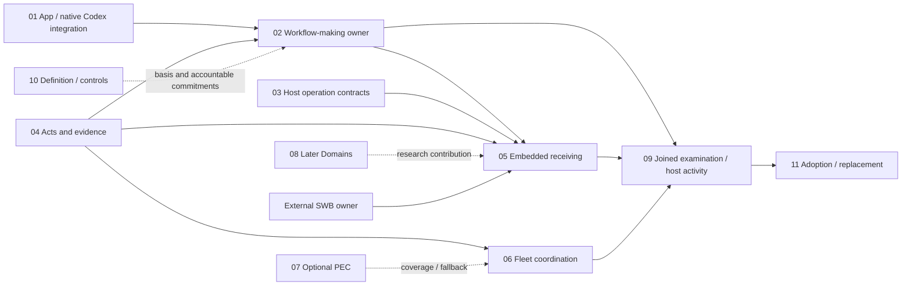

> **Subsequent standing:** the owner approved Group2 and all five recommendations. [The actual decision](../../../_Decomposition/checkpoint_snapshots/GROUP2-20260927T233018Z/DECISION.md) binds the presented/discussed composite and its checked consolidation; it does not claim prior owner hash review of Candidate2. The exact discussion-stage reader is [preserved here](../../../_Decomposition/checkpoint_snapshots/GROUP2-20260927T233018Z/presentation/READER.md). The historical text below remains as written; its old discussion labels do not state current standing.

# App v4 — Group2 structural decision

**Proposal: 11 flat Packages and 41 Deliverables. Group2 is not yet confirmed.** Candidate APP-V4-GROUP2-20260927-CANDIDATE-2 is bound by its [manifest](CP2_DRAFT_MANIFEST.json); [independent checking](REVIEW.md) records the actual verdict. This reader is a derived publication, not the canonical amendment surface.

The owner [confirmed Group1](../../../_Decomposition/checkpoint_snapshots/GROUP1-20260927T222641Z/DECISION.md): all 262 scope IDs, 234 IN / 15 OUT / 13 TBD, vocabulary and ten objectives. Those commitments remain. This decision concerns their proposed work boundaries, outputs, responsibilities and coverage—not seed acceptance again or detailed implementation choices.

## Proposed work domains

| Home | Accountable contribution | Deliverables |
|---|---|---:|
| PKG-01 Native App and third-party harness integration | Stock Codex initially; native OAuth/sign-in, API keys, local providers, recovery and packaging | 6 |
| PKG-02 Workflows and roles | Complete workflow-making workspace, portability, checkpoints and additive guidance | 4 |
| PKG-03 Host operations | Catalog/basis/proposal semantics, App external receiving and host integration guide | 4 |
| PKG-04 Human acts and evidence | Autonomy distinctions, visible standing and content-bound run/decision records | 3 |
| PKG-05 Embedded receiving | Minimal-loop/model and panel receiving contracts; conditional common contributions | 2 |
| PKG-06 Fleet coordination | File-based briefs/graphs and return/waiting/decision views | 2 |
| PKG-07 PEC receiving | Qualified consumption, adoption evidence and independent fallback paths | 2 |
| PKG-08 Domains receiving | Query/source admission and later research-to-design contribution | 2 |
| PKG-09 Joined examination | Candidate support, integrated qualification, connected activity and practitioner validation | 9 |
| PKG-10 Project definition | Adopted working basis, usable controls/feedback, responsibility account and production DAG | 4 |
| PKG-11 Adoption and continuity | Preserved history/obligations, consumer adoption and owner replacement evidence | 3 |

The [full register](../../../_Decomposition/Deliverables.csv) names each output, interface, proposed responsibility, anticipated artifacts and focused verification. These are proposed responsibility domains, not phases, a repository directory design or new engine/service boundaries. Responsibility labels are proposed functional ownership carried through the existing four roles.

The following is a **selected interface view**, not an accepted DAG, schedule or readiness assertion:

PKG-10 supplies definition/control inputs across the project; the diagram shows selected joins only. File-native controls work now, before new fleet software exists.

## Five recommendations to decide

1. **Separate native integration from workflow-making, with one complete-result owner.** DEL-02-02 owns create–execute–review/register–reuse–refine across its native, workflow and evidence inputs. Supplier connection alone is not completion. DEL-09-02 supplies one independent joined candidate dossier for workflow, recovery and three-mode scenarios.
2. **Keep shared meaning and external construction distinct.** PKG-03/04 define operation and act meaning; PKG-05 owns App/shared receiving and conformance. SWB still builds its host internals, loop/panel and domain behavior. DEL-09-06 owns the connected activity/round-trip integration and received contributions; prepared handoffs do not prove live success. Common construction needs agreed repeated responsibility.
3. **Keep PEC and Domains independent.** Their truth, qualification and consumer contracts differ. Neither home assigns provider construction; Domains allocation stays TBD. PEC product consumption keeps its qualified/released/adopted envelope while contract/fixture preparation can proceed earlier. Missing providers do not create a blanket App-start gate.
4. **Consolidate qualification evidence, retain local checks.** Related scenarios become cases within two durable units: DEL-09-02 standalone qualification and DEL-09-07 local host qualification. Every feature keeps its own verification. Distinct fleet, external-control/extension, connector, later-reconstruction and practitioner evidence remain bounded outputs. This is not a late testing phase.
5. **Treat practice and transition as concrete outputs.** PKG-10 produces identified bases, technical promise/consumer accounts, usable controls and an examined project DAG. PKG-11 consumes actual evidence and continuing obligations for adoption/replacement. Neither creates a Deliverable per manual rule, copies whole manuals or implies Root rearchitecture.

## Implementation approach clarified

Codex is sufficient initially. “Chirality-owned” means responsibility for behavior, receiving-contract fit, integration and maintenance, not writing everything from scratch. Assess relevant Pi, T3 Code, v3 and other exemplars; selectively reuse/adapt suitable code or patterns, retain significant source/version/attribution and adaptation rationale in existing SoW/PR records, and qualify the actual selection. Dated reports are leads, not current fitness or licensing approval.

This adds no research Package, mandatory supplier copy, new App engine or generalized multi-harness gateway. Choosing Pi's runtime as a dependency would remain a distinct architecture decision. The minimal-host receiving and external construction boundaries are unchanged. The [owner clarification](../../Changes/APP-V4-IMPLEMENTATION-CLARIFICATION-20260927.md) records the source and limits. Candidate1 remains historical at Git 17b8083da; this successor has new hashes. Group2 and the five recommendations remain under discussion.

## Coverage and exceptions

Every IN/OUT/TBD item has exactly one home; only IN items map to production Deliverables. All ten objectives have proposed mappings. [Coverage telemetry](../../../_Decomposition/Coverage_Telemetry.json) reports no missing homes, unmapped IN items, inappropriate OUT/TBD mappings or unresolved register-check findings.

Context envelopes are **2 S / 31 M / 8 L / 0 XL**. Recommend retaining the eight L boundaries with their [specific qualifications](../../../_Decomposition/ContextBudgetQA.csv): supplier hosting/recovery, workflow workspace, examination support, standalone qualification, connected activity, local-host qualification and external-control/extension proof. They retain coupled state or a joined evidence context while splitting feature construction elsewhere. Reassess context when local SoWs supply concrete implementation detail; no XL exception is requested.

Existing policy/classifier, automatic extension, technical means, additional host/fleet, validation-period, provider and adoption choices remain [open at their points of need](../../../_Decomposition/Open_Issues.csv). OUT/TBD homes provide accountability; they do not authorize that construction. No package or deliverable production folders/contracts have been created.

## Discussion and eventual checkpoint

The five recommendations remain under discussion; this revision does not request confirmation again. The eventual Group2 decision concerns candidate APP-V4-GROUP2-20260927-CANDIDATE-2: its proposed 11 Packages, 41 Deliverables, scope/objective mappings and boundary/context qualifications. Codex sufficiency and implementation sourcing do not by themselves confirm the proposed split.

After the actual decision, the manager records Group2's snapshot/pointer. Group3 then receives its separate independent final audit and human acceptance before downstream setup. This proposal and its Git integration do not perform either act.
