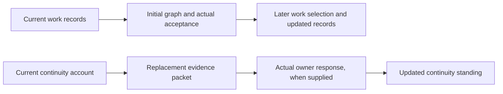

# App v4: initial dependency-graph basis

**Decision subject:** APP-V4-DAG-BASIS-20260928-CANDIDATE-1 — not yet confirmed.

The11 Packages and41 Deliverables are accepted; all41 local ScopeOfWork contracts have been independently checked and recorded INITIALIZED. This decision concerns how their required contributions are represented and how unresolved groups will be tracked. It does not ask you to accept the seeds or decomposition again.

**A fully resolved DAG is not required for the30% gate.** The intended result is an examined, accepted initial graph with unresolved SCCs characterized and routed for later/post30 work. Resolving every interface, obtaining every future input and completing every witness are not extra pre30 conditions. Graph-basis confirmation, graph-version acceptance and the actual30% decision remain separate acts.

## Recommended decision

- Retain the full required-contribution account and default selection rules. A relationship means a particular contribution is needed before a particular part of work—not that one whole Deliverable must finish before another can start.
- Carry the six characterized coupled groups in the candidate layer, with actual owners, missing inputs and next steps. An acyclic admitted layer does not supply those inputs or close the cases. Holds concern the affected work at its point of need; independent work is not blanket-held.
- Track the expanded13-member group in continuing **CASE-002**, preserving its original history and **CASE-004** as traceable constituent history. This is a proposed case-record match, not a merger of Deliverables or responsibilities. No cut, graph group or scope change is proposed for application now.

## What the coupled groups mean

| Work relationship | Characterized later/post30 route and what changes the hold |
|---|---|
| [Codex hosting ↔ account/provider access](../../cases/SCC-CASE-001/Case_Datasheet.md) | Identify the pin/protocol input, account evidence and exact conditional qualification return. Actual versions and received evidence—not contract status alone—support the dependent claims. |
| [Workflow, records, host interfaces, catalog and extension evidence](../../cases/SCC-CASE-002/Case_Datasheet.md) | Use the concrete existing-OUT/REQ contribution matrix for source-qualified drafts, portable meanings, records/settings, loop/panel needs, catalog/proposals, adapter evidence and extension trace. Coordinate those specific interfaces under existing owners when that work proceeds. The actual OI-003 owner ruling remains distinct from the trace. [Earlier catalog/proposal lineage](../../cases/SCC-CASE-004/Case_Datasheet.md) is preserved. |
| [Packaging ↔ examination support](../../cases/SCC-CASE-003/Case_Datasheet.md) | Identify reusable support first, then the actual package and native witness evidence at their points of need. A defined harness does not substitute for an exercised package. |
| [PEC/Domains receiving ↔ source-file recovery](../../cases/SCC-CASE-005/Case_Datasheet.md) | Develop common recovery and identify connector-specific cases/terms; obtain qualified provider/adoption inputs only for the corresponding later joins. Neither connector's availability gates initial App definition or file recovery. |
| [Work controls ↔ project DAG](../../cases/SCC-CASE-006/Case_Datasheet.md) | Current records support the first graph; an accepted/current graph later supports work selection. No already-accepted graph is needed to prepare itself. |
| [Continuity ↔ replacement evidence](../../cases/SCC-CASE-007/Case_Datasheet.md) | Current continuity informs the packet; a later actual owner response updates continuity. A pending/negative response is legitimate, and replacement does not automatically retire or adopt other work. |

The timing distinction is visible in these two examples. Arrows below show **contribution flow**, not an accepted DAG or schedule:

## Checked coverage and remaining uncertainty

The [independent refreshed audit](../../../_Evaluation/DepClosure/CLOSURE_APP_V4_TARGETS_2026-09-27_2237/Dependency_Closure_Report.md) verifies41 valid registers and the six source-grounded target refinements:403 active execution rows,161 local arcs and six SCCs. It found no concrete source defect in its bounded examination. Its raw-cycle BLOCKER means the raw relationships are not an acyclic ordering; **it is not a30% gate-failure verdict**.

Eighteen package-level and14 unknown entries remain. The [target account](../../../_Coordination/AgentRuns/APP-V4-INITIAL-SETUP-20260927/TARGET_RESOLUTION.md) distinguishes known producing responsibilities, future candidate/contract-subset/reviewer/source instances, and genuine open choices. They are not32 new human decisions. Actual policy, shared/host placement, model/catalog details and Domains allocation/admission remain at their existing points of need; external host/provider work and actual human acts remain separately owned. No dependency has been declared fulfilled.

A narrower initial-production view is an alternative, requiring explicit named exclusions and a limited reliance boundary. It would not represent the full lifecycle obligations. The recommendation above retains the full account with honest candidates instead of silently applying that narrowing.

After confirmation, the remaining work is to assemble and audit the qualified initial version, obtain its separate independent review, and present its actual version-acceptance checkpoint. Characterized SCCs may remain unresolved. Their later resolution, product implementation and the30% decision are not performed by this basis decision.

[Exact basis, rules and source identity](GRAPH_BASIS.md) · [Accepted node inventory](DeliverableNodes.csv) · [Refreshed audit QA](../../../_Evaluation/DepClosure/CLOSURE_APP_V4_TARGETS_2026-09-27_2237/QA_Report.md)
