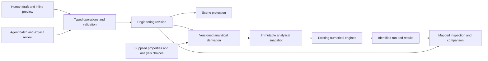

# Piping: design-first modeling and analysis product direction

**Investigation report · 5 September 2026 · recommendation for owner review**

## Executive recommendation

Develop Piping as a persistent 3D centerline engineering modeler: people lay out and revise piping in a visible workspace; the application derives traceable analytical inputs; agents propose changes through the same engineering operations. Start with a tested interaction design and a few narrow architecture witnesses in parallel, then join them in one native modeling-to-results journey. Preserve useful engines and operations. A wholesale model rewrite or a full solid CAD kernel should not be a prerequisite.

The investigation found substantial working machinery beneath an unsatisfactory authoring experience. Current source contains viewport picking, geometric operations, shared sections, mechanics, atomic batches, undo, diagnostics and persistence. Yet the observed Toolkit consumed much of a compact window, technical strings dominated discovery, and a pipe label entered a numeric quantity display path. A larger operation catalogue cannot resolve these problems by itself. The [June 18 redesign plan](PLAN_2026-06-18_workspace_redesign_c5_7.md) recorded substantially the same complaint and subsequently recorded corrective work. The lesson is to accept complete user tasks and visible workspace states throughout feature assembly, alongside component and operation tests.

There is also a real integration seam to design around. The native desktop calls a Rust preview model/compiler; the canonical Python physical-to-analytical transform is separate. Neither attractive geometry nor schema coverage proves that an authored engineering state reaches analysis with correct units, idealization and result lineage. Reuse both bodies of work through a deliberate adapter and migration contract; the canonical adapter currently covers less than the product mechanics route and is not a drop-in replacement.

**Recommended next program:** agree one representative engineering task, build its connected prototype, verify coordinate handling and revision/result identity with bounded witnesses, then deliver one native slice: create a short explicit centerline system, assign supplied properties and linear restraints/loads, check readiness, derive an identified analytical snapshot, solve, inspect one selected case, save/reopen, and revise through either human edits or an offline agent-authored batch. Expand bends, attachment-aware edits, derived-load regeneration and comparisons after that slice is convincing.

Owner decisions are needed on personal workspace preference, first geometry and connection semantics, lawful data sources, supported analysis families, readable window sizes and measurable usability targets. Live provider integration remains separately held under D-58. This report requests no implementation, lifecycle, release or engineering acceptance.

**Evidence boundary.** Local source is bound to `f4b223dd115c4234e0182dcd752a885c3de175ce`. The parent’s packaged-app observation is inherited evidence; its binary revision was not established. PR715’s merge is historical parent context, not proof of the binary/source relationship. No new product tests, engineering calculations or usability trial were run for this report. Findings combine accepted [UX evidence](../execution/_Coordination/AgentRuns/HELP-HUMAN-PIPING-20260905-PRODUCT-DESIGN-INVESTIGATION/instances/U1/FINDINGS.md), [architecture evidence](../execution/_Coordination/AgentRuns/HELP-HUMAN-PIPING-20260905-PRODUCT-DESIGN-INVESTIGATION/instances/A2/FINDINGS.md), and [human/agent evidence](../execution/_Coordination/AgentRuns/HELP-HUMAN-PIPING-20260905-PRODUCT-DESIGN-INVESTIGATION/instances/H3/FINDINGS.md), accepted for research quality only.

## 1. What the product evidence establishes

| Evidence | Finding and practical implication | Limit |
|---|---|---|
| Parent-observed native window, approximately 1203×768 | Opening Toolkit nearly displaced the model; creation required navigation between tool and review surfaces. Preserve a working canvas during authoring. | One observed window/session; exact binary unknown. |
| [Toolkit CSS](../apps/desktop/src/styles.css), `.toolkit-commands`; [UI source investigation](../execution/_Coordination/AgentRuns/HELP-HUMAN-PIPING-20260905-PRODUCT-DESIGN-INVESTIGATION/instances/U1/children/U1a/FINDINGS.md) | The catalogue occupies normal flow and can grow to `min(60vh,36rem)`. A large canvas element can still be off-screen or clipped. | Source mechanism consistent with observation; no native reproduction. |
| [PropertyInspector](../apps/desktop/src/features/model-tree/PropertyInspector.tsx), `DualUnitValue` | A selected field enters a quantity readout even when its value is text. Text, references, enums and quantities need separate renderers. | Source-supported mechanism, not a new runtime test. |
| [OperationApplyPanel](../apps/desktop/src/features/operations/OperationApplyPanel.tsx) and [BatchReviewPanel](../apps/desktop/src/features/toolkit/BatchReviewPanel.tsx) | Apply already validates. Separate Validate is optional; shortening the observed path is not removal of a mandatory approval gate. | No measured click-count or productivity improvement. |
| [PipeViewport](../apps/desktop/src/features/viewport/PipeViewport.tsx), `pipeMesh` | Pipes use fixed visual radii; component symbols and tagged picking exist. A rendered pipe does not establish engineering OD or fitting geometry. | Scene representation is distinct from physical and analytical accuracy. |
| [Architecture source index](../execution/_Coordination/AgentRuns/HELP-HUMAN-PIPING-20260905-PRODUCT-DESIGN-INVESTIGATION/instances/A2/SOURCE_INDEX.md) | Existing transform, mechanics and persistence contracts offer reusable foundations with material integration gaps. | Source/test reading; no fresh numerical verification. |

The parent successfully created `node:CUA-DEMO-01` through the native UI under explicit user authorization, with one undo checkpoint; the session was unsaved. That is useful evidence of one functioning route. It does not establish an agent API, universal semantic parity, authenticated human authorship or engineering acceptance. The UI’s local-session acceptance assertion describes the route, not a verified actor.

The repository has genuine functional, geometry, screenshot and end-to-end tests. Toolkit tests check catalogue coverage, search, gating and dispatch; other tests check conversion, viewport dimensions and batch application. These answer narrower questions than whether someone can keep the relevant pipe visible, choose the right command, enter meaningful properties and recover from an error without coaching. DEL-07-06 still retains independent usability and human-selected readability/contrast work. Historical complaints do not prove that earlier redesign was ignored or identify a particular regression; current source includes several of its improvements. Stale statements such as SPEC’s “no frontend scaffold” are not current capability evidence.

## 2. Design one engineering task before extending the interface

Use one task as the product’s design and verification spine: **lay out a short piping system, establish its engineering meaning, inspect a traceable linear analysis, then change a support and compare the consequence**. Use invented rehearsal values explicitly labeled as such in public fixtures; actual engineering values must come from the user or a lawful, reviewed source. Do not select plausible material or section defaults to make the demonstration pass.

The first executable slice should use explicit straight spans/junctions and a declared linear solve profile. A prototype can show future circular bends and attachment behavior, but must identify them as proposed. A corner made from straight members must not silently claim the mechanics of a fitting. Let incomplete designs be saved and developed: missing material blocks the relevant analysis, while malformed identities or broken mandatory references block the edit itself.

| Key screen/state | What the user sees and does | What must be unambiguous |
|---|---|---|
| Empty model | Project/save state, units, triad and “Start a pipe run”; open/import alternatives nearby. | Empty is valid; analysis inputs have not been invented. |
| Routing | Pick an explicit start or endpoint; see ghost segments, snap target, plane/axis, distance and elevation; type dimensions; Add/Finish or Cancel. | Alignment and connection are different outcomes; preview identifies the proposed topology. |
| Selected pipe | Highlighted span, handles and typed geometry/properties in the inspector; inspect shared references and provenance. | Name has no units; OD/wall differ from display thickness; a shared-section change shows every affected pipe. |
| Support | Pick a supported attachment location; show restraint axes, degrees of freedom, supplied stiffness and reference frame. | Ground-fixed and pipe-following behavior is explicit; unavailable attachment edits explain their restriction. |
| Loads | Choose a case, quantity and target; see force/moment glyphs and temperature/pressure labels; inspect source or generator basis. | Entered and generated loads remain distinguishable; missing values remain visible. |
| Results | Choose model/run, case, quantity and units; linked table/geometry selection; inspect assumptions and analytical mapping. | Selected-case shape differs from an envelope; stale, failed and unavailable results are distinct. |
| Error/repair | Inline field error or focused issue drawer selects the affected entity, preserves the draft and offers a remedy. | Readiness, derivation failure, non-convergence and missing rule data are different conditions. |
| Agent review | Grouped before/after changes, affected geometry, rationale, assumptions, base revision and validation findings; explicit Apply batch/Reject. | Review concerns the exact proposal; neither successful validation nor agent authorship grants acceptance. |

Selection should be shared across canvas, tree, grid and inspector, including explicit mixed-value handling. Click, additive selection, marquee behavior, overlapping-object picking and Escape must have one documented convention. Camera motion must not unexpectedly edit geometry. Manipulation previews connected objects; unsupported attachment propagation should be explained before committing. Preserve the camera, selection and entered data during routine corrections.

Routing precision has useful precedents: Autodesk documents continuation, routing planes, snaps and direct distance entry. These support explicit geometric feedback, not imported tolerances, engineering defaults or a commercial parity claim. [Plant 3D compass and snaps, 2024 documentation](https://help.autodesk.com/cloudhelp/2024/ENU/Plant3D-UserGuide/files/GUID-80606EFD-7D5C-43CD-8F90-DBFEF07EE34D.htm).

## 3. Preferred workspace and visual language

Keep one recognizable workflow spine—Model, Loads, Analyze, Results, Rules, Report—and a short toolbar. The preferred arrangement is a persistent canvas between a collapsible browser and a selection/tool inspector. Searchable command discovery opens transiently; a single resizable lower drawer serves tables, issues or results. This is the design to test with the owner, not an already selected personal preference.

```text
Project / Save          Model  Loads  Analyze  Results  Rules  Report
Select | Route | Component | Support | Move | Measure    Undo / Views
┌────────────────┬──────────────────────────────────┬───────────────┐
│ Model browser  │                                  │ Selection or  │
│ Search/filter  │       PERSISTENT 3D CANVAS        │ active tool   │
│ Systems/IDs*   │   ghost route • dimensions • axes │ typed fields  │
│                │                                  │ Add / Cancel  │
├────────────────┴──────────────────────────────────┴───────────────┤
│ Optional single drawer: model grid / issues / selected-run results │
└────────────────────────────────────────────────────────────────────┘
Active tool hint / coordinates / units / save state / issues / run
* System/run grouping requires corresponding model support.
```

A full ribbon catalogue spends vertical space on exhaustive discovery; a floating palette can obscure geometry and needs placement management. Begin with the docked inspector and compact toolbar, collapse the tree when necessary, and retain user resizing without losing draft state. Evidence hashes, conversion internals and diagnostic codes belong in reachable Details; actionable warnings remain visible in the task surface. Each field and action should have one obvious home.

Use icon plus short label for unfamiliar domain actions. Define a consistent set for nodes, pipes, bends, tees/reducers, restraints, anchors, springs, equipment/nozzles, forces, moments and result quantities. Reuse platform-style symbols for ordinary selection/search/undo actions. Existing icons are a foundation; the missing piece is consistent domain meaning across toolbar, tree, viewport and inspector. Pair warning color with shape/text; a green symbol must never imply engineering approval. This adapts Apple’s prioritization and icon-consistency guidance. [Apple toolbars](https://developer.apple.com/design/human-interface-guidelines/toolbars?changes=_2), [Apple icons](https://developer.apple.com/design/human-interface-guidelines/icons?changes=l_8_2).

Microcopy should describe the object and next action: “Material missing—choose a material before analysis”; “Results belong to Model 12; current model is 13”; “Cannot move this selection: attached support S-12 is outside this operation.” A text label gets a text editor; a quantity gets value, dimension, entered unit and optional converted display; a reference gets a searchable picker and source. “Mixed” is different from empty. Internal operation terms remain available for diagnosis without becoming the default interface language.

Linked table/graphic selection is especially valuable for repetitive engineering assignments and result inspection. Bentley documents this interaction in AutoPIPE input grids; its historical results guidance also describes point/grid review. The proposal transfers an interaction pattern, not a claim that Piping matches those products. [AutoPIPE input grids](https://bentleysystems.service-now.com/community?id=kb_article_view&sysparm_article=KB0026084), [historical results review](https://bentleysystems.service-now.com/community?id=kb_article&sysparm_article=KB0116822).

## 4. Separate engineering truth, visualization, analysis and results

The authored document is already a graph of identified nodes, pipes, components, supports, properties and loads. Evolve it deliberately into a typed engineering graph. Scene meshes must remain projections; analytical nodes/elements must remain derived identities with mappings back to authored objects.



An engineering revision should preserve centerlines, connectivity, component identity, section/material references, support/load attachments, units, assumptions and provenance. Future ports/tangents and stable attachment stations need explicit contracts. Remeshing must not churn authored IDs. A derivation manifest should bind source revision/hash, adapter version/settings, coordinate conversions, library versions/hashes, scenario, warnings/exclusions and source-to-element/station/local-frame mappings. A result belongs to that exact analytical snapshot, solver/settings and run—not merely a project name.

The active route is `App → previewService → Tauri → Rust product_physics`; the separate [Python transformation](../core/model_transform/physical_to_analytical/contract.py) and [solver-boundary adapter](../core/model_transform/physical_to_analytical/_solver_boundary_adapter.py) provide contract evidence without owning preview runtime. Design a versioned bridge and differential witnesses against existing product/numerical fixtures before switching callers. Retain current supported families honestly; do not replace them wholesale with a narrower adapter.

| Treatment | Capability | Design implication |
|---|---|---|
| Reuse | Rust operations, atomic replay, hashes, rollback, session undo; viewport identity picking | Keep one mutation path; improve capture and review around it. |
| Reuse | Frame/pipe mechanics, linear/nonlinear support primitives, case algebra, thermal/pressure and selected bend/component mechanics | Existing numerical capability is substantial; integration and engineering validation remain family-specific. |
| Refactor/integrate | Typed inspector, common selection, scene projection, command discovery | Eliminate duplicated field/selection state and preserve canvas space. |
| Refactor/integrate | Canonical/product seam, coordinate normalization, analytical mappings | Introduce an explicit adapter with supported-profile diagnostics and migrations. |
| Complete accepted capability | Immutable states/runs, durable operation decisions, comparisons and save/reopen lineage | Session history and one current SQLite envelope are insufficient. |
| New capability requiring precise scoping | General port/tangent connections, attachment migration, geometric constraint evaluators | Existing guarded transforms and constraint-record validation do not demonstrate these functions. |
| Later, only if justified | Fabrication solids, imported B-rep editing, general CAD kernel | First centerline/frame scope does not establish this need. |

Current split/transform operations use explicit identity maps and conservatively reject attachments they cannot preserve. Keep those protections until replacement attachment policies are verified. A numerical curved-bend element does not mean the editor trims tangent legs or mates fitting ports automatically. Likewise supplied constraint validation does not establish computed clearance, obstacle avoidance or slope feasibility. Simple swept envelopes may serve an initial clearance feature; exact solids require a concrete later use case.

Retain conservative whole-model result invalidation initially. Generated self-weight is a useful first dependency-aware extension: section/density changes should mark its derivation stale and offer a regenerated diff, preserving user-entered loads. Old runs may remain inspectable as historical. Model changes must not make old results look current.

Three source-indicated risks deserve targeted witnesses, not bug declarations: equivalent meter/mm/inch coordinate geometry through the native path; nonlinear selected-solution propagation into displacement, reaction and force/stress recovery; unique immutable model/run identities through save/reopen. In addition, current deformation visualization can select each node’s governing case separately and normalize display offsets. Introduce an explicit selected-case shape and clearly labeled envelope, with scale/basis visible. DEL-07-05 owns this results presentation, with DEL-14-02 supplying run binding; DEL-07-04 owns warnings.

## 5. Human convenience and agent parity share semantics

For a small human edit, show an inline draft and readable change preview, then **Add/Apply** validates and commits through the engine. Cancel leaves the model unchanged; success updates selection, invalidates results and offers Undo. An unexpected cascade opens a larger review. This fits the existing [PRD structured-edit requirement](../docs/PRD.md) and SOW-069 without making the user navigate a queue for every ordinary action. Validate remains available for inspection without application.

For an agent, prepare a coherent batch against a named revision. Show grouped geometry/property changes, rationale, missing inputs and assumptions; the user explicitly applies or rejects that exact batch. Both paths invoke the same typed operations and diagnostics. No direct Three.js writer, private SQL path or special agent mutation route is warranted.

The [atomic batch engine](../core/model_operations/operation_applier/src/atomic_batch.rs) privately replays dependent members and publishes only complete success. App revision/hash/generation checks guard session staleness. However, the caller supplies the model and claimed hash: this does not establish service-owned latest state across writers. A future public command service needs compare-and-swap publication, idempotency and honest authorization evidence. Withdrawing a queued proposal suppresses late publication; it is not proof that synchronous backend replay stopped.

Persist author/source, executor/channel, human authorization scope, reviewed base/operation hashes, validation receipt, timestamp and persistence disposition separately. Current local-session acceptance metadata is asserted, with identity verification explicitly absent. Saved intents flatten batch information and do not restore decision receipts or undo; reopening reports acceptance unknown. A durable ledger needs its own schema, migrations, retention and recovery tests. Engineering-value provenance remains separate from who clicked Apply.

**Proposed parity matrix:** pair equivalent human and agent inputs; compare domain outcomes, diagnostics, IDs, hashes and state effects, not pixels. Existing source tests supply foundations; comprehensive paired native evidence remains outstanding.

| Paired scenario | Required outcome |
|---|---|
| Build line; edit property/support | Same supported operations, unit/provenance rules and final graph; grouped edit has one undo boundary. |
| Missing reference; invalid topology/dimension | Same affected-object diagnostics; no published model or fabricated value. |
| Stale draft/batch after edit or reopen | Reject old basis; show changes; reprepare and review without silent rebase. |
| Valid first member, failing later member | Complete rollback; ordered member findings; no success receipt or undo checkpoint. |
| Preview, withdrawal, late response | No acceptance from preview; withdrawn work cannot reappear as committed. |
| Save/reopen; retry/duplicate request | Exact model/lineage restored as specified; honest unknown identity; idempotent commit once implemented. |
| Apply, undo/redo after solve | Coherent restoration; stale solve/rule/proposal outputs stay invalidated. |
| Forged actor or approval metadata | No inferred authenticated identity or engineering acceptance. |

A transport-neutral registry should describe command versions, schemas, ownership, prerequisites, availability, units/provenance, effects, undo and typed errors. It can inform both GUI affordances and later machine discovery. Offline batch design/testing is useful now; it does not adopt a live provider, sidecar, daemon or Root-runtime client. [D-58](../execution/_Coordination/_DECISIONS/D-58_RULING_2026-07-27.md) preserves the agent-assisted outcome while leaving the successor mechanism unresolved.

## 6. Stage the program around converging evidence

The following is a **proposed program**, not an activated work graph or amended schedule. Appoint one integration owner across package boundaries; package managers retain their deliverable responsibilities. Preserve the accepted vocabulary’s existing-capability-first sequencing. Design work can explore later states without prematurely implementing reserved capabilities.

| Stage and dependency | Concrete output | Gate and landing ownership |
|---|---|---|
| 0. Agree task and boundaries | Scenario script, current/partial/held capability map, exact geometry/analysis profile, decision list | Owner agrees task and usability measures. DEL-07-09 vocabulary; PKG-07 integration with PKG-02/13/14/16 owners. |
| 1A. Design prototype after 0 | Connected eight-state prototype, icon/typed-field patterns, keyboard and compact-window behavior; uncoached task observations | Owner and independent representative users demonstrate task comprehension/recovery. DEL-07-01/02/06; related editors/results owners. |
| 1B. Architecture witnesses after 0, parallel with 1A | Adapter/migration outline; coordinate, source-ID map, revision/run persistence witnesses; scoped nonlinear-consumption witness | Explain or repair failures within authorized scope; declare supported first profile. DEL-02-01/02/05, DEL-13-04, DEL-14-01/02, mechanics owners. Nonlinear witness gates its later consumption claims. |
| 2. Native vertical slice after 1A and required 1B gates | Route→properties/support/load→check→derive→linear solve→selected-case results→save/reopen→edit; equivalent offline batch | Proven binary/source binding, paired negative tests, complete native walkthrough and focused engineering reference evidence. PKG-07 shell/results; PKG-16 edits; PKG-13 bridge; PKG-14 lineage; PKG-03/04/05 mechanics inputs. |
| 3. Engineering edits after slice acceptance | Explicit bend/tangent and attachment contracts; supported connected moves/splits; self-weight regeneration; state/run comparison | Each family proves topology, units, mapping and invalidation; unresolved families remain restricted. PKG-02/03/13/14/16 with PKG-07 surfaces. |
| 4. Later expansions after separate decisions | Additional nonlinear/bend scenarios, constraint computation, exchange profiles, optional live agent transport | Family-specific validation and owning holds resolved; PKG-17 loss maps retained; D58 mechanism decision precedes live integration. |

The critical dependency is convergence: prototype acceptance alone cannot prove analytical lineage; architecture witnesses alone cannot prove usability. Stage 2 must use the designed interaction with real operations, persistence and analysis. Avoid a long “platform first” rewrite followed by another interface project. Conversely, do not ship a prototype-looking surface whose apparent engineering promises outrun the adapter profile.

## 7. Scope routing, owner decisions and proposed acceptance

Much of this direction already fits accepted scope. [Deliverables.csv](../docs/_Registers/Deliverables.csv) assigns physical/analytical schema to DEL-02-01 (SOW-041/065), transformation to DEL-13-04 (SOW-066), state/run/comparison work to DEL-14-01..05 (SOW-071..073), structured edits/history to DEL-16-01..04 (SOW-069/070), and viewport/inspector/results/usability to PKG-07. PKG-00 provides architecture constraints, not newly activated production. DEL-07-09 owns vocabulary/organization; implementation follows the [SCA-009 landing annex](../execution/_ScopeChange/SCA-009_2026-08-20_0000/Vocabulary_Annex.md). The annex’s historical candidate header must be read with the accepted amendment, not mistaken for today’s acceptance state.

Detailed port/tangent attachment semantics and geometric evaluators are genuine unimplemented capability; owners must determine exact fit or scope amendment before dispatch. Full fabrication CAD is not justified by current global centerline scope. Route/support candidate-generator ownership is explicitly reserved for a separate act. Public multiwriter identity/authorization and provider transport need explicit contracts; D58 is not lifted by this report. Existing DEL-13-04 PDU-023/PDU-047 and PKG-14/17 validation/review holds remain open to their owners.

The owner should decide:

- Preferred workspace balance and frequent tasks: docked inspector/tree, toolbar labels, keyboard conventions and table usage.
- First geometry/analysis families, junction/fitting meaning, attachment movement rules, tolerances and incomplete-design policy.
- Canonical/product migration ownership, authoritative revision service, history/retention and actor model.
- Which lawful user/import datasets may be selected, how sources are reviewed, and which values stay explicitly missing; no engineering defaults are selected here.
- Target users, readable text/contrast and compact-window requirements, representative task/model size and acceptable performance/error rates.
- Whether and when a successor live-agent mechanism or broader fabrication capability warrants a separate decision.

**All following checks are PROPOSED, not ratified acceptance criteria.** Agree thresholds before using them to declare success. A 1200×768 frame with at least 600×420 clear canvas during ordinary authoring is one candidate to test, not an existing requirement or guaranteed feasible budget.

| Dimension | Measurable evidence to collect |
|---|---|
| Usability/layout | Task completion without coaching; time, navigation detours, wrong-object edits and recovery; unobscured canvas bounds in every tool/review/error state; no clipped essential controls. |
| Accessibility/readability | Keyboard completion, visible focus, text enlargement, contrast and color-independent warning/result comprehension at agreed targets. |
| Editing/parity | Paired matrix outcomes; preview/cancel causes zero publication; atomic failures and stale proposals leave state unchanged; text fields never emit quantity diagnostics. |
| Provenance/persistence | Save/reopen preserves specified hashes, source maps, decisions and run identity; changed inputs visibly invalidate results/derived loads; unsupported identity assertions remain labeled. |
| Engineering | Coordinate-basis equivalence at agreed numerical tolerances; dimensional checks; source-to-element/station mapping; selected-solution recovery; missing inputs and unsupported idealizations block honestly. |
| Delivery | Actual native binary tied to source/build evidence; representative walkthrough and independent usability evidence accompany appropriate tests/review. |

## Evidence status and handoff

This report is a derivative recommendation consuming research accepted in the [fan-in record](../execution/_Coordination/AgentRuns/HELP-HUMAN-PIPING-20260905-PRODUCT-DESIGN-INVESTIGATION/FAN_IN_ACCEPTANCE.md). Its authoritative basis is [SOFTWARE_DECOMP revision 0.12](../execution/_Decomposition/SOFTWARE_DECOMP.md), [accepted SCA-009](../execution/_ScopeChange/SCA-009_2026-08-20_0000/Handoff_State.md), and [approved DAG-010](../execution/_DAG/DAG-010/HANDOFF.md). DAG rebuild closure does not close every historical amendment rerun. The [project contract](../docs/CONTRACT.md) continues to require units, explicit missing data, lawful provenance and separation of mechanics, rule evaluation and human professional judgment. No unreviewed piping-design equation extraction grounds this report.

External primary sources were researched on 2026-09-05; several Apple/Autodesk passages were accessible through indexed official text, and Bentley results guidance is historical. [The source packet](../execution/_Coordination/AgentRuns/HELP-HUMAN-PIPING-20260905-PRODUCT-DESIGN-INVESTIGATION/instances/U1/children/U1b/SOURCES.md) records those limits. No commercial product was operated or benchmarked. Current implementation claims rest on source inspection; numerical risks remain hypotheses for targeted witnesses.

Synthesis is ready for fresh read-only report criticism and owner consideration. Implementation, derivative regeneration, lifecycle and engineering acceptance remain separate work. Re-inspect relevant seams after source/binary changes; rerun scoped witnesses and usability tasks when their contracts or design change. The next owner is HELP_HUMAN for report fan-in and decision routing; no authority pointer moves with this document.
